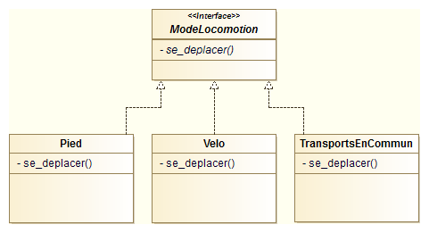
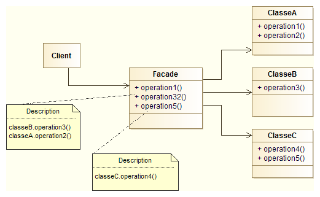
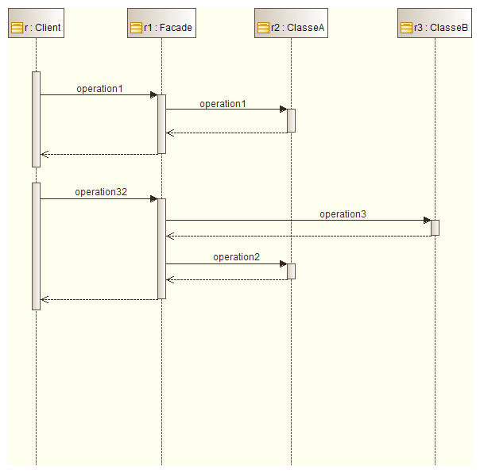
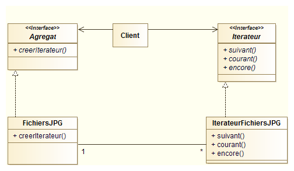

% Analyse informatique avancée
% Disivion des enseignements en informatique
% 2016


# Introduction #

Ce cours d'analyse avancée doit nous permettre d'améliorer nos techniques de conception d'applications. Nous ne reviendrons pas sur les principes de base de l'orientée objet (classe/objet, encapsulation, héritage, polymorphisme), sensés être connus avant d'aborder ce cours. Nous développerons en revanche la finalité de l'orienté objet qui vise à développer des applications évolutives, sans avoir à reprendre tous le code à chaque modification. 

Nous commencerons par présenter brièvement quelques uns des diagrammes UML étudiés en première année, avant d'étudier de manière plus poussée ce langage (contraintes OCL, stéréotypes, interfaces). Cela nous permettra enfin de parler des patrons de conception et de découvrir leur intérêt.


# Les bases d'UML #

Dans cette première partie, nous rappelons quelques uns des formalismes de base du langage UML (Unified Modeling Language) pour présenter ensuite de nouvelles notions permettant d'étendre les possibilités de ce langage. 


## Le diagramme de cas d'utilisation ##

### Objectifs du diagramme ###
Le diagramme de cas d'utilisation répond à la problématique de modélisation des besoins des utilisateurs. Il offre une vision des **grandes fonctionnalités** proposées par l'application aux utilisateurs de celle-ci. 

L'objectif de ce diagramme est de structurer et de clarifier les besoins du client. Le diagramme de cas d'utilisation doit se limiter à identifier les fonctionnalités principales et ainsi à définir le contour (ou frontière) du système, sans chercher à lister toutes les fonctions que le système doit réaliser ni à détailler les solutions d'implémentation. Dans le cas de systèmes complèxes en particulier, hérarchiser et simplifier l'information pour rendre compte des besoins avec un haut niveau d'abstraction est indispensable. Enfin, il ne s'agit pas dans ce diagramme de représenter un enchaînement temporel d'actions, ni de détailler les entrées/sorties du système.

Le diagramme de cas d'utilisation est un diagramme central qui sert de fil rouge tout au long des développements pour s'assurer ques les fonctionnalités initialement identifiées sont bien implémentées.

### Eléments de base d'un diagramme de cas d'utilisation ###
Le diagramme de cas d'utilisation est composé de *cas d'utilisation* et d'*acteurs*. L'ensemble des cas d'utilisation définissent le contour (ou frontière) du *système*, symbolisé par un trait englobant tous les cas d'utilisation.

#### Le cas d'utilisation ####
Un cas d'utilisation est une séquence d'actions destinées à répondre à un besoin précis d'un utilisateur. Il est en général exprimé à l'aide d'un verbe à l'infinitif.


Un cas d'utilisation peut être structuré en sous-cas d'utilisation à l'aide deux types de relations :

* la relation d'inclusion (*include*) : le cas d'utilisation contient nécessairement le ou les sous-cas de destination. Cette relation permet de décomposer un cas complèxe en sous-cas plus simples;
* la relation d'extension (*extend*) : le sous-cas d'utilisation étend les objectifs du cas d'utilisation de destination. La relation d'extension peut être vu comme une fonctionnalité optionnel.

Les relations d'inclusion et d'extension sont représentée à l'aide de flèches pointillées à côté desquelles on indique le type de relation. La flèche d'inclusion va du cas général au sous-cas tandis que la flèche d'extension va du sous-cas vers le cas d'utilisation général.


Une relation d'inclusion ou d'extension peut être partagée par plusieurs cas d'utilisation d'origine.

#### L'acteur ####
Un acteur est une entité (personne humaine, dispositif matériel ou logiciel) intéragissant avec l'application en échangeant de l'information avec celle-ci. Un acteur peut jouer plusieurs rôles vis à vis d'un même système. On parle d'**acteur principal** ou parfois simplement d'**acteur**.

L'acteur est représenté par un bonhomme. Le rôle est indiqué en dessous du bonhomme.


La seule relation possible entre deux acteurs est la généralisation. Un acteur A est une généralisation d'un acteur B si l'acteur A peut être substitué par l'acteur B, l'inverse n'étant pas vrai.


Un **acteur secondaire** est une entité qui est appelée par le système pour la réalisation d'un cas d'utilisation. Ils sont traditionnellement positionnés à droite du système avec lequel ils interagissent. On précise qu'il s'agit d'un acteur secondaire en ajoutant `<<secondary>>` à côté du nom ou sur le lien avec le cas d'utilisation.


#### Exemple ####
Nous représentons le diagramme de cas d'utilisation d'une application de remontés d'informations collaboratives sur des incidents dans les transports. 

Trois types d'utilisateurs se connectent l'application : le visiteur "simple", le modérateur et le gestionnaire de l'application :

* Le visiteur peut consulter les cartes disponibles sur l'application. Il peut effectuer une recherche d'itiniéraire entre deux points de départ et d'arrivée. Enfin, lorsqu'il constate un incident sur le réseau, il peut le signaler à l'application.
* Le modérateur peut également effectuer chacune de ces actions. Le modérateur est un visiteur particulier. De plus, lorsqu'un incident est signalé par un visiteur, le modérateur peut valider ou pas cet incident pour le rendre visible par tous les visiteurs sur le fond de carte. 
* Le gestionnaire peut mettre a jour le réseau (ajouter, supprimer ou modifier un tronçon). Il s'agit de la seul action que le gestionnaire peut effectuer. Pour ce faire, il doit nécessairement se connecter à l'application à l'aide d'un identifiant/mot de passe.


## Diagramme d'activité ##

### Objectifs du diagramme ###
Le diagramme d'activité intervient pour décrire le fonctionnement du système lors d'un cas d'utilisation. Il permet de représenter graphiquement le comportement d'une méthode ou le déroulement d'un cas d'utilisation. Si toutes les activités peuvent théoriquement être décrites à l'aide d'un diagramme d'activité, nous nous contenterons généralement de décrire uniquement les plus importantes.

Une activité représente une exécution d'un mécanisme, un déroulement d'étapes séquentielles. Le passage d'une activité à une autre est matérialisé par une transition. Les transitions sont déclenchées par la fin d'une activité et provoquent le début immédiat d'une autre.

### Eléments de base d'un diagramme d'activité ###
L'**activité** est représentée par un rectangle aux bords arrondis. Elle est toujours nommée.


Une **transition** est matérialisée par une flèche entre deux activités. Le sens de la flèche indique le sens de la transition.


Un diagramme d'activité peut également être composé de **branchements conditionnels**. Ils permettent de faire des choix entre plusieurs activités (ils correspondent à des tests). On parle aussi de *point de choix* qui sont symbolisés par des losanges. Les conditions du test doivent nécessairement être écrites dans le diagramme (terme de *condition de garde*).


Lorsque plusieurs activités s'effectuent en même temps (dit aussi *en parallèle*), UML permet d'utiliser des **transitions concurrentes**. Elles sont matérialisées par des barres pleines horizontales. La création des différents états concurrents est appelée **fork** et la synchronisation des activités  en concurrence pour revenir à un activité linéaire est appelée **join**.


Enfin, un diagramme d'activité comporte toujours un **état initial** (disque plein) et un **état final** (disque plein entouré d'un anneau).


### Couloirs d'activités ###
UML permet de réprésenter les entités responsables de chaque activité. Pour cela, nous utilisons des **couloirs d'activtés**. 


## Diagramme de classe ##

### Objectifs du diagramme ###
Le diagramme de classes est utilisé pour représenter les structures de données intervenant dans le système et les relations entre elles. A ce titre, il est constitué de **classes** et d'**associations**.

Il s'agit de représenter de manière visuelle le monde que l'on cherche à modéliser. La modélisation reste toutefois statique : on ne décrit pas les intéractions, ni cycles de vie des objets.

Les concepts de l'approche orientée objet (héritage, agrégation, encapsulation) sont appliqués pour établir le diagramme de classes.

### La classe ###
#### Définition ####
La **classe** définit la structure des objets composant le système. Elle possède des propriétés (attributs et méthodes) et permet de créer les objets ayant ces propriétés.

Elle est représentée par un rectangle avec le nom de la classe. Si la classe possède des attributs et/ou des méthodes, ils sont ajoutés dans des cases en dessous du nom.


#### Attributs ####
Les attributs sont **typés**, c'est à dire qu'un attribut peut stocker des données d'un type défini. Les principaux types simples sont les suivants : 

* Caractère (`character`)
* Chaîne de caractères (`string`)
* Nombre (`number`)
	* Entier (`integer`)
	* Réel (`float`)
* Date (`date`) et instant (`time`)
	* Instant daté (`datetime`)
* Booléen (`boolean`)
* Identifiants (`genericname`)

Les attributs d'une classe peuvent présenter une **multiplicité**, qui définit le nombre de valeurs possibles pour l'attribut. Les multiplicités différentes de 1 sont représentées entre crochets après le type de l'attribut (exemple : `coord: float[2]`).

Un attribut peut avoir une **valeur par défaut**, qui est dans ce cas écrite à la fin de la ligne et précédée du signe `=`.

On distingue trois niveau de **visibilité** des attributs : 

* **privé** (`-`) : la partie privée de la classe est totalement opaque et seul les objets eux même peuvent accéder aux attributs placés dans la partie privée;
* **protégée** (`#`) : ces attributs sont alors visibles à la fois par les objets eux même et par les instances des classes dérivées de la classe fournisseur. Pour toutes les autres classes, ces attributs restent invisibles;
* **publique** (`+`) : les attributs sont visibles dans toutes les classes, ce qui revient à se passer de la notion d'encapsulation.

Un attribut dont la valeur ne peut pas être renseignée par l'utilisateur, mais est toujours dépendante du contenu d'autres attributs, est un **attribut dérivé**. Dans ce cas, l'attribut est précédé du signe `\`.

Finalement, la syntaxe générale pour les attributs d'une classe est la suivante (où les mentions optionnelles sont entre accolades) :

    {-, #, +} nom_attribut : type_attribut {[multiplicite]} {=valeur_initiale}


#### Les méthodes ####
Les méthodes définissent le comportement des instances d'une classe. Elles peuvent modifier la valeur des attributs.

La syntaxe pour les opérations d'une classe est similaire à celles des attributs :

    {-, #, +} nom_methode ({nom_param1: type_param1, nom_param_2: type_param2, ...}) {: type_retour}

`{nom_param1: type_param1, nom_param_2: type_param2, ...}` est la signature de la méthode.

#### Exemple ####

La classe `Point` possède deux attributs, les coordonnées `x` et `y` de type réel, et une méthode `deplacer(dx, dy)` modifiant ces coordonnées :


Remarque : UML supporte l'abstraction. Aussi, selon la complexité du domaine d'intérêt, on enrichira ou simplifiera le diagramme pour le rendre pertinent vis à vis des développements à effectuer.

### Les relations entre classes ###
On distingue plusieurs type de relations entre classes : l'**association**, l'**héritage**, l'**agrégation**.

#### L'association ####
L'association est utilisé pour représenter un lien possible entre instances de classes. Elle est toujours nommée pour indiquer quel type de lien est symbolisée et est représentée à l'aide d'un trait entre les deux classes.


On peut donner à chaque classe un **rôle** dans la relation. Cela est utile pour préciser le contexte ou lorsque plusieurs associations concernent les mêmes classes. Lors de l'implémentation du modèle UML, le rôle est traduit en un attribut de la classe d'objets.


Les **multiplicités** d'une association permettent de contraindre le nombre d'objets impliqués dans une relation (on parle également de cardinalité). On les indique aux extrémités des associations. La syntaxe est la suivante :

    multiplicité_min .. multiplicité_max

Sachant que :

* l'on utilise `*` pour indiquer un nombre indéterminé
* `n..n` se note aussi `n`
* `0..*` se note aussi `*` 

Le plus souvent, une association relie deux classes différentes mais il est possible de faire pointer les deux extrémités d'une association vers la même classe. On parle d'**association réflexive**.

Il est parfois nécessaire d'ajouter des précisions sur une association qui ne se trouvent dans aucune des classes qu'elle lie. La modélisation objet ne permettant qu'aux classes d'avoir des attributs, nous utilisons une **classe d'association**, symbolisée de la manière suivante :


Par défaut, une association est navigable dans les deux sens. Dans la pratique, lors de l'implémentation, la portée de l'association est parfois réduite (cela signifie que les instances d'une classe ne connaissent pas les instances de l'autre classe de l'associaiton). UML permet de préciser la **navigabilité** d'une association. On l'indique à l'aide d'une flèche à l'extrémité de l'association.

 

#### L'héritage ####
La relation d'**héritage** est une relation de spécialisation/généralisation. Les éléments fils héritent de la structure des éléments parents. C'est à dire que les attributs et méthodes de la classe mère se retrouvent automatiquement dans la classe fille. 

On représente la relation d'héritage avec une flèche (extrémité de la relation triangulaire).


#### Agrégation et composition ####
L'**agrégation** permet de rendre compte du principe orienté objet de même nom : une instance de classe peut être composée d'instances d'autres classes. On la représente avec un losange vide du côté de l'agrégat.

La **composition** est une agrégation forte qui ajoute des contraintes sur le cycle de vie des objets : unicité de l'appartenance, disparition des objets composants (les parties) avec la disparition de l'objet composé (le tout). Elle est représentée par une losange plein du côt de l'agrégat.

Par exemple, une école est composée de cycles qui sont composés d'étudiants. Pour autant, la relation école-cycle n'est pas de même nature que cycle-étudiant : si on supprime l'école, on supprime également les cycles (= relation de composition). Mais les étudiants ne disparaissent pas pour autant (relation d'agrégation) !


### Classes abstraites ###
Le concept de **classe abstraite** permet de définir des classes :

* regroupant des attributs et méthodes transmis par héritage à d'autres classes;
* mais ne pouvant pas être instanciées.

Une classe abstraite peut contenir des attributs ainsi que des méthodes, qui peuvent être concrètes (c'est à dire dont le traitement est défini dans la classe) ou abstraite (dont le traitement n'est pas définit). Les classes concrètes héritant d'une classe abstraite possédant des **méthodes abstraites** doivent obligatoirement redéfinir ces méthodes.

En UML, les classes et méthodes abstraites sont écrites en italique.

Dans l'exemple ci-dessous, nous définissons une classe abstraite Animal. Il n'est pas possible de créer un animal sans préciser de quel type il s'agit, mais on peut bien créer des chiens et des chats. La méthodes `manger()` est implémentée dans la classe Animal car tous les animaux mangent de la même manière. En revanche, tous crient d'une manière différente : la méthode `crier()` est donc abstraite, ce qui permet de forcer toutes les classes filles à l'implémenter.


## Les contraintes OCL ##

Certaines contraintes ne peuvent pas être exprimées par le langage UML basique : invariant de classe, pré ou post-condition d'une opération, une règle de calcul, etc. Si ces contraintes peuvent s'exprimer en langage naturel, graphiquement nous utiliserons du texte encadré d'accolades. Nous parlerons de langage OCL (Object Constraint Language) qui est un langage à expressions, permettant d'exprimer des contraintes sur les diagrammes UML au moyen d'expressions booléennes qui doivent être vérifiées par le modèle.


L'utilisation d'un langage à expression est motivée par les imprecisions et ambiguités induites par le langage naturel.


Une contrainte exprimée en OCL peut être attachée à n'importe quel élément du modèle. 


## Les stéréotypes ##

Les **stéréotypes** permettent d'étendre les concepts décrits par le langage UML (ce que l'on appelle le *métamodèle*). Ils permettent de donner une signification particulière à une classe. 

Par exemple, le concept de liste finie de valeurs possibles pour un attribut, n'existe pas dans le langage UML de base. Pour le représenter nous pouvons définir un stéréotype *énumération* qui ressemblera à une classe mais servira en fait à représenter un ensemble de valeurs. 

Le symbole utilisé pour les stéréotypes sont des chevrons encadrant le nom du stéréotype. Le stéréotype est placé au dessus du nom de l'élément qu'il décrit.

Quelques stéréotypes sont définis dans le langage UML :

* `<<enumeration>>` : classe définissant un ensemble de valeurs constituant les valeurs possibles pour un type donné;
* `<<interface>>` : classe contenant uniquement description d'un ensemble d'opérations utilisées pour spécifier un service offert par une classe;
* `<<acteur>>` : classe modélisant un ensemble de rôles joués par un acteur
* `<<exception>>` : classe modélisant un cas particulier de signal
* `<<utilitaire>>` : classe réduite au concept de module et qui ne peut être instanciée


## La notion d'interface ##

En première approche, nous avions définit l'interface comme la partie visible des objets. Nous avons également précisé que par défaut les attributs d'une classes se doivent d'être cachés de l'extérieur (visibilité privée). 

> Par extension, nous définirons une interface comme la spécification externe des opérations visibles d'une classe.

Une interface est donc utilisée pour décrire des objets mais uniquement en terme de méthodes abstraites. Elle ne peut contenir ni attribut, ni méthode implémentée. L'intérêt de l'interface est de pouvoir regrouper un ensemble de méthodes assurant un service cohérent.

Pour signifier qu'une classe implémente les méthodes d'une interface, on dit que la classe **réalise** l'interface. Une classe peut réaliser plusieurs interfaces.

Pour représenter l'interface, nous utilisons le stéréotype *interface* au dessus de son nom. Le lien de réalisation d'une interface à l'aide de tirets se terminant par un triangle blanc. Le lien d'utilisation d'une interface est matérialisé à l'aide de tirets se terminant par une flèche.


L'exemple ci-dessous illustre l'utilisation d'interfaces dans une modélisation. Les classes `Humain` et `Chien` implémentent toutes deux l'interface `Deplacement`. Les méthodes sont bien abstraites dans l'interface ne sert qu'à spécifier un ensemble de méthodes ayant une vocation commune (gérer des déplacements). L'implémentation des méthodes peut être différentes dans chacune des classes (autrement dit, un chien et un homme peuvent tout deux marcher et courir, mais ils ne le font pas de la même manière).

Par ailleurs, les méthodes de communication des humains et des chiens étant différentes, ces deux classes implémentent des interfaces différentes pour ce qui concerne les aspects communication.


# La conception orientée objet #

Dans le but de nous aider à élaborer des applications évolutives, nous étudierons au cours cette partie cinq principes fondamentaux de la conception orientée objet.

* **S**ingle responsibility principle / Principe de responsabilité unique
* **O**pen close principle / Principe d'ouverture-fermutre
* **L**iskov substitution principle / Principe de substitution de Liskov
* **I**nterface segregation principle / Principe de ségrégation des interfaces
* **D**ependency inversion principle / Principe d'inversion des dépendances

Les premières lettres de ces cinq principes forment l'acronyme *SOLID*, ce qui est un des objectifs des applications que l'on cherche à construire.


## Principe de responsabilité unique ##

> Une classe ne doit posséder qu'une et une seule raison de changer. 

Ce principe évite la rigidité et la fragilité du code. Il permet de s'assurer que les classes n'offrent que des services fortement liés entre eux.

La difficulté de mise en oeuvre de ce principe sera d'identifier les raisons de changer d'une classe. Cela passera souvent par l'identification des différents clients de la classe et de l'utilisation qu'ils en font.

Par exemple, l'opérations d'impression d'une page n'est pas de la responsabilité directe du livre qui fait appel à divers pilots d'impressions pour cela. Si le pilote d'impression venait à changer, ce qui n'a pas de lien direct avec le livre, il faudrait pourant, avec cette modification, retoucher la classe `Book`.


Pour respecter le principe de responsabilité unique, les opérations qui ne sont pas effectuées par le livre lui-même sont déplacées dans des classes appropriées. C'est le cas de `print_page()`. Mais `get_current_page()` et `turn_page()` sont bien effectués par le livre lui-même et restent dans la classe.


## Principe d'ouverture/fermeture ##

> Une classe doit être ouvert aux extensions mais fermées aux modifications.

Il s'agit de permettre les modifications et ajouts de fonctionnalités sans avoir à modifier du code existant.

Intéressons nous pour illustrer ce principe à un logiciel de dessin. Nous souhaitons pouvoir dessiner pour commencer deux types de géométries : des cercles et des rectangles. Une première approche consisterai à faire porter par la classe `EditeurGraphique` une methode générique de dessin testant le type de géométrie pour appeler les méthodes spécifiques de cette même classe.


Cette appriche fonctionne, mais si nous voulons ajouter un nouveau type de géométrie (un hexagone par exemple), nous devrons ajouter une fonction `dessinerHexagone()` dans la classe `EditeurGraphique`, et surtout, modifier le corps de la fonction principale de dessin pour tester un nouveau type de géométrie.

Une solution consiste à faire porter la méthode `dessiner()` par chacun des types de géométries. De cette manière, il n'est plus nécessaire de tester le type de géométrie dans la méthode principal de dessin : la méthode de dessin utilisée sera celle de la classe de l'objet dessiné.


## Principe de substitution de Liskov ##

> Les sous-classes doivent pouvoir remplacer leur classe de base.
> 
> Les méthodes qui utilisent des objets d'une classe doivent pouvoir utiliser "inconsciemment" des objets dérivés de cette classe.

Ce principe implique que l'héritage doive correspondre à une extension d'une classe.

Conceptuellement, un carré est un rectangle. Dans la terminologie orientée objet, nous dirons que le carré hérite du rectangle. Mais avec une telle modélisation, la méthode `setDimension(longueur, largeur)` du rectangle ne peut pas être utilisée en l'état pour le carré . 

Ainsi, soit nous redéfinissons la méthode dans la classe carré, mais dans ce cas, l'héritage n'a plus d'intérêt. Soit nous devons tester le type de l'objet avant d'utiliser la méthode, et ajouter une contrainte s'il s'agit d'un carré.


Pour respecter le principe de Liskov, nous ne fairons donc pas hériter le carré du rectangle : il s'agit de deux classes distinctes.


## Principe de séparation des interfaces ##

> Plusieurs interfaces client spécifiques valent mieux qu'une seule interface générale. Les classes clients ne doivent pas être forcées de dépendre d'interfaces qu'elles n'utilisent pas.

Ce principe conduit à la multiplication d'interfaces très spécifiques et petites plutôt qu'à la réalisation de grosses interfaces générales.

Pour réaliser un programme destiné à écrire des logs sur différents supports, nous pouvons écrire des méthodes pour chaque type de log (écriture dans un fichier texte, enregistrement dans une base de données, affichage console, etc.) dans une unique interface que réalise la classe principale. Mais cette conception ne respecte pas le principe de séparation des interfaces : un client de la classe `Logger`connaitra toujours toutes les méthodes même s'il n'en utilise qu'une seule.


La solution est de déporter chacune des méthodes d'écriture dans une interface spéficique qui est réalisée par la classe principale `Logger`.


## Principe d'inversion des dépendances ##

> Dépendez des abstractions, ne dépendez pas des concrétisations.

Les modules de bas niveau doivent se conformer à des interfaces définies par les modules de haut niveau.

Prenons l'exemple d'une pizzeria qui réalise différents types de pizza. La classe Pizza dépend de nombreuse classes de bas niveau.


La classe Pizza dépend d'une interface de haut niveau, en relation avec des classes de bas niveau.


## Remarque ##

Les cinq principes détaillés ci-dessus sont des lignes directrices à suivre pour concevoir des applications performantes. Rien n'empèche de ne pas les respecter et, dans la pratique, il est même rare qu'un programme les respecte tous. Leur mise en pratique sera d'autant plus pertinente que les programmes sur lesquels ils s'appliquent évoluent fréquemment.

Si nous devions retenir une seule règle générale de *bonne* conception, nous retiendrons qu'il convient de toujours séparer ce qui varie de ce qui n'est pas succeptible d'évoluer dans le temps.


# Les patrons de conception #

## Généralités ##

En 1995, quatre experts de l'orienté objet publient un livre où ils proposent des solutions génériques à des problèmes récurrents en développement logiciel. Ils ont en effet constaté que des modèles d'architecture qui répondent de manière identique à des problèmes semblables (constatation qui se généralise à d'autre domaines que l'informatique : cuisine, architecture, mécanique...). Les solutions que les experts ont proposés se nomment **patrons de conception** ou **design patterns** (le terme anglais est souvent conservé). 

23 patrons de conception sont proposés par les créateurs du concept qui les ont organisés en trois catégories. Ces trois catégories sont toujours d'actualité aujourd'hui :

* 5 patrons *de construction*, centrés sur la création d'objets;
* 7 patrons *de structuration*, ciblés sur la hiérarchie et les relations entre classes;
* 11 patrons *de comportement*, décrivants des mécanismes astucieux à mettre en oeuvre pour l'exécution des codes.

On définit un patron de conception par quatre caractéristiques principales :

* *nom* : augmente le vocabulaire, une idée de solution devient nommée, à ajouter ensuite au catalogue de solutions
* *problème* : description du contexte et des conditons d’applications du patron de conception
* *solution* : les éléments de la solution, leurs relations, responsabilités, collaborations; pas de manière précise, mais suggestives...
* *conséquences* : résultats et compromis issus de l'application de la forme


## Pourquoi utiliser des patrons de conception ? ##

Utiliser les patrons de conception permet de s'assurer d'appliquer de bons principes orientés. Ils apportent un haut niveau d'abstraction aux solutions mises en oeuvre ce qui les rend plus robustes, même si elles seront parfois plus difficiles à appréhender. En favorisant la réutilisation de solutions déjà éprouvées par d'autres, ils permettant également de capitaliser une expérience précieuse. 

La communication entre développeurs utilisant les patrons de conception est par ailleurs rendue plus facile. Les patrons de conception apportent un vocabulaire commun permettant d'exprimer plus de choses en moins de mots : *"J'utilise le pattern Observer"* donne en une seule phrase beaucoup plus d'information sur la modélisation retenue que de longs paragraphes se perdant dans les détails de l'implémentation.

Pour conclure cette introduction, nous formulerons quelques mises en garde sur l'utilisation des patrons de conception :

* Comme leur nom le laisse presager, il s'agit de modèle de conception dont il est possible de s'inspirer pour décrire un problème. Il ne s'agiera jamais d'une règle que l'on applique directement sans se poser de question sur l'adéquation avec le problème étudié. 
* Un patron de conception n'est pas non plus une brique logiciel : il s'applique toujours à un problème particulier. 
* Enfin, l'utilisation d'un patron de conception implique qu'il n'y a plus de décision à prendre pour la modélisation puisque la solution est déjà choisie. Mais faire le bon choix, impliquera de connaître ces 23 patrons de conception, de savoir dans quels cadres ils s'appliquent, comment les combiner, etc.

Dans la suite de ce cours, nous étudierons les caractéristiques de quelques uns des principaux patrons de conception : le pattern State, le pattern Strategy, le pattern Observer... pour enfin introduire le modèle d'architecture MVC.


## Le patron état ##

> Le patron de conception état est utilisé pour modifier le comportement d'un objet lorsque son état interne change. Tout se passera comme si l'objet changeait de classe.

Pour illustrer cette définition et introduire le patron Etat, intéressons nous au problème suivant : considérons un système composé d'une bille et de deux cases (gauche et droite). A l'état initial, la bille se situe dans la case de gauche. Puis à tout moment de la vie du système, l'utilisateur peut déplacer la bille soit à droite soit à gauche. Si la bille se situe déjà dans la case de gauche, l'action de déplacement vers la gauche n'a aucun effet (idem pour la droite).


L'utilisation d'un diagramme d'état-transition est particulièrement adaptée pour modéliser la situation :


Dans la classe représentant la bille, nous pourrions alors, le plus simplement possible, avoir un attribut `position` indiquant si la bille se situe à gauche ou à droite. Dans les deux méthodes de déplacement, nous testerions alors la position courante pour savoir s'il ne faut rien faire ou s'il faut déplacer la bille.


D'un point de vu fonctionnel, cette solution répond parfaitement aux attentes. En revanche, l'aspect modélisation n'est pas des plus convainquant.

En effet, imaginons maintenant que nous souhaitions faire évoluer notre système pour ajouter deux cases supplémentaires (les positions possibles sont haut-gauche, haut-droite, bas-droite et bas-gauche) et des déplacements vers le haut et vers le bas. 


Pour prendre en compte ces modifications dans notre modèle, nous allons devoir :

* ajouter des méthodes `up()` et `down()`
* modifier les tests de toutes les méthodes en ajoutant deux conditions supplémentaires.

Ce dernier point est contraire au principe d'ouverture/fermeture (le programme doit être *fermé aux modifications*).De plus, si nous continuions à ajouter des cases, les écritures des tests deviendraient vite un casse tête source d'erreurs.

Pour résoudre ce problème, la solution que nous proposons consiste à écrire une classe pour chaque état et faire porter les méthodes de déplacement par les états eux-mêmes. Nous pouvons alors ajouter autant de cases (*de classes état*) que souhaité.


Nous appliquons en fait ici le patron de conception Etat dont le diagramme de classes général est présenté ci-dessous.


Ce patron sera utile lorsque les cas suivants se présenterons :

* un objet a un comportement dépendant de son état qui peut changer au cours du temps;
* une opération contient de nombreuses conditions qui dépendent de l'état d'objets. 


## Le patron stratégie ##

Le patron de conception Stratégie présent de nombreux points communs avec le patron Etat : il s'agit comme pour ce dernier patron d'isoler ce qui varie dans des interfaces.

> Le patron strategie définit une famille d'algorithmes, encapsule chacun d'eux et les rend interchangeables. Stratégie permet à l'algorithme de varier indépendamment des clients qui l'utilisent.

Le diagramme de classe général de ce patron est décrit ci-dessous.


Nous appliquerons ce patrons lorsque :

* plusieurs classes liées diffèrent uniquement par un comportement;
* différents algorithmes peuvent être utilisés pour une problématique donnée.

Pour l'illustrer, nous nous intéresserons à une problématique de simulation d'une ville (*jeu de type Sim City*). Il s'agit pour l'instant uniquement de se concentrer sur la partie modélisation de quelques comportements des habitants. 

Pour se déplacer dans la ville, les habitants doivent pouvoir emprunter différents modes de locomotion : marche, vélo ou transports en commun. 

D'autres part, des zones pour les habitations sont localisées dans la ville et plusieurs facteurs peuvent intervenir dans le choix d'un lieu d'habitation par un habitant : le temps de transport domicile-travail, la proximité de la nature, des commerces ou encore des écoles, etc.  Trois combinaisons de ces critères, donnant plus ou moins d'importance à l'un ou à l'autre, doivent être observables chez les habitants :
 
* moins de transports possible;
* le plus proche possible de la nature (parcs);
* importance égale accordée à tous les facteurs.

La simulation doit pouvoir faire intervenir différents types d'habitants aux comportements prédéfinis. Par exemple :

* l'amoureux de la nature se déplace en marchant et habite proche des parcs
* le sportif se déplace en vélo et habite proche des parcs (pour pouvoir courir)
* la famille nombreuse se déplace en transports en commun et tient compte de tout les facteurs pour le choix de son lieu d'habitation.

L'analyse du problème nous permet tout d'abord d'identifier deux comportements : le mode de locomotion et le choix du lieu d'habitation. Afin de rendre notre programme modulable et évolutif, nous choisissons d'isoler ces deux comportements dans des interfaces. Plusieurs classes les implémenterons, correspondant chacune à la réalisation concrète du comportement. Par exemple, nous créons une interface `ModeLocomotion` implémentée par trois classes `Marche`, `Velo` et `TransportsEnCommun`.



Il nous reste alors à attribuer un comportement à chacun des habitants. Nous utilerons un lien de composition entre les comportements et la classe représentant les habitants. Enfin pour modéliser les différents types d'habitants, des classes héritant de la classe générale `Habitant` seront ajoutées, le comportement par défaut étant attribué dans le constructeur de la classe.


## Le patron observateur ##

Ce patron s'utilise lorsque le changement d'état d'un objet se répercute sur d'autres objets, ou lorsqu'un objet doit prévenir d'autres objets sans pour autant les connaître. Il définit une relation entre objets de type un-à-plusieurs, de façon que, lorsqu'un objet change d'état, tous ceux qui en dépendent soient notifiés et soient mis à jour automatiquement.

> Le patron de conception observateur permet de notifier et mettre à jour un ensemble d'objets lorsqu'un objet change d'état, et ce sans pour autant avoir besoin de connaître l'ensemble d'objets à informer.

Par exemple, lorsqu'un élément est ajouté dans la corbeille d'un ordinateur, l'icône de la corbeille prend une nouvelle apparence. D'un point de vue programmation, la modification de cette icône est facile à envisager (l'événement d'ajout d'un élément provoque le modification de l'icône). Mais en fait, si des fenêtres sont ouvertes avec des liens vers la corbeille, chacune des icônes affichées à l'écrant va être modifier. La problème de programmation devient dès lors beaucoup plus complèxe : à chaque ajout d'un élément dans la corbeille, il faudrait tester toute l'interface graphique pour détecter les icônes de la corbeille et modifier leur apparence.


Le patron de conception Observateur nous permet de simplifier la programmation de cette situation. Le principe de ce patron d'architecture est de mettre à jour des observateurs via une interface commune. On cherche à coupler le moins possible des objets qui interagissent.


Ce patron d'architecture trouvera un intérêt lorsque :

* Le changement d'état d'un objet impacte d'autres objets
* Des notification sur le changement d'état d'un objet doivent être envoyées à d'autres objet inconnus

Nous retrouverons aussi des exemples d'implémentations de ce patron dans les réseaux sociaux où l'ajout d'une actualité sur une page se répercute dans tous les fils d'actualités des amis de la page.


## Le patron décorateur ##

En programmation orientée objet, la façon la plus classique d'ajouter des fonctionnalités à un objet et d'utiliser l'héritage. Mais l'abus d'héritage abouti rapidement à des structures complèxes avec un grand nombre de classes, et le risque de bugs inhérents à la redéfinition de méthodes.

> Le patron décorateur facilite les évolutions d'une application en permettant d'ajouter facilement des fonctionnalités. Il utilise une combinaison d'héritage et de composition.

Le patron décorateur attache dynamiquement des responsabilité supplémentaires à un objet. Il fournit une alternative souple à la dérivation pour étendre les fonctionnalités.


Le patron Décorateur est particulièrement utile pour :

* ajouter de manière dynamique et transparente des fonctionnalités à un objet, sans affecter les autres objets;
* pour modéliser des fonctionnalités qui peuvent être retirées;
* lorsque l'héritage pour ajouter des fonctionnalités induit une explosion du nombre de classes.


Illustrons ce patrons de conception à l'aide d'un problème de pizzeria. Nous devons réaliser une application pour un pizzaiolo qui a mis en place un nouveau concept : les clients peuvent choisir la taille de leur pizza (une ou deux personnes) et l'ensemble des ingrédients qu'ils souhaitent mettre sur leur pizza. Le pizzaiolo se charge de confectionner la pizza et le logiciel de calculer le prix de la commande.

Nous créons deux classes `PizzaUnePersonne` et `PizzaDeuxPersonnes` implémentant une interface `Pizza`. Il s'agit des types généraux de pizza.

Le code correspondant en java est :

``` java
public abstract class Pizza {
    public String description;
    public abstract double cout();
}

public class PizzaUnePersonne extends Pizza {
	public double cout() { 
        return cout = 6.0;
    }
    public String description = "Pizza une personne";
}
```

Pour ajouter les garnitures à la pizza, nous utilisons le patron de conception Décorateur. L'interface `GarniturePizza` implémente l'interface générale `Pizza` et est elle-même implémentée par tout un ensemble de classe représentant les garnitures concrètes (formage, jambon, etc.).

Nous noterons qu'en appliquant le patron Décorateur, une classe de garniture est une implémentation de l'interface générale représentant les pizza, au même titre que les différents types de pizza, ce qui ne reflète pas la réalité. Il s'agit bien là d'une "astuce" de modélisation destinée à pouvoir ajouter des fonctionnalités (des garnitures) aux pizza.


Le code en Java de la classe abstraite `Garniture` est présenté ci-dessous :

``` java
public abstract class GarniturePizza extends Pizza {
    private Pizza pizza;
    public Garniture(Pizza p) {
        this.pizza = p;
    }
}
```

Nous présentons ci-dessous le code de la classe `Jambon` implémentant l'interface `GarniturePizza` afin de comprendre comment est organisé le patron.

``` java
public class Jambon extends GarniturePizza {
    public Jambon(Pizza p) {
        super(p);
    }
    public String description += ", Jambon";
    public double cout() {
        return this.pizza.cout() + 1.5;
    }
}
```

Pour instancier une pizza, il nous reste à écrire :

``` java
\\ On instancie un objet Pizza
Pizza pizza1 = new PizzaUnePersonne();
\\ Puis on ajoute des garnitures
pizza1 = new Jambon(pizza1);
pizza1 = new Fromage(pizza1);
...
\\ On teste
System.out.println(pizza1.description + " : " + pizza1.cout());
```


## Le patron adapteur ##

> Le patron de conception adapteur fournit au client l'interface qu'il attend en utilisant les services d'une classe dont l'interface est différente.

* Quand l'utiliser ?
	* Les noms des fonctions d'une classe à utiliser ne sont pas les bons
	* Les paramètres et types de retours du client et de l'utilisateur sont différents
	* Une classe cliente ne peut plus être modifiée
	* Réutiliser du code ancien dans une nouvelle application


Pour illustrer ce patron, imaginons que nous devions réaliser un logiciel de représentation de traces GPS. Ce logiciel comporte un sortie graphique permettant d'afficher les traces dans une IHM. Les traces peuvent être des points (une seule mesure GPS) ou des polylignes. Les spécifications de l'application précisent que l'utilisateur de l'IHM doit pouvoir modifier la couleur des traces.

Pour résoudre ce problème, nous pourions réaliser le diagramme de classes suivant :


On nous demande alors de pouvoir intégrer à l'affichage les surfaces des communes (affichage et choix de la couleur du polygone). La classe `Commune` a par ailleurs déjà été réalisée et nous est transmise.


Dans une telle situation, il n'est pas envisageable de modifier le code que nous avons déjà écrit, ni celui de la classe `Commune`, sans risquer d'introduire des erreurs. Il nous faut donc trouver un moyen d'adapter la classe `Commune`à notre contexte. Nous décidons pour cela d'utiliser le patron de conception adapteur.


## Le patron facade ##

Les principes de conception orienté objet permettent de développer des applications réutilisables et facilement maintenables. Pour ce faire, elles multiplient généralement le nombre de classes et interfaces, petites et très spécifiques.

Si la maintenabilité du système est garantie, sa complèxité ne fait que croitre. Or bien souvent le client n'utilise qu'une infime partie de code développé. Lui permettre d'utiliser du code simplifié devient alors un enjeu majeur.

> Le patron de conception façade fournit une interface simplifiant l'usage d'un sous-système.

Le principe est donc similaire au patron adapteur : là où le patron adpateur définissait permettait à une classe existante de respecter une interface définie, le patron facade défini une nouvelle interface à partir de classes existantes.

Le modèle du patron est le suivant :



Pour expliquer les enchaînements d'actions entre les différents acteurs, le diagramme de séquence est parfaitement adapté.




## Le patron itérateur ##

Un *itérateur* est un objet permettant de parcourir les éléments contenus dans un autre objet. Souvent cet autre objet est une sctructure de données de type tableau, liste, arbre, etc.

Remarque : dans le contexte de la programmation sur des bases de données, le terme de curseur est employé à la place d'itérateur.

L'itérateur dispose de trois fonctionnalités essentielles : accéder à l'élément courant, se déplacer sur l'élément suivant et déterminer si le conteneur a été entièrement parcouru. Disposer d'un itérateur sur une structure de données permet à l'utilisateur de parcourir cette structure sans avoir besoin de connaître les détails de son organisation. C'est donc très utile lorsque nous souhaitons permettre à une utilisateur de parcourir des données dans un conteneur mais sans avoir à lui détailler la structure de ce conteneur.


Pour comprendre le fonctionnement du patron, intéressons nous à l'exemple d'un répertoire composé de fichiers. On nous demande de pouvoir parcourir les fichiers dont l'extension est en ".jpg".



Il n'y a pas de difficulté pour écrire le code des interfaces :
 
``` java
public interface Iterateur {
	public Agregat suivant();
	public Agregat courant();
	public Agregat premier();
	public boolean encore();
}
```

``` java
public interface Agregat {
	public Iterateur creerIterateur();
}
```

L'implémentation de l'interface `Agregat` ne contenant que les fichiers jpg est réalisée par la classe `FichiersJPG` :

``` java
public class FichiersJPG implements Agregat {
	public Iterateur creerIterateur() {
		return new IterateurFichiersJPG(this)
	}
}
```

La classe `IteraterFichiersJPG` est quand à elle l'implémentation de l'interface `Iterateur` :

``` java
public class IterateurFichiersJPG implements Iterateur {
	private File[] fichiers;
	int position;
	
	public IterateurFichiersJPG(File repertoire) {
		String[] listeFichiers = repertoire.list();
		for (int i = 0; i < listeFichiers.length; i++) {
			if (listeFichiers[i].endWith(".jpg")) {
				this.fichiers.add(listeFichiers[i]);
			}
		}
		this.position = 0;
	}
 
	public Agregat suivant() {
		Fichier f = this.fichiers[this.position];
		position += 1;
		return f
	}

	public Agregat courant() {
		return this.fichiers[this.position];
	}

	public boolean encore() {
		if (position >= this.fichiers.length) {
			return false;
		} else {
			return true;
		}
	}
}
```

Ensuite, pour utiliser l'itérateur (par exemple pour afficher le nom des fichiers jpg), nous pourrons écrire :

``` java
Fichiers[] fichiers = 
Iterator iterateurFichiersJPG = repertoire.creerIterateur();
while (iterateurFichiersJPG.encore()) {
	Fichier f = (Fichier)iterateurFichiersJPG.suivant();
	System.out.println(f.getAbsolutePath());
}
```


## Le patron composite ##

> Le patron de conception composite définit un modèle de structure arborescente pour un ensemble de composants cohérents. Il permet aux clients de traiter de façon uniforme des objets individuels et des compositions d'objets.

* container graphique
* structure de document (chapitre, section, paragraphe...)
* container conceptuel (états composites dans UML)


Par exemple, si nous souhaitons modéliser un explorateur de fichiers, sachant que l'arborescence est constitués de fichiers et/ou de répertoires, qui peuvent eux même être composés de fichiers et/ou répertoires... Nous pouvons appliquer le patron composite pour réaliser le diagramme de classe.


Si on s'intéresse au code des différentes classes.

La classe `Composant` :

``` java
public class Composant {
    protected String nom;
    
    public Composant(String _nom) {
        nom = _nom;
    }

    public abstract void parcourir();
}
```

La classe `Fichier` :

``` java
public class Fichier {
    public Composant(String _nom) {
        super(_nom);
    }

    public void parcourir() {
		System.out.println(nom);
	}
}
```

Et enfin la classe `Repertoire` :

``` java
public class Repertoire extends Composant {
    private List<Composant> enfants = new LinkedList<Composant>();
    
    public Repertoire(String nom) {
        super(nom);
    }

    public void parcourir() {
        System.out.println(nom);
		// On appelle les méthodes parcourir de tous les enfants
        Iterator<Composant> eIterator = enfants.iterator();
        while(eIterator.hasNext()) {
            Composant eComposant = eIterator.next();
            eComposant.parcourir();
        }
    }

    public List<Composant> getEnfants() {
        return enfants;
    }
    
    public void ajouter(Composant _composant) {
        liste.add(_composant);
    }
    
    public void retirer(Composant _composant) {
        liste.remove(_composant);
    }
}
```


## Le patron fabrique ##


* Design pattern factory
* Déléguer la création des objet à une autre classe plutôt que d'utiliser des `new`


# Modèle-Vue-Contrôleur #

Le **Modèle/Vue/Contrôleur** (**MVC**) est une méthode de conception d'application. Elle est très utilisée, notamment sous des formes dérivées telles que le MVVC pour le web. Le MVC consiste à séparer les développements en trois types d'objets. Le **modèle** est la logique métier de l'application, la **vue** est sa représentation, tandis que le **contrôleur** définit la manière dont l'interface utilisateur réagit aux actions de ce dernier. Avant le MVC, les interfaces graphiques tendaient à mélanger ces troix éléments, ce qui rendait difficile leur maintenance et leur réutilisation.

Avec le MVC, les actions de l'utilisateur sur la vue sont envoyés au contrôleur qui les interprête en signaux pour le modèle. Le modèle se met alors à jour et notifie les modifications aux vues qui en dépendent. 


L'architecture MVC présente l'avantage d'être simple à mettre en place et offre un couplage très faible des composants, ce qui garanti une grande souplesse pour les évolutions du programme. Il est ainsi facile d'ajouter autant des vues se mettant chacune à jour après un changement dans le modèle. Autant de contrôleurs que nécessaire peuvent venir écouter les messages envoyés par ces vues.


Nous illustrerons l'architecture MCV en prenant l'exemple d'une palette de choix d'une couleur dans un outil bureautique classique. La fenêtre de choix de la couleur est composée de plusieurs composants permettant de définir, de différentes manières, la couleur à appliquer : slider de luminosité, roue chromatique, saisie RVB. Ces éléments correspondent à des *vues* qui sont "écoutées" par autant de *contrôleurs*. Lorsqu'un composant de l'interface est modifié, son contrôleur traduit ce changement en modifiant le modèle qui notifie alors tous les composants de l'interface pour qu'ils mettent à jour leur interface.


Lorsque l'utilisateur déplace le curseur du slider de luminosité, le contrôleur "écoutant" cette vue, récupère la nouvelle position du curseur et la transforme en une donnée compréhensible par le modèle. Celui-ci calcul alors la nouvelle couleur et notifie toutes les vues qui viennent le nouvel état du modèle pour mettre à jour leur affichage.


De même, si l'utilisateur saisie une valeur dans les zones de texte RVB, le contrôleur associé s'active. Il contrôle que la valeur saisie est acceptable (entier entre 0 et 255) et la transforme en une donnée compréhensible par le modèle qui se met à jour et notifie les vues pour actualiser l'affichage.


Le schéma est identique si l'utilisateur déplace le curseur de la roue chromatique : réception par le contrôleur, transformation en données compréhensible par le modèle, modification de l'état du modèle et notification aux vues qui s'actualisent.


Le **MVC** a été utilisé la première fois pour construire des interfaces grapiques en Smalltalk-80. Bien qu'antétieur aux patrons de conception UML, l'architerture MVC peut être réexpliquée à l'aide de ces modèles :

* les vues qui recoivent les notifications du modèle sont un parfait exemple de mise en oeuvre du patron Observateur;
* la relation Vue-Contrôleur est un exemple de patron Stratégie;
* dans le cas où plusieurs vues et/ou contrôleurs sont définis, ils peuvent être analysés au travers du patron Composite;
* enfin, d'autres patrons peuvent intervenir : Fabrique pour définir un contrôleur par défaut pour une vue, Décorateur pour personnaliser les vues...


