% Analyse avancée
% Division des enseignements en informatique
% 2016


# Introduction #

## Objectifs ##

> L'orienté objet vise à développer des applications évolutives, sans avoir à reprendre tout le code à chaque modification.


## Objectifs ##

* étudier UML de manière plus poussée
* améliorer les techniques de conception d'application
* découvrir les patrons de conception


# Les bases d'UML #

## Diagramme de cas d'utilisation (1/3) ##

* Structurer le besoin
* Eléments de base
	* Cas d'utilisation
	* Inclusion / extension
	* Acteur
	* Acteur secondaire
	* Système


## Diagramme de cas d'utilisation (2/3) ##


<br/>


## Diagramme de cas d'utilisation (3/3) ##

* Exemple


## Diagramme d'activité (1/4) ##

* Décrire le fonctionnement du système lors d'un cas d'utilisation
* Eléments de base
	* Activité / transition
	* Branchement conditionnel
	* Transitions concurrentes
	* Etat initial / état final


## Diagramme d'activité (2/4) ##


## Diagramme d'activité (3/4) ##


## Diagramme d'activité (4/4) ##


## Diagramme de classe (1/3) ##

* Représenter les structures de données
* Eléments de base
	* Classe (attributs, méthodes, type, multiplicité...)
	* Association, héritage, agrégation, composition
	* Classe abstraite
	* Classe d'association


## Diagramme de classe (2/3) ##


<br/>


## Diagramme de classe (3/3) ##


<br/>


## Principes OO ##

* Objets = entité du monde réel, idée, concept
* Classe = type abstrait décrivant la structure d'objets
* Encapsulation = masquer les détails de l'implémentation
* Héritage = créer une classe à partir d'une autre
* Polymorphisme = redéfinir des méthodes


## Les contraintes OCL (1/5) ##

* Contexte
	* certaines contraintes inexistantes en UML
		* ex: une règle de calcul d'un attribut dérivé
	* expressions litterales sources d'interprétation
* Solution = **langage OCL** (Object Constraint Language)
	* langage à expressions
	* `{expression OCL}`
	* attachable à n'importe quel élément du modèle


## Les contraintes OCL (2/5) ##

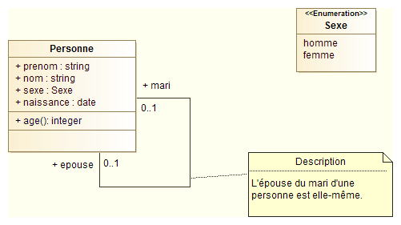

## Les contraintes OCL (3/5) ##


## Les contraintes OCL (4/5) ##

* Contrainte structurelle :

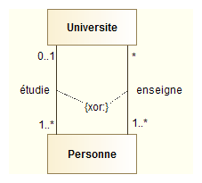


## Les contraintes OCL (5/5) ##

* Pré et post-conditions :


## Les stéréotypes ##

* Raison d'être
	* extension des concepts décrits par UML (le *métamodèle*)
	* définition de nouveaux éléments réutilisables
* Symbole
	* `<< nom du stéréotype>>`
* Exemple : énumération


## Les stéréotypes (2/2) ##

* Quelques stéréotypes définis dans le langage UML :
	* `<<enumeration>>` : classe listant les valeurs possibles d'un type donné
	* `<<interface>>` : classe de description d'un service offert par une classe
	* `<<acteur>>` : classe modélisant un ensemble de rôles joués par un acteur
	* `<<exception>>` : classe modélisant un cas particulier de signal
	* `<<utilitaire>>` : classe réduite au concept de module, non instanciable
 

## La notion d'interface (1/2) ##

* L'année dernière :
	* *L'interface est la partie visible des objets. Par défaut, les attributs d'une classe se doivent d'être cachés de l'extérieur*.

<br/>

* Nouvelle définition :

>  Une interface est définie comme la spécification des opérations visibles d'une classe.


## La notion d'interface (2/2) ##

* Interface :
	* uniquement des méthodes
	* réalisée par la classe qui implémente les méthodes (**lien de réalisation**)

<br/>

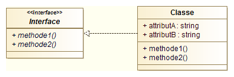


## Interfaces - Exemple 1 ##

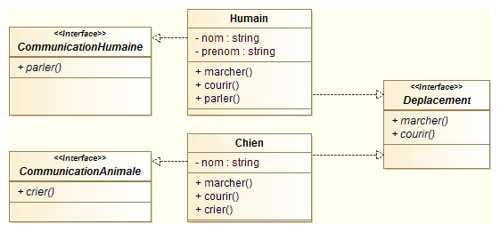


## Interfaces - Exemple 2 ##

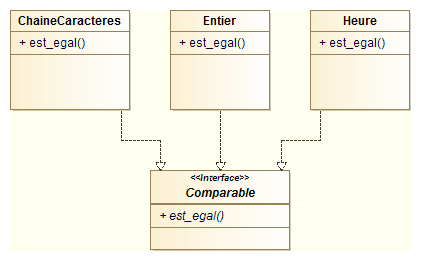


## Interfaces : couplage fort/faible ##

<br/>

* **Couplage faible** : fait de lier une classe à une interface

<br/>

* **Couplace fort** : fait de lier une classe à une autre classe


## Exercice ##

* Modélisation d'un GPS grand public de navigation pour une voiture
	* Diagramme de cas d'utilisation
	* Diagramme de classes
	* Diagramme d'activité


# Conception orientée objet #

## Principes OO ##

* 5 principes l'orientée objet
	* **S**ingle responsibility principle
	* **O**pen close principle
	* **L**iskov substitution principle
	* **I**nterface segregation principle
	* **D**ependency inversion principle


## Principe de responsabilité unique (1/3) ##

> Une classe ne doit posséder qu'une et une seule raison de changer. 

* Objectifs :
	* éviter la rigidité du code
	* flexibilité des évolutions


## Principe de responsabilité unique (2/3) ##
<br/>

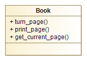


## Principe de responsabilité unique (3/3) ##
<br/>

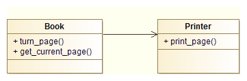


## Principe d'ouverture/fermeture (1/3) ##

> Une classe doit être ouvert aux extensions mais fermées aux modifications.

* Objectif :
	* permettre les ajouts de fonctionnalités...
	* ...sans avoir à modifier le code
	* maintenance facilité


## Principe d'ouverture/fermeture (2/3) ##
<br/>

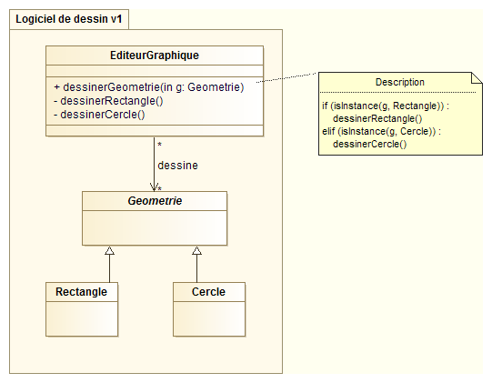


## Principe d'ouverture/fermeture (3/3) ##
<br/>

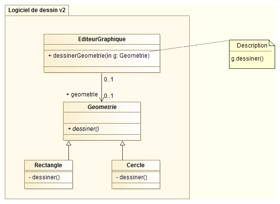


## Principe de substitution de Liskov (1/3) ##

> Les sous-classes doivent pouvoir remplacer leur classe de base.

* Objectifs : 
	* pouvoir utiliser *inconsciemment* des objets dérivés d'une classe mère et de ses classes filles
	* souplesse et adaptabilité du code
* => Héritage = spécialisation


## Principe de substitution de Liskov (2/3) ##
<br/>

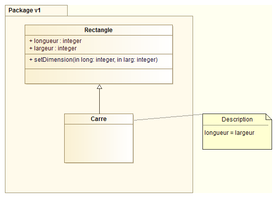


## Principe de substitution de Liskov (3/3) ##
<br/>

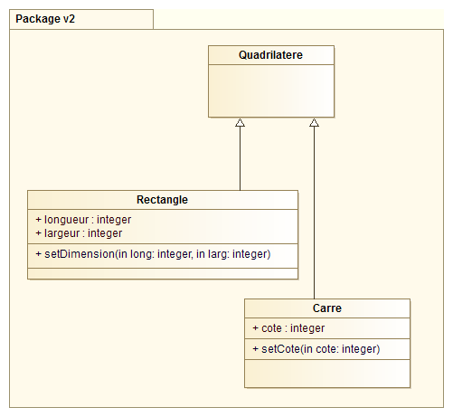


## Principe de séparation des interfaces (1/3) ##

> Plusieurs interfaces client spécifiques valent mieux qu'une seule interface générale. Les classes clientes ne doivent pas être forcées de dépendre d'interfaces qu'elles n'utilisent pas.

* Objectifs :
	* faciliter maintenance
	* faciliter redéploiement
* => Multiplication d'interfaces petites et très spécifiques


## Principe de séparation des interfaces (2/3) ##
<br/>

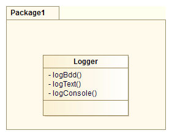


## Principe de séparation des interfaces (3/3) ##
<br/>

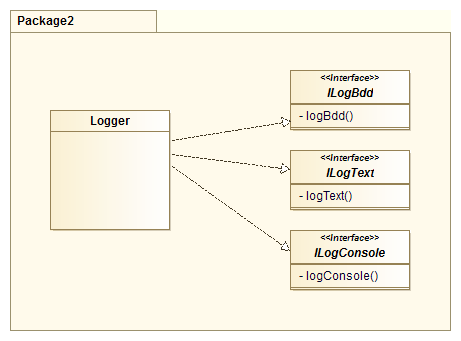


## Principe d'inversion des dépendances (1/3) ##

> Dépendez des abstractions, ne dépendez pas des concrétisations.

* Objectifs :
	* permettre modification des objets
	* limiter couplages entre objets
* => Modules de bas niveau doivent interagir avec des interfaces de modules de haut niveau


## Principe d'inversion des dépendances (2/3) ##
<br/>

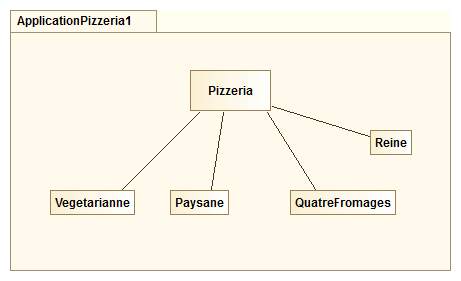


## Principe d'inversion des dépendances (3/3) ##
<br/>

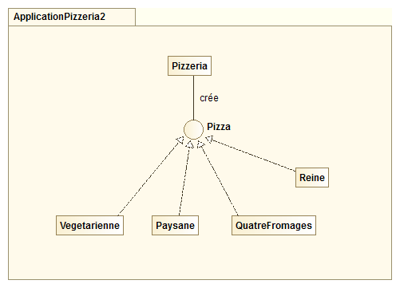


## En pratique ##

* Lignes directrices pour concevoir des applications performantes
* D'autant plus pertinent que les programmes évoluent fréquemment
* Dans la pratique...
	* toujours séparer ce qui varie de ce qui n'est pas succeptible d'évoluer dans le temps
	* c'est en codant, codant, codant... que l'on s'améliore


# Les patrons de conception #

## Généralités ##

* *Design Patterns: Elements of Reusable Object-Oriented Software* (Gang of Four, 1995)
* Solutions génériques à des problèmes récurrents
* **Patrons de conception** ou *design pattern*


## Catégories de patrons ##

* 23 patrons rangés en trois catégories :
	* 5 patrons **de création**, centré sur la création d'objets
		* *Fabrique, Singleton, Prototype...*
	* 7 patrons **de structuration**, ciblés sur la hiérarchie et les relations entre classes
		* *Adapteur, Facade, Décorateur, Composite...*
	* 11 patrons **comportementaux**, décrivants des mécanismes astucieux à mettre en oeuvre pour l'exécution des codes
		* *Observateur, Etat,Strategie, Visiteur, Itérateur, Interpréteur...*


## Caractéristiques principales ##

* *Nom* : augmente le vocabulaire, une idée de solution devient nommée, à ajouter ensuite au catalogue de solutions
* *Problème* : description du contexte et des conditons d’applications du patron de conception
* *Solution* : les éléments de la solution, leurs relations, responsabilités, collaborations; pas de manière précise, mais suggestives...
* *Conséquences* : résultats et compromis issus de l'application de la forme


## Pourquoi utiliser des patrons de conception ? ##

* Avantages :
	* Respect des principes orientés objets
	* Niveau d'abstraction élevé
	* Vocabulaire commun
	* Catalogue de solutions (=> complexité moins grande)
	* Capitalisation de l’expérience
* Inconvénients :
	* Abstraction parfois difficile à mettre en place
	* 23 patrons à connaître
	* Solutions combinant plusieurs patrons


## Le patron Etat ##

> Le patron de conception Etat est utilisé pour modifier le comportement d'un objet lorsque son état interne change. Tout se passera comme si l'objet changeait de classe.

* Quand l'utiliser ?
	* Objet avec un comportement dépendant de son état
	* Opération contenant de nombreuses conditions


## Le patron Etat - exemple (1/5) ##

* Problème étudié :
	* Un système est composé d'une bille et de deux cases (gauche et droite). A l'état initial, la bille se situe dans la case de gauche. A tout moment de la vie du système, l'utilisateur peut déplacer la bille soit à droite soit à gauche. Si la bille se situe déjà dans la case de gauche, l'action de déplacement vers la gauche n'a aucun effet (idem pour la droite).

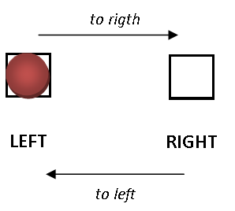


## Le patron Etat - exemple (2/5) ##
<br/>

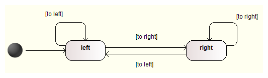


## Le patron Etat - exemple (3/5) ##
<br/>

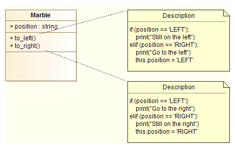


## Le patron Etat - exemple (4/5) ##

* En ajoutant deux cases haut et bas...

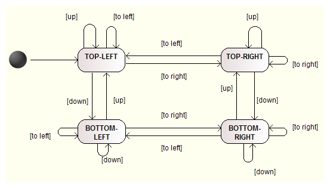


## Le patron Etat - exemple (5/5) ##

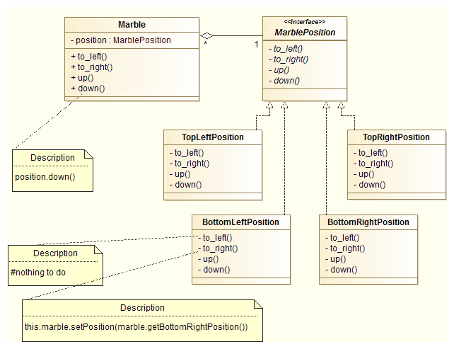


## Modèle du patron Etat ##

* Diagramme de classes du patron :

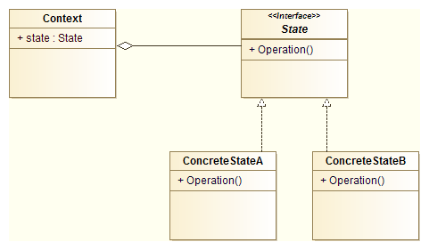


## Exercice ##

* Le démineur


## Le patron Strategie ##

> Le patron de conception Strategie définit une famille d'algorithmes, encapsule chacun d'eux et les rend interchangeables. Stratégie permet à l'algorithme de varier indépendamment des clients qui l'utilisent.

* Nombreux points communs avec le patron Etat
	* Isoler ce qui varie dans des interfaces
	* Utiliser les interfaces
* Quand l'utiliser ?
	* Plusieurs classes liées diffèrent par un comportement
	* Différents algorithmes utilisés pour une problématique donnée

## Modèle du patron Stratégie ##
<br/>


## Exercice ##

* Problématique : simulation d'une ville / modélisation des habitants
	* plusieurs modes de locomotion : marche, vélo, transports en commun
	* parcelles d'habitations localisées
	* nombreux facteurs de choix d'un lieu d'habitation : temps de transport domicile-travail, proximité avec la nature, proximité des équipements, etc.
	* combinaison de facteurs possibles : moins de transport, plus proche des parcs possible, choix moyen
	* plusieurs catégories d'habitants :
		* l'écolo se déplace en marchant et habite proche des parcs
		* le sportif se déplace en vélo et habite proche des parcs
		* la famille nombreuse se déplace en transports en commun et tient compte de tout les facteurs pour le choix de son lieu d'habitation


## Exercice - solution ##

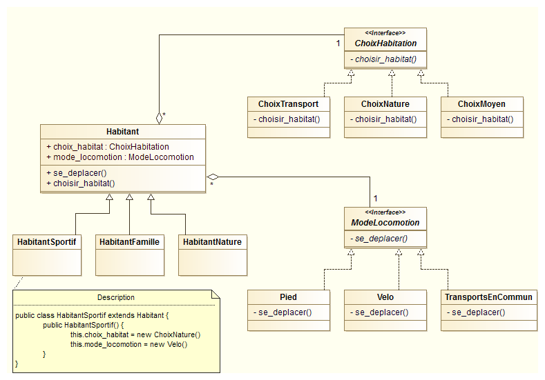


## Le patron Observateur ##

> Le patron de conception Observateur permet de notifier et mettre à jour un ensemble d'objets lorsqu'un objet change d'état, et ce sans pour autant avoir besoin de connaître l'ensemble d'objet à informer.

* Mise à jour des observateurs via une interface commune
* Quand l'utiliser ?
	* Changement d'un objet impactant d'autres objets
	* Notifications d'autres objets inconnus


## Le patron Observateur - Exemple ##
<br/>

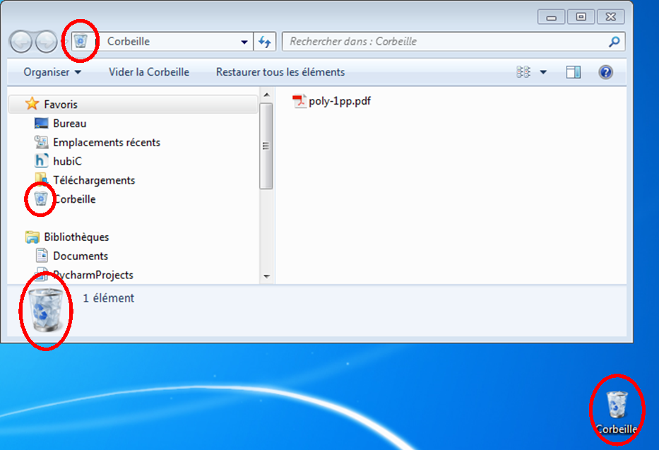


## Modèle du patron Observateur ##
<br/>


## Le patron Observateur - Application ##

* Fils d'actualités dans les réseaux sociaux :

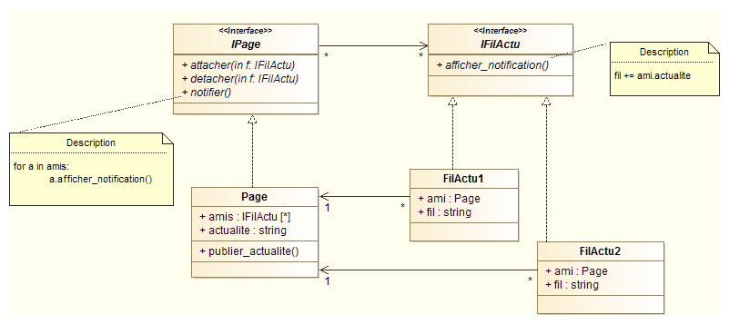


## Exercice ##

Nous désirons modéliser le fonctionnement d'une montre digitale. La montre comporte un affichage et quatre boutons. Trois modes de fonctionnement sont possibles : affichage de l'heure, chronomètre et réglages.

Le bouton A est utilisé pour changer de mode, ce qui s'effectue de manière cyclique : heure => chronomètre => réglages => heure...

Le bouton B est utilisé pour éclairer la montre. Le fonctionnement de ce bouton est identique quel que soit le mode de fonctionnement.

En mode affichage de l'heure, le bouton C permet de passer d'un affichage de l'heure sur 12 ou 24h. Le bouton D quant à lui est inactif.

En mode chronomètre, le bouton C permet de lancer le chronomètre et de prendre des temps intermédiaires. Le bouton D est utilisé pour arrêter le chronomètre. Une pression longue sur le bouton D permet de remettre le chronomètre à zéro. Lorsque la montre est en mode chronomètre, l'affichage est divisé en deux. La partie supérieure montre le temps écoulé depuis le déclanchement tandis que la partie inférieure s'arrête sur le dernier temps intermédiaire. Le chronomètre doit pouvoir continuer de fonctionner lorsque l'on change de mode.

Enfin, en mode réglage, le bouton C permet d'avancer l'heure d'une heure, tandis que le bouton D l'avance d'une minute.


## Le patron Décorateur ##

> Le patron décorateur facilite les évolutions d'une application en permettant d'ajouter facilement des fonctionnalités. Il utilise une combinaison d'héritage et de composition.

* Quand l'utiliser ?
	* Ajouter dynamiquement des fonctionnalités à des objets
	* Modéliser des fonctionnalités qui peuvent être retirées
	* Limiter l'héritage


## Modèle du patron Décorateur ##

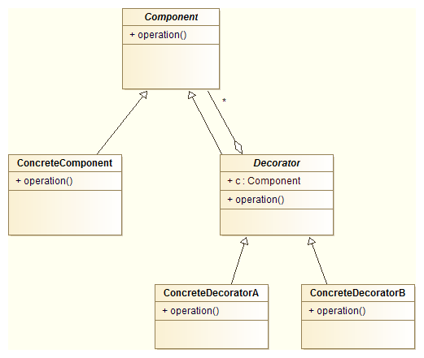


## La patron Décorateur - Exemple (1/6) ##

* Problématique :
	* Application pour une pizzeria qui a mis en place un nouveau concept : les clients peuvent choisir la taille de leur pizza (une ou deux personnes) et l'ensemble des ingrédients qu'ils souhaitent mettre sur leur pizza. Le pizzaiolo se charge de confectionner la pizza et le logiciel de calculer le prix de la commande.


## La patron Décorateur - Exemple (2/6) ##

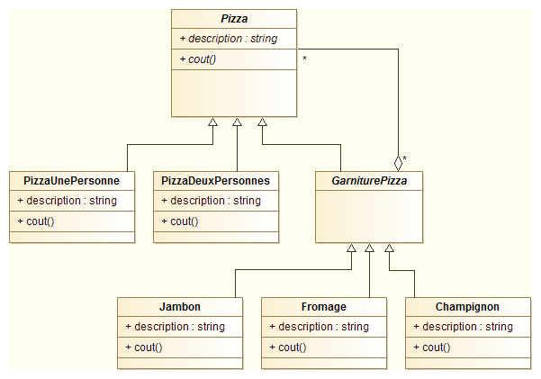


## La patron Décorateur - Exemple (3/6) ##

* Création des classes principales :

``` java
public abstract class Pizza {
    public String description;
    public abstract double cout();
}

public class PizzaUnePersonne extends Pizza {
	public double cout() { 
        return cout = 6.0;
    }
    public String description = "Pizza une personne";
}
```

## La patron Décorateur - Exemple (4/6) ##

* Création de la classe abstraite `GarniturePizza` :

``` java
public abstract class GarniturePizza extends Pizza {
    private Pizza pizza;
    public Garniture(Pizza p) {
        this.pizza = p;
    }
}
```


## La patron Décorateur - Exemple (5/6) ##

* Création d'une classe de garniture :

``` java
public class Jambon extends GarniturePizza {
    public Jambon(Pizza p) {
        super(p);
    }
    public String description += ", Jambon";
    public double cout() {
        return this.pizza.cout() + 1.5;
    }
}
```


## La patron Décorateur - Exemple (6/6) ##

* Instanciation d'une pizza :

``` java
\\ On instancie un objet Pizza
Pizza pizza1 = new PizzaUnePersonne();
\\ Puis on ajoute des garnitures
pizza1 = new Jambon(pizza1);
pizza1 = new Fromage(pizza1);
...
\\ On teste
System.out.println(pizza1.description + " : " + pizza1.cout());
```


## Le patron adaptateur par l'exemple (1/4) ##

* Problématique :
	* Nous réalisons un logiciel de représentation de traces GPS. Ce logiciel comporte un sortie graphique permettant d'afficher les traces dans une IHM.
	* Les traces peuvent être des points (une seule mesure GPS) ou des polylignes.
	* L'utilisateur de l'IHM doit pouvoir modifier la couleur des traces.
	* => Proposez une modélisation de la partie représentation graphique des données.


## Le patron adaptateur par l'exemple (2/4) ##

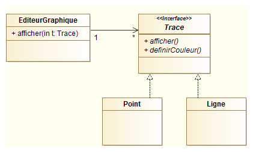


## Le patron adaptateur par l'exemple (3/4) ##

* Problématique (suite) :
	* On nous demande de pouvoir intégrer à l'affichage les surfaces des communes (affichage et choix de la couleur).
	* La classe Commune a déjà été réalisée et nous est transmise.
	* => Proposez une intégration à votre modèle. 
	* Les classes existantes pouvant être utilisées ailleurs dans le code, on veillera à respecter le principe d'ouverture/fermeture pour ne pas introduire de disfonctionnement.


## Le patron adaptateur par l'exemple (4/4) ##

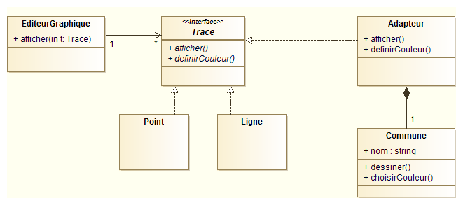


## Le patron adaptateur ##

> Le patron de conception adapteur fournit au client l'interface qu'il attend en utilisant les services d'une classe dont l'interface est différente.

* Quand l'utiliser ?
	* Les noms des fonctions d'une classe à utiliser ne sont pas les bons
	* Les paramètres et types de retours du client et de l'utilisateur sont différents
	* Une classe cliente ne peut plus être modifiée
	* Réutiliser du code ancien dans une nouvelle application


## Modèle du patron adapteur ##

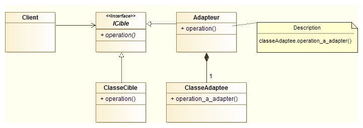


## Le patron façade ##

Les principes de conception orienté objet permettent de développer des applications réutilisables et facilement maintenables. Pour ce faire, elles multiplient généralement le nombre de classes et interfaces, petites et très spécifiques.

Si la maintenabilité du système est garantie, sa complèxité ne fait que croitre. Or bien souvent le client n'utilise qu'une infime partie de code développé. Lui permettre d'utiliser du code simplifié devient alors un enjeu majeur.

> Le patron de conception façade fournit une interface simplifiant l'usage d'un sous-système.


## Modèle du patron façade ##

schéma patron facade


## Le patron itérateur ##

En informatique, un itérateur est un objet permettant de parcourir les éléments contenus dans un autre objet. Souvent cet autre objet est une sctructure de données de type tableau, liste, arbre, etc.

Remarque : dans le contexte de la programmation sur des bases de données, le terme de curseur est employé à la place d'itérateur.

L'itérateur dispose de trois fonctionnalités essentielles : accéder à l'élément courant, se déplacer sur l'élément suivant et déterminer si le conteneur a été entièrement parcouru. Disposer d'un itérateur sur une structure de données permet à l'utilisateur de parcourir cette structure sans avoir besoin de connaître les détails de son organisation.

Cela est très utile lorsque nous souhaitons permettre à une utilisateur de parcourir des données dans un conteneur mais sans avoir à lui en détailler sa structure. Le patron itérateur répond à cette problématique.

> Le patron de conception itérateur fournit un moyen d'accéder de façon séquentielle aux éléments d'une collection.


## Modèle du patron itérateur ##

image patron itérateur


## Le patron composite par l'exemple ##

* Problématique
	* Nous cherchons à modéliser un explorateur de fichiers.
	* L'arborescence est constitués de fichiers et/ou de répertoires, qui peuvent eux même être composés de fichiers et/ou répertoires.


## Le patron composite par l'exemple ##

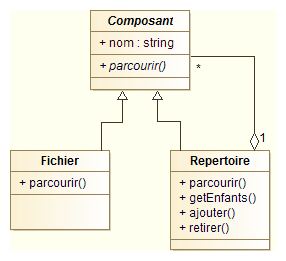


## Le patron composite ##

> Le patron de conception composite définit un modèle de structure arborescente pour un ensemble de composants cohérents. Il permet aux clients de traiter de façon uniforme des objets individuels et des compositions d'objets.

* Quand l'utiliser ?
	* système comportant une hiérarchie avec un nombre de niveaux indéterminés
	* système composé d'éléments pouvant eux-même être composés d'éléments de base

* Exemples : éléments graphiques d'un logiciel de dessin, structures de document, états composite UML


## Modèle du patron composite ##

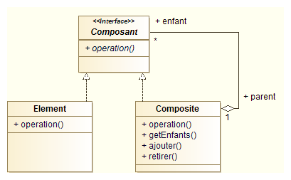


## Le patron fabrique ##

* Design pattern factory
* Déléguer la création des objet à une autre classe plutôt que d'utiliser des `new`


## Modèle du patron fabrique ##


# Modèle-Vue-Contrôleur #

## MVC : présentation ##

* **Modèle / Vue / Contrôleur**
* Méthode de conception d'application
* Construction d'interfaces graphiques en Smalltalk-80
* Formes dérivées
	* MVVC pour le web


## MVC : principe (1/3) ##

* Séparer les développements en trois types d'objets
	*  **modèle** = la logique métier
	*  **vue** = représentation du modèle
	*  **contrôleur** = réactions de l'interfaces aux actions de l'utilisateur
* Faciliter maintenance et réutilisation des IHM


## MVC : principe (2/3) ##

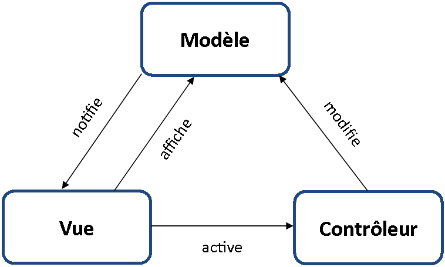


## MVC : principe (3/3) ##

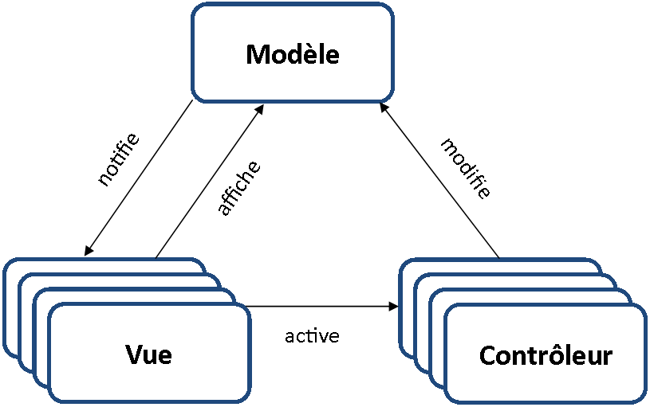


## MVC : exemple ##

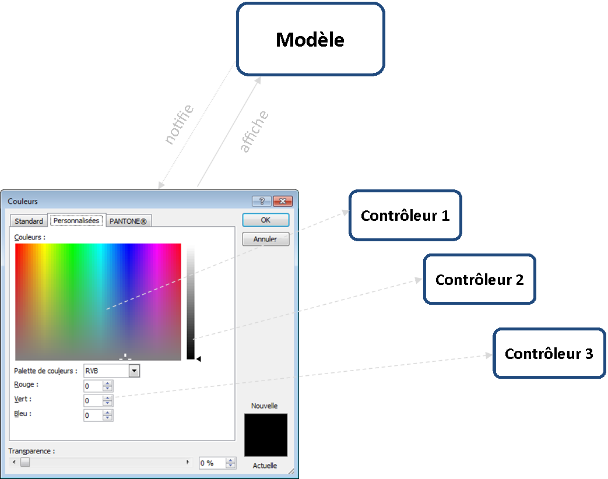


## MVC : exemple ##

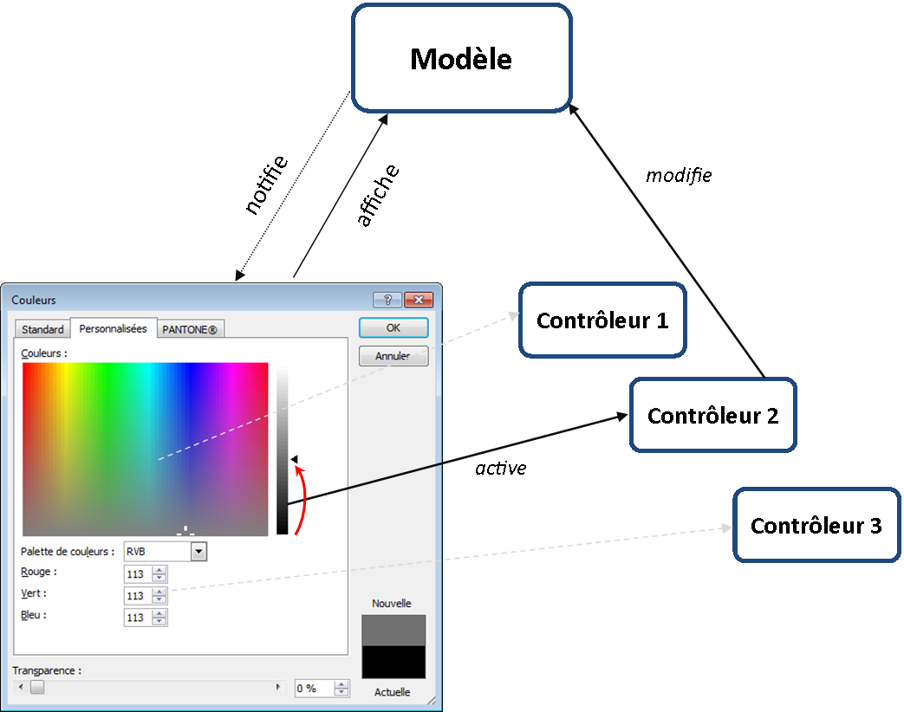


## MVC : exemple ##

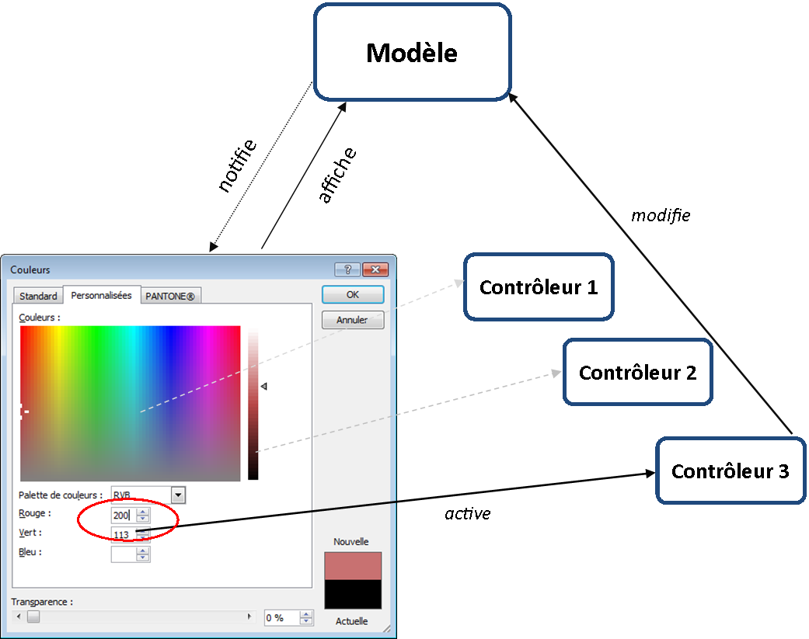


## MVC : exemple ##

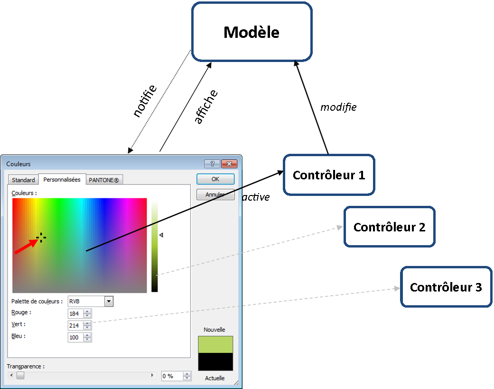


## MVC et patrons de conception ##

* MVC antérieur aux patrons de conception
* Mais réexpliquable en terme de patrons
	* observateur entre les vues et le modèle
	* stratégie entre les vues et les contrôleurs
	* composite dans le cas de plusieurs couples vue/contrôleur
	* fabrique, décorateur...


