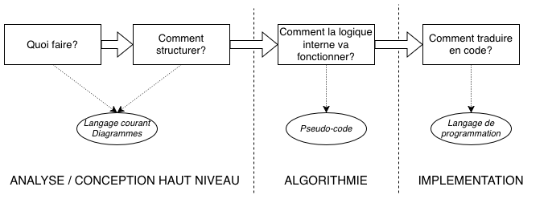
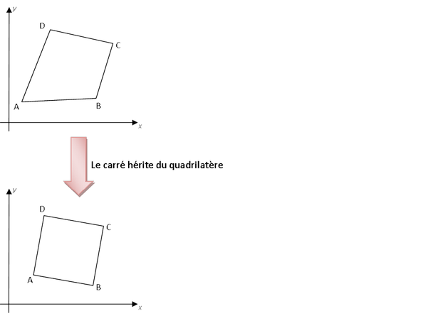
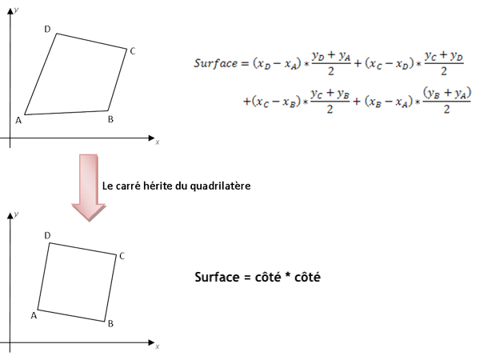
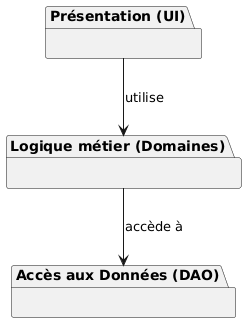
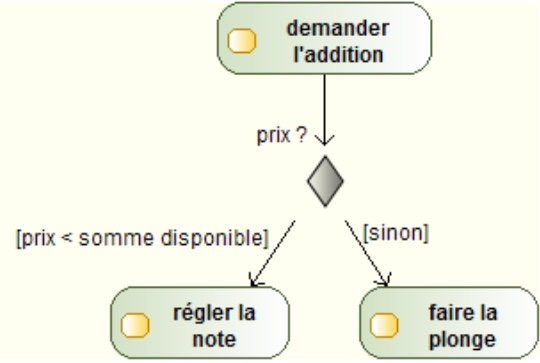
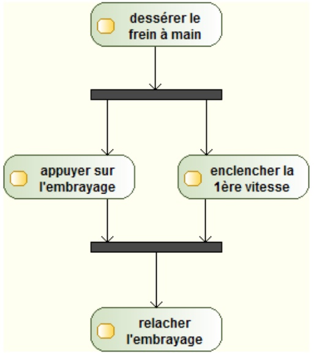

% Analyse informatique
% Centre de compétences technologies des systèmes d'information
% novembre 2025 - v1.3


# Introduction #

Dans le découpage traditionnel en trois grandes phases de la conception de programmes informatiques (analyse -> algorithmie -> implémentation), ce cours traite de la première : l'analyse informatique. Cette phase vise, en partant d'un énoncé en langage courant d'un problème à résoudre, à formuler une modélisation précise de la solution qui pourra être mise en oeuvre.



Avant de s'attaquer à cette problématique d'analyse et de modélisation des systèmes informatiques, il est intéressant de se pencher sur les raisons de l'importance de cette phase en informatique.

En informatique, contrairement à d'autres domaines industriels, le produit fini (c'est-à-dire le logiciel) ne s'use pas, son comportement ne se dégrade pas au cours du temps. Les défaillances du logiciel ne sont jamais imputables à des défauts de matériaux. Ce qui signifie aussi qu'elles sont toujours provoquées par des erreurs humaines lors de la conception, que ce soit lors de la modélisation, lors de l'écriture d'algorithmes ou lors du développement proprement dit. Il n'est dès lors pas possible de négliger l'une de ses phases, au risque de se retrouver avec un programme bloqué par des comportements non prévus.

De plus, comme le logiciel ne dégrade pas au cours du temps, il ne devient obsolète que par rapport à des concurrents proposant des produits plus performants ou face à des usages nouveaux le rendant inadapté. Au début de l'histoire de l'informatique, les programmes étaient relativement *simples*. Il était alors relativement aisé par la personne l'ayant conçu de le faire évoluer pour le maintenir compétitif. Puis à partir des années 1970, les programmes se sont complexifiés, les équipes travaillant dessus ont grossi. Cette tendance s'est accélérée au cours des années 1980, si bien qu'il est devenu de plus en plus souvent nécessaire de faire évoluer les programmes. A tel point que si ces possibilités d'évolutions du logiciel n'avaient pas été prévues dès le départ, il devenait très compliqué de maintenir les programmes. La phase d'analyse n'était plus négligeable.
Aujourd'hui le développement des plateformes web, comme Facebook, Airbnb, Uber ou Leboncoin, ressemble plus à un processus continu s'étalant sur plusieurs années, sans que l'ensemble des fonctionnalités ne soient connues initialement. Ce qui renforce d'autant plus le besoin de développer des solutions qui seront ouvertes aux évolutions.  

Quelques chiffres viennent appuyer ces affirmations. Depuis les années 1990, le cabinet de conseil en informatique Standish Group mène des études sur la réalisation des projets informatiques en entreprise (*Chaos Report*[^1]). Les chiffres de ces études nous apprennent que seul un tiers des projets sont considérés comme des succès. Les deux tiers restant étant soit des échecs totaux (abandon du projet) pour 20%, soit des résultats mitigés (périmètre de l'application réduit) pour 40%. Ces études nous apprennent également que la phase de développement initial ne représente que 30% du coût du logiciel (17% pour la correction de bogues et 53% pour la maintenance).

[^1] Quelques articles sur le Chaos Report du Standish Group:
- https://bestofbusinessanalyst.fr/pourquoi-projets-it-echecs/
- https://www.successthroughsafe.com/blog-1/2021/11/13/standish-chaos-report-2021
- http://alain.battandier.free.fr/spip.php?article18

Ce cours se concentrera sur la modélisation des systèmes informatiques qui a pour but :

* d'élaborer la structure des programmes;
* de s'assurer que les exigences initiales ont bien été respectées;
* de maintenir les logiciels.

Après avoir énoncé quelques généralités sur les manières de programmer et introduit le concept de programmation orientée objet qui répond aux problématiques de maintenance des systèmes informatiques, nous utiliserons l'Unified Modeling Language (UML) pour modéliser ces systèmes. 


\newpage

# Introduction à la programmation orientée objet #

## Langages et paradigmes de programmation ##
Ceux qui ont déjà un peu programmé savent peut-être qu'il n'existe pas qu'une seule manière de programmer. Un **paradigme** de programmation est un style de programmation informatique que le développeur peut employer avec un langage de programmation pour résoudre un problème. Un langage de programmation peut être défini par plusieurs paradigmes.

En programmation **impérative**, le programme est découpé en instructions exécutées les unes à la suite des autres. Des branchements, avec ou sans condition, permettent de passer à une autre bloc d'instructions, tandis que des bouclages permettent de répéter plusieurs fois un bloc d'instructions. C'est la manière la plus naturelle d'exprimer un calcul pour une machine. Dans le monde réel, une recette de cuisine est un exemple de programme impératif (*faire fondre le beurre / lorsque le beurre est fondu ajouter le chocolat / ajouter les oeufs*).
Les premiers langages de programmation (Algol 58, BASIC) fonctionnaient ainsi, car c’était la manière la plus directe de contrôler une machine. Mais à mesure que les programmes grossissaient, les instructions s’enchaînaient par centaines, voire milliers. Modifier quelque chose devenait risqué : changer une étape pouvait perturber tout le reste, car tout dépendait de tout.

Pour tenter de remédier à ce chaos, les programmeurs ont commencé à ranger les instructions qui allaient ensemble dans des ensembles qu’on appelle des procédures. C'est le paradigme **procédural** (utilisé en C, Pascal ou Fortran). Chaque procédure correspond à une tâche identifiable : `faireFondreBeure()`, `ajouterChocolat()`, etc.
Cela rend le programme plus clair : on découpe un grand problème en plusieurs petits morceaux réutilisables. On peut ainsi faire appel à une fonction sans avoir besoin de connaître ses détails internes (un peu comme on appelle une machine à laver sans savoir comment elle tourne).
Mais il restait une difficulté : les données (les informations manipulées, comme la température du beurre ou la quantité de chocolat) étaient partagées un peu partout. Chaque fonction pouvait les modifier librement, ce qui rendait les programmes fragiles. Changer un détail dans la manière de stocker une donnée pouvait obliger à revoir plusieurs fonctions, ce qui rendait la maintenance toujours un peu risquée.

En programmation **fonctionnelle**, un programme est pensé comme une série de transformations successives (ou composition de fonctions, au sens mathématique du terme). Chaque fonction prend une valeur d’entrée, calcule un résultat, et le transmet à la suivante, sans modifier l'environnement autour. On pourrait ici faire l'analogie avec une chaîne de montage où chaque fonction est un poste de travail qui prend une pièce (des données), effectue une seule transformation (sans se soucier de ce qui s'est passé avant ou après), et la passe au poste suivant.
Cette approche évite les effets secondaires et facilite la compréhension du calcul. Elle est née très tôt (langage LIST dans les années 1950) et, même si elle reste plus abstraite, certaines de ses idées (comme les fonctions réutilisables et les calculs sans effet de bord) se retrouvent dans de nombreux langages modernes.

La programmation **objet** vise à définir chaque brique d'un logiciel et ses interactions comme un objet, regroupant à la fois les données (ce qu'il possède) et les fonctions qui les manipulent (ce qu'il sait faire). Dans la vie réelle, cela revient à considérer le programme informatique comme une équipe d'experts : au lieu d'une longue liste d'instructions, on donne un ordre à un expert ("cuisinier: couper -> oignons", "commis: laver -> assiettes"), et il exécute la tâche car il détient les compétences et les outils nécessaires.
Ce paradigme objet voit le jour dans les années 1960 (langage Simula-67) et se développera largement lors des décennies suivantes (Java, Python, C++). En effet, en encourageant la réutilisation des développements, il facilite grandement la maintenance des programmes informatiques.


## Grands principes de l'orienté objet ##
Avant d'aborder la présentation d'UML, ce chapitre revient sur les fondements de la méthode de programmation dite orientée objet.

Si l'approche fonctionnelle tente de résoudre un problème en le découpant en sous-problèmes, eux-mêmes découpés en sous-sous-problèmes... jusqu'à arriver à des briques élémentaires facilement maîtrisables, à l'inverse, l'approche orientée objet vise en premier à identifier les structures de données intervenant dans le problème à résoudre, pour ensuite établir les interactions entre ces structures. Sans grande surprise, la structure de données élémentaire de l'approche orientée objet est l'*objet*. 

> Un **objet** est une entité autonome, aux frontières précises, décrit par une collection de propriétés et de traitements associés.
>
> * Un objet possède une identité (sa référence unique en mémoire, qui le distingue des autres, même s'ils partagent le même nom ou les mêmes attributs).
> * Un ensemble d'attributs caractérisent l'état de l'objet.
> * Un ensemble d'opérations en définit le comportement.

Exemples : 

* le point de coordonnées (2, 3) est un objet. Il est défini par des propriétés : x=2 et y=3. Certaines opérations sont possibles sur ce point : le déplacer ou calculer la distance à un autre point.
* le bouton "Enregistrer" du ruban supérieur de Word est un objet. Il possède une dimension, des coordonnées, une icone. Une méthode est associée au clic sur ce bouton (elle déclenche l'enregistrement du document).
* la personne Paul Higone, né le 12/03/1990, est un objet.


Dans le modèle orienté objet, les objets sont créés selon des modèles appelés *classes*.

> Une **classe** est un type de donnée abstrait destiné à décrire une structure d'objets, caractérisé par des attributs et des méthodes.
> 
> * un objet est créé selon le modèle d'une classe : l'objet est une **instance** de classe.

Exemples :

Un point, un bouton, une personne sont des classes. Elles définissent respectivement des structures pour les objets points de coordonnées (2, 3), bouton "Enregistrer" du ruban supérieur de Word et Paul Higone.

3 grands principes viennent ensuite régir les liens entre classes en programmation orientée object : encapsulation, héritage et polymorphisme. 

> L'**encapsulation** est un concept de l'orienté objet qui consiste à masquer les détails de l'implémentation d'un objet à son utilisateur.
> 
> * La partie visible de l'objet est appelée **interface**.
> * L’encapsulation facilite l’évolution des applications en permettant de faire évoluer l'implémentation d'un objet dans modifier son interface.
> * Elle garantit l’intégrité des données en permettant d'interdire l'accès direct à certains attributs.

Le principe de l'encapsulation peut être vu comme une transposition, dans l'univers de la programmation orientée objet, de principe déjà appliqués dans d'autres secteurs de l'industrie. Si les composants d'une voiture en interaction avec le conducteur (volant, pédales, etc.) n'ont que très peu évolué depuis de nombreuses années, il n'en est pas de même des moteurs qui ont largement été améliorés.
Volants, pédales, etc. représentent l'interface de la voiture, tandis que le moteur en est l'implémentation. L'implémentation (le moteur), masquée au conducteur, peut évoluer sans modifier la manière de conduire.


Autre exemple informatique, un nombre complexe peut être représenté de différentes manières : cartésienne x + i.y ou polaire k.e^{i.r}. Il est toujours possible de passer d'une forme à l'autre et de calculer partie réelle, partie imaginaire, module ou argument. Si un programmeur souhaite créer une classe pour manipuler les nombres complexes, il aura donc le choix de la forme utilisée (cartésienne ou polaire). Il s'agit d'un choix d'implémentation. Celle-ci sera masquée à l'utilisateur qui, lorsqu'il manipulera un objet nombre complexe, pourra toujours revenir à l'une ou l'autre des deux formes. Parties réelle et imaginaire, module et argument constituent l'interface de la classe.


> L'**héritage** est un principe autorisant la création d'une classe dérivée à partir d'une classe existante.
>
> * Les attributs et méthodes de la classe existante sont transmis à la classe dérivée.
> * Ce principe encourage la réutilisation, il permet de créer des classes généralistes et de leur ajouter des spécificités.
> * Nous utiliserons aussi les termes de classe *mère* ou *parente* pour la classe existante et de classe *fille* pour la classe dérivée.

L'héritage est aussi appelé la relation *est un type de*.

La classe Carré hérite de la classe Quadrilatère : on dit qu'un carré est un type de quadrilatère. Les méthodes et propriétés du quadrilatère sont automatiquement transmises au carré : composition de 4 points, surface, déplacement d'un sommet...



> Le **polymorphisme** est la faculté de pouvoir redéfinir dans une classe dérivée les méthodes héritées de la classe parente.
>
> * Il permet une programmation plus générique : possibilité d’utiliser toujours la même fonction sur plusieurs types d’objets.
> * Ce principe autorise, dans le cas de l’héritage, à spécifier un comportement général hérité de la classe mère.

Considérons la classe parente Quadrilatère avec une méthode pour calculer sa surface. La classe fille Carré redéfinit cette méthode en simplifiant la formule. Si l'on place un Quadrilatère et Carré dans une liste de forme géométriques et qu'on appelle la méthode pour calculer la surface sur chacun d'eux, le programme saura automatiquement appliquer la formule correcte pour chaque objet. Le code d'appel est générique, mais le comportement est spécifique.



En résumé, l'approche orientée objet s'attache à décrire les objets qui interviennent dans un système. La classe est un modèle pour construire des objets. La mise en oeuvre d'une modélisation orientée objet fait intervenir trois grands principes, l'encapsulation, l'héritage et le polymorphisme, qui visent à faciliter les évolutions des programmes. Mais la décomposition d'un problème selon une approche objet n'est pas toujours très intuitive, d'où la nécessité de disposer d'outils pour nous aider à aborder l'approche objet et à représenter les systèmes modélisés. 


\newpage

# Le langage de modélisation UML #

## Naissance d'UML ##
L'approche fonctionnelle visait à découper un programme en sous-programmes, à leur tour découpés autant de fois que nécessaire pour arriver à des briques élémentaires contrôlables (on parle parfois d'approche *descendante*).


L'approche fonctionnelle présente l'avantage d'être assez naturelle à mettre en oeuvre. Mais elle ne se prête pas facilement à l'évolution des logiciels : il n'est pas facile d'identifier la partie du code à modifier et la moindre petite évolution peut requérir des changements dans de nombreuses parties du code.


L'orienté objet naît de l'idée de regrouper au même endroit les choses qui vont ensemble (les composants d'un programme et les traitements associés). Il découpe pour ce faire un programme en structures élémentaires qu'il fait ensuite interagir (approche qualifiée d'*ascendante*). A l'inverse de l'approche fonctionnelle, l'approche objet est beaucoup moins intuitive car elle impose de penser le système en termes d'entités (les "acteurs" ou "sujets", c'est-à-dire les *NOMS*) plutôt qu'en termes d'actions à exécuter (les *VERBES*).

Pour appliquer ce modèle de développement, il devient rapidement nécessaire de disposer d'outils pour aider à la modélisation. A mesure que ce modèle de conception se répand au cours des années 1980, plusieurs méthodes et outils visant à faciliter la modélisation orientée objet voient ainsi le jour. 

En 1995, deux grandes méthodes utilisées jusqu'alors (OMT-2 de James Rumbaugh et Booch'93 de Grady Booch) s'associent pour donner naissance à UML 0.8. La méthode OOSE d'Ivar Jacobson rejoint le projet l'année suivante qui, avec le soutien de partenaires industriels puissants (HP, IBM, Microsoft, Oracle, etc.), donne naissance à UML 0.9. C'est la période d'unification des méthodes de conception orientée objet qui abouti en janvier 1997 à la version 1.0 d'UML. Cette version est soumise à l'Object Management Group (OMG[^2]; organisme ayant pour but de promouvoir l'approche objet). La version 1.1 sera adoptée en novembre 1997 et s'impose comme un standard de l'industrie.

[^2] https://www.omg.org/


UML sera alors adopté par un nombre toujours croissant de développeurs et continuera par ailleurs son évolution. Après plusieurs versions intermédiaires, la version 2.0 est publiée en 2003. Nous en sommes maintenant[^3] à la version 2.5 et UML est largement adopté dans le monde de l'informatique.

[^3]: novembre 2024.


## Présentation générale d'UML ##
Unified Modeling Language (UML) est un langage graphique de conception orientée objet qui permet de décrire l'intégralité d'un système informatique, de sa conception au déploiement sur des machines. UML intègre par ailleurs des possibilités d'extension permettant de couvrir des spécificités de domaines particuliers (c'est le cas des données géographiques par exemple).


Il est important de noter qu'UML est uniquement un langage de modélisation (un ensemble de règles et de symboles pour dessiner les plans du logiciel). Il ne s'agit pas d'une méthode de développement (comme Scrum ou le Cycle en V), car il ne dicte pas la façon dont le projet doit être organisé.

UML a été conçu de manière à être compréhensible à la fois par l'homme et par la machine. Ses diagrammes sont ainsi composés de formes géométriques simples facilement compréhensibles par un humain, mais également interprétables par un ordinateur.

Le langage UML dans sa version 2 se compose de 14 diagrammes :

* 7 diagrammes structurels permettent de décrire l'anatomie du système : de quoi le système est-il fait ? Ils décrivent les composants, les classes et les fonctionnalités attendues ou permises par l'application.
* 7 diagrammes comportementaux concourent à la description de la physiologie du système : que fait le système et comment ? Ils décrivent la dynamique et les interactions entre les différents éléments d'un système.


Chacun de ces diagrammes couvre une partie de la conception de systèmes informatiques ou apporte une vision différente sur ce système. Modéliser à l'aide d'UML ne signifie pas qu'il faudra systématiquement réaliser l'intégralité des diagrammes (cela sera d'ailleurs rarement le cas). Il s'agira plutôt d'identifier quels diagrammes apportent une réponse pertinente à la problématique que nous cherchons à représenter.

Nous noterons également qu'UML supporte largement l'abstraction. En fonction des situations, nous représenterons plus ou moins de détails dans un diagramme. Tout le travail sera donc de déterminer quels diagrammes sont utiles à notre problème et quelles informations il est pertinent d'y faire figurer.

### Les diagrammes structurels ###
* Diagramme de classes : représente l’architecture conceptuelle du système en décrivant les classes
que le système utilise et les liens entre classes
* Diagramme de composants : décrit l’organisation et les dépendances entre les composants
physiques du système (fichiers, bibliothèques, bases de données, etc.)
* Diagramme de structure composite : décrit la structure interne d’un objet complexe
* Diagramme de déploiement : détaille les éléments matériels du système et la répartition de la
partie logicielle sur ce matériel
* Diagramme d’objets : illustre une instanciation des classes définies dans le diagramme de classes
à un instant précis de l’exécution du système
* Diagramme de package : représente l’organisation en paquetages du projet
* Diagramme de profil : permet de spécialiser, de personnaliser , pour un domaine particulier un
méta-modèle de référence d’UML

### Les diagrammes comportementaux ###
* Diagramme de cas d'utilisation : identifier et clarifier les fonctionnalités que doit fournir un logiciel
* Diagramme d'états-transitions : montre la manière dont l'état d'un système est modifié en fonction
des événements
* Diagramme d'activité : décrit sous forme de flux ou d'enchaînement d'activités le comportement du
système
* 4 diagrammes d’interactions : sous catégorie de diagrammes comportementaux mettant l'accent
sur les interactions entre les éléments du système :
    * Diagramme de séquence : détail des échanges et interaction entre composants d’un système. C'est le plus utilisé des diagrammes d'interactions.
    * Diagramme de communication : représentation simplifiée de l'échange de messages entre
les objets
    * Diagramme global d’interaction : diagramme d'activité où les noeuds représentent des
diagrammes de communication
    * Diagramme de temps : diagramme d'interaction où l'accent est mis sur les contraintes de
temps.


\newpage

# Modélisation structurelle #

## Le diagramme de cas d'utilisation ##
### Préambule ###
Le diagramme de cas d'utilisation est souvent placé à la frontière entre l'analyse fonctionnelle et la modélisation structurelle. Notre découpage précédent le plaçait d'ailleurs dans la liste des diagrammes comportementaux, alors qu'il apparaît ici dans la partie sur la modélisation structurelle.

### Objectifs du diagramme ###
Le recueil d'informations sur les besoins d'un client donne souvent lieu à des informations de niveaux variés et en quantités très inégales. Se baser sur ces seules informations pour mener un projet conduit à des frustrations de la part du développeur dont le travail n'est pas justement valorisé, mais également du client qui ne voit pas ses attentes réalisées.

Le diagramme de cas d'utilisation répond à cette problématique de modélisation des besoins des utilisateurs. Il offre une vision des *grandes fonctionnalités* proposées par l'application aux utilisateurs de celle-ci. 

L'objectif de ce diagramme est de structurer et de clarifier les besoins du client : il doit se limiter à identifier les fonctionnalités principales et ainsi à définir le contour du système, sans chercher à lister toutes les fonctions que le système doit réaliser ni à détailler les solutions d'implémentation. Dans le cas de systèmes complexes en particulier, hiérarchiser et simplifier l'information pour rendre compte des besoins avec un haut niveau d'abstraction est indispensable. Enfin, il ne s'agit pas dans ce diagramme de représenter un enchaînement temporel d'actions, ni de détailler les entrées/sorties du système.

Le diagramme de cas d'utilisation est un diagramme central qui sert de fil rouge tout au long des développements pour s'assurer ques les fonctionnalités initialement identifiées sont bien implémentées.

/begin{note}
**Clarification sur la classification du Diagramme de Cas d'Utilisation**

Le lecteur attentif aura remarqué que dans la spécification officielle UML de l'OMG, le diagramme de cas d'utilisation est classé parmi les diagrammes comportementaux alors qu'il apparait ici dans une partie sur la modélisation structurelle. Il faut bien y voir là une incohérance.

En pratique, le diagramme de cas d'utilisation se situe à la frontière entre besoins et conception. Une démarche d'ingénierie sérieuse ne peut pas commencer à réfléchir à la structure d'une application sans avoir au préalable défini ce que l'utilisateur attend.

C'est pourquoi, par pragmatisme d'ingénierie (et pédagogique), nous le traitons ici au début de la modélisation structurelle : il est le pont entre la collecte des besoins et la conception détaillée.
/end{note}

### Eléments de base d'un diagramme de cas d'utilisation ###
Le diagramme de cas d'utilisation est composé de *cas d'utilisation* qui forment le *contour du système* et d'*acteurs*.

#### Le cas d'utilisation ####
Un cas d'utilisation est une séquence d'actions destinées à répondre à un besoin précis d'un utilisateur. Il est en général exprimé à l'aide d'une phrase courte du type "verbe à l'infinitif + complément".


Un cas d'utilisation peut être structuré en sous-cas d'utilisation à l'aide deux types de relations :

* la relation d'inclusion (*include*) : le cas d'utilisation contient nécessairement le ou les sous-cas de destination. Cette relation permet de décomposer un cas complèxe en sous-cas plus simples;
* la relation d'extension (*extend*) : le sous-cas d'utilisation étend les objectifs du cas d'utilisation de destination. La relation d'extension peut être vu comme une fonctionnalité optionnelle.

Les relations d'inclusion et d'extension sont représentées à l'aide de flèches pointillées à côté desquelles est indiqué le type de relation. La flèche d'inclusion va du cas général au sous-cas tandis que la flèche d'extension va du sous-cas vers le cas d'utilisation général.


Une relation d'inclusion ou d'extension peut être partagée par plusieurs cas d'utilisation d'origine.

#### L'acteur principal ####
Un acteur est une entité (personne humaine, dispositif matériel ou logiciel) interagissant avec l'application en échangeant de l'information avec celle-ci. Un acteur peut jouer plusieurs rôles vis-à-vis d'un même système. Lorsque l'activité du système a pour objectif de satisfaire des besoins d'un acteur, l'acteur sera qualifié de principal.

L'acteur est représenté par un bonhomme. Son rôle est indiqué en dessous du bonhomme.


La seule relation possible entre deux acteurs est la *généralisation*. Un acteur A est une généralisation d'un acteur B si l'acteur A peut être substitué par l'acteur B, l'inverse n'étant pas vrai.

Par exemple, sur un forum un modérateur est un usager particulier, mais à l'inverse un usager quelconque ne peut pas se substituer à un modérateur.


#### Le contour du système ####
L'ensemble des cas d'utilisation définissent le contour (ou frontière) du système. Il est symbolisé par un trait englobant tous les cas d'utilisation. Le nom du système est précisé en haut à gauche.

Prenons l'exemple d'une application de remontés d'informations collaboratives sur des incidents dans les transports. Trois types d'utilisateurs se connectent l'application : le visiteur "simple", le modérateur et le gestionnaire de l'application.

* Le visiteur peut consulter les cartes disponibles sur l'application. Il peut effectuer une recherche d'itinéraire entre deux points de départ et d'arrivée. Enfin, lorsqu'il constate un incident sur le réseau, il peut le signaler à l'application.
* Le modérateur peut également effectuer chacune de ces actions. Le modérateur est un visiteur particulier. De plus, lorsqu'un incident est signalé par un visiteur, le modérateur peut valider ou pas cet incident pour le rendre visible par tous les visiteurs sur le fond de carte. 
* Le gestionnaire peut mettre a jour le réseau (ajouter, supprimer ou modifier un tronçon). Il s'agit de la seule action que le gestionnaire peut effectuer. Pour ce faire, il doit nécessairement se connecter à l'application à l'aide d'un identifiant/mot de passe.


#### Les acteurs secondaires ####
Un acteur est dit principal lorsqu'il est à l'initiative des échanges nécessaires pour réaliser le cas d'utilisation. Lorsque la réalisation du cas d'utilisation fait appel à d'autres acteurs (généralement d'autres systèmes informatiques connectés), nous parlons alors d'acteurs secondaires.

Dans l'exemple précédent d'application de calcul d'itinéraires, le visiteur est un acteur principal. L'application doit lui permettre de rechercher un itinéraire (fonctionnalité attendue). Pour réaliser cette fonctionnalité, le système va se connecter à une base de données contenant les informations sur le réseau routier. Cette base de données est un acteur secondaire du système. 

Les acteurs secondaires sont traditionnellement positionnés à droite du système avec lequel ils interagissent. Nous précisons qu'il s'agit d'acteurs secondaires en ajoutant `<<secondary>>` à gauche du rôle.


\newpage

## Le diagramme de classes ##

### Objectifs du diagramme ###
Alors que le diagramme de cas d'utilisation sert à montrer à quelles attentes le système répond, le diagramme de classes est utilisé pour représenter les structures de données intervenant dans le système et les relations entre elles. A ce titre, il est constitué de *classes* et d'*associations*.

Il s'agit de représenter de manière visuelle le monde que nous cherchons à modéliser. A ce stade, la modélisation reste toutefois statique : nous ne décrivons pas les interactions, ni cycles de vie des objets.

Les concepts de l'approche orientée objet (*héritage*, *agrégation*, *encapsulation*) sont appliqués pour établir le diagramme de classes.

### La classe ###
#### Définition ####
La classe définit la structure des objets composant le système. Elle possède des propriétés (attributs et méthodes) et permet de créer les objets ayant ces propriétés.

Elle est représentée par un rectangle portant le nom de la classe. Si la classe possède des attributs et/ou des méthodes, ils sont ajoutés dans des cases en dessous du nom.


#### Attributs ####
Le principe d'encapsulation de l'orienté objet stipule que les attributs d'une classe sont masqués à l'intérieur de la définition de la classe et ne peuvent être manipulés directement dans les autres classes. 

Les règles de **visibilité** complètent ou précisent la notion d'encapsulation. Elles permettent également d'assouplir le degré d'encapsulation ou de protection des attributs. Trois niveaux de visibilité sont possibles : 

* **privé** : la partie privée de la classe est totalement opaque et seul les objets eux même peuvent accéder aux attributs placés dans la partie privée;
* **protégé** : ces attributs sont alors visibles à la fois par les objets-eux même et par les instances des classes dérivées de la classe mère. Pour toutes les autres classes, ces attributs restent invisibles;
* **publique** : les attributs sont visibles dans toutes les classes, ce qui revient à se passer de la notion d'encapsulation.

Le niveau de visibilité est précisé, dans les représentations graphiques des classes, au moyen des caractères +, # et - qui correspondent respectivement à public, protégé et privé. Il n'y a pas de visibilité par défaut et il est donc obligatoire de la préciser.

L'intérêt de déclarer des attributs publics, et donc de ne pas respecter le principe d'encapsulation, est par exemple de réduire le temps d'accès à ces attributs : il n'est plus nécessaire de passer par des méthodes de lecture et mise à jour d'attributs.

Les attributs sont **typés**, c'est à dire qu'un attribut peut stocker des données d'un type défini. Les principaux types simples sont les suivants : 

* Caractère (`character`)
* Chaîne de caractères (`string`)
* Nombre (`number`)
	* Entier (`integer`)
	* Réel (`float`)
* Date (`date`) et instant (`time`)
	* Instant daté (`datetime`)
* Booléen (`boolean`)
* Identifiants (`genericname`)

Les attributs d'une classe peuvent présenter une **multiplicité**, qui définit le nombre de valeurs possibles pour l'attribut.

Par exemple, pour stocker les coordonnées x et y d'un point, deux possibilités s'offrent à nous :

* utiliser deux réels x et y : `x: float` et `y: float`
* utiliser un tableau de deux réels : `coord: float[2]`


Un attribut peut avoir une **valeur par défaut**, qui est dans ce cas écrit à la fin de la ligne et précédée du signe `=`.

Par exemple, si l'on modélise une classe `Route` pour gérer un réseau routier, il peut être intéressant d'indiquer que par défaut le nombre de voies est égal à 2. Nous écrirons dans les attributs de la classe :

```
- nb_voies: integer = 2
```

Notons également l'existence d'attributs dont la valeur est toujours dépendante du contenu d'autres attributs et ne peut pas être renseignée par l'utilisateur : les **attributs dérivés**. Dans ce cas, l'attribut est précédé du signe `\`.

Par exemple, pour la classe `Rectangle` suivante, la surface n'est pas un attribut classique car il n'est pas possible de la modifier. Elle dépend toujours de la longueur et de la largeur du rectangle.


Finalement, la syntaxe générale pour les attributs d'une classe est la suivante (les mentions optionnelles étant entre accolades) :

```
{-, #, +} {/} nom_attribut : type_attribut {[multiplicite]} {=valeur_par_defaut}
```

#### Les méthodes ####
Les méthodes définissent le comportement des instances d'une classe. Elles peuvent modifier la valeur des attributs ou encore retourner des résultats.

La syntaxe pour les méthodes d'une classe est similaire à celles des attributs :

```
{-, #, +} nom_methode ({nom_param1: type_param1, nom_param_2: type_param2, ...}){: type_retour}
```

`{nom_param1: type_param1, nom_param_2: type_param2, ...}{: type_retour}` est la signature de la méthode.

Par exemple, la classe `Point` suivante possède une méthode `deplacer()` permettant de déplacer une instance de Point de `(dx, dy)`.


### Les relations entre classes ###
Nous distinguons plusieurs types de relations entre classes : l'*association*, l'*héritage*, l'*agrégation* ou la *composition*.


#### L'association ####
L'association est utilisée pour représenter un lien possible entre instances de classes. Elle est nommée pour indiquer la nature du lien symbolisé et est représentée à l'aide d'un trait simple entre les deux classes.


Il est aussi possible de donner à chaque classe un **rôle** dans la relation. Cela est utile pour préciser le contexte ou lorsque plusieurs associations concernent les mêmes classes.

Lors de l'implémentation du modèle UML dans un langage de programmation, le rôle est traduit en un attribut de la classe d'objets.


Les **multiplicités** d'une association ajoutent une contrainte sur le nombre d'objets impliqués dans une relation (on parle également de *cardinalité*). Elles sont indiquées aux extrémités des associations. La syntaxe est la suivante :

```
multiplicité_min .. multiplicité_max
```

Sachant que :

* l'on utilise `*` pour indiquer un nombre indéterminé
* `n..n` (ou `*..*`) se note aussi `n` (ou `*`)

Quelques exemples de multiplicités rencontrées fréquemment :

* `1` = un seul objet en relation
* `1..2` = entre 1 et 2
* `1..*` = minimum 1
* `*` = autant qu'on le souhaite


Le plus souvent, une association relie deux classes différentes, mais il est possible de faire pointer les deux extrémités d'une association vers la même classe dans le cas d'une **association réflexive**.

Par exemple, l'association *est parent de* relie deux instances de la classe `Personne` :


Jusqu'à présent, les associations que nous avons rencontrées étaient "simples", au sens où elles apportaient toutes les informations sur le lien entre les classes liées. Mais il est parfois utile d'ajouter des précisions sur une association qui ne sont disponibles dans aucune des classes qu'elle lie. Considérons par exemple le modèle suivant où des entreprises emploient des personnes.


L'information sur le salaire de l'emploi ne peut être renseignée ni dans la classe `Entreprise` (tous les salariés n'ont pas le même salaire), ni dans la classe `Personne` (une personne peut avoir plusieurs travails). L'information ne peut être portée que par l'association. Or la modélisation objet ne permet qu'aux classes d'avoir des attributs. Aussi pour faire porter des attributs à une association, nous utilisons une **classe d'association** (une classe portant sur l'association) symbolisée de la manière suivante :


Enfin notons que par défaut, une association est navigable dans les deux sens. Dans la pratique, lors de l'implémentation, la portée de l'association est pourtant parfois réduite (cela signifie que les instances d'une classe ne connaissent pas les instances de l'autre classe de l'association). UML permet de préciser la **navigabilité** d'une association. Le cas échéant, elle sera indiquée à l'aide d'une flèche à l'extrémité de l'association.

Dans l'exemple ci-dessous, l'électeur vote pour zéro ou un candidat. Si l'électeur connait le candidat pour lequel il a voté, le candidat ne sais pas quels électeurs ont voté pour lui.


En terme d'implémentation cela signifie que la classe `Electeur` aura un attribut référençant le "candidat voté", mais la classe `Candidat` n'aura pas d'attribut permettant de retrouver la liste des électeurs.


#### L'héritage ####
La relation d'**héritage** est une relation de spécialisation/généralisation. Les éléments fils héritent de la structure des éléments parents. C'est à dire que les attributs et méthodes de la *classe mère* se retrouvent automatiquement dans la *classe fille*. Il s'agit de la mise en oeuvre en UML du principe orienté du même nom.

Nous représentons la relation d'héritage avec une flèche possédant une extrémité triangulaire.


Si la classe fille hérite par défaut des fonctionnalités de la classe mère (dans les exemples ci-dessous, l'étudiant sportif possède les attributs nom et prénom de l'étudiant même s'ils ne sont pas représentés), elle peut aussi spécialiser ou redéfinir un comportement :

* en définissant de nouveaux attributs et/ou méthodes (par exemple, le sport pratiqué par l'étudiant sportif);
* en remplaçant complètement une méthode héritée (calcul de la surface d'un polygone, d'un quadrilatère, etc. par exemple);
* en spécialisant la méthode héritée (`deplacer(dx, dy, dz)` du Point3D utilise `deplacer(dx, dy)` du Point2D).


#### Agrégation et composition ####
La relation d'**agrégation**, en programmation orientée objet, permet de définir une classe comme étant composée d'un assemblage d'autres classes.

En UML, l'agrégation est représentée par un trait se terminant par un losange blanc du côté de l'agrégat.

La **composition** est une agrégation forte qui ajoute des contraintes sur le cycle de vie des objets : unicité de l'appartenance, disparition des objets composants (les *parties*) avec la disparition de l'objet composé (le *tout*).

Elle est représentée par un trait se terminant par un losange noir du côté de l'agrégat.

Par exemple, une école est composée de cycles et est aussi composée d'étudiants. Pour autant, la relation école-cycle n'est pas de même nature que école-étudiant : si on supprime l'école, on supprime également les cycles (= relation de composition). Mais les étudiants ne disparaissent pas pour autant (relation d'agrégation) !


### Les classes abstraites ###
Le concept de *classe abstraite* permet de définir des classes :

* regroupant des attributs et méthodes transmis par héritage à d'autres classes;
* mais ne pouvant pas être instanciées.

L'intérêt de la classe abstraite est de pouvoir définir un gabarit, un patron de classe qui sera réutilisé, grâce à l'héritage, dans d'autres classes.

En UML, les noms des classes abstraites sont écrits en italiques. Nous définissons par exemple une classe `FormeGeometrique` qui représente une forme géométrique générique. Il n'est pas possible de créer une instance de forme géométrique sans préciser de quel type de forme il s'agit (polygone, ligne, etc.). Mais la classe abstraite `FormeGeometrique` possède bien des attributs et méthodes, qui définissent un patron de forme géométrique, et qui sont transmis aux classes filles `Polygone` et `Ligne`.


Une classe abstraite peut contenir des attributs ainsi que des méthodes, qui peuvent être concrètes (c'est à dire dont le traitement est défini dans la classe) ou abstraite (dont le traitement n'est pas définit). Les classes concrètes héritant d'une classe abstraite possédant des **méthodes abstraites** doivent obligatoirement redéfinir ces méthodes (grace au polymorphisme). Comme pour les classes abstraites, les méthodes abstraites sont écrites en italique.

Dans le diagramme de classes ci-dessous, nous définissons une classe abstraite `Animal`. Il n'est en effet pas possible de créer un animal sans préciser de quel animal il s'agit. Nous pouvons en revanche bien créer des chiens et des chats qui sont des classes concrètes héritant d'`Animal`. 


Dans cet exemple, la méthode `manger()` est implémentée dans la classe `Animal` car tous les animaux mangent de la même manière. En revanche, tous crient d'une manière différente : la méthode `crier()` est donc abstraite, ce qui permet de forcer toutes les classes filles à l'implémenter (le chien aboiera tandis que le chat miaulera).


\newpage

## Le diagramme de paquetage ##
### La notion de paquetage ###
L'idée du **paquetage** est de rapprocher des éléments qui sont proches. Un paquetage partitionne l'application en regroupant ou référençant un ensemble de d'entités de l'application (généralement des classes) offrant un service cohérent. Les paquetages permettent de découper le modèle UML en éléments logiques et de montrer les interactions à un haut niveau.

Pour que l'utilisation de paquetage ait un sens, il convient naturellement de minimiser les liens entre paquetages. Pour les très gros projets, un paquetage peut être à son tour subdivisé en sous-paquetages.

Le diagramme de paquetages UML représente l'organisation d'un programme en paquetages.


Si les paquetages n'apportent pas d'éléments fondamentalement nouveaux dans la modélisation du système, ils permettent de préciser le contexte de définition et d'utilisation d'une classe, ainsi que de mieux structurer l'application en rendant ses différentes parties plus facilement réutilisables. Enfin les diagrammes de paquetages UML sont souvent employés pour donner une vue d'ensemble d'un programme, les différentes parties (les paquetages) étant développées dans des diagrammes de classes séparés.

### Dépendances entre paquetages ###
Chaque paquetage définit sont *espace de nom*. Le nom complet de la classe `A` dans le paquetage `Package1` est : `Package1::A`. Deux éléments dans deux paquetages différents sont alors bien différents même s'ils portent le même nom. 

Un *lien de dépendance* indique qu'un élément du `Package1` utilise un élément du `Package2`.


Pour utiliser la classe `A` du paquetage `Package2` dans le paquetage `Package1`, nous écrirons donc `Package2::A`.

Remarquons que la notion de visibilité qui s'appliquait aux attributs d'une classe s'applique ici aux classes d'un paquetage :

* une *classe publique* est utilisable dans d'autres paquetages;
* un *classe privée* n'est utilisable que par les classes de son paquetage.

Rendre une classe privée permet d'empêcher qu'elle soit utilisée par d'autres paquetages.

Un lien d'*import* permet aux éléments d'un paquetage d'utiliser les éléments d'un second paquetage sans avoir à utiliser leur nom complet. L'espace de nom du paquetage importé est ajouté à celui du paquetage important.


Pour utiliser la classe `A` du paquetage `Package2` dans le paquetage `Package1`, nous écrirons simplement dans ce cas `A`.

### Architecture logique ###
L'organisation du code en paquetages n'est pas nécessaire dans tout les projets. Elle deviendra intéressant lorsque la taille des systèmes grandira. Il est par exemple courant de séparer les parties interfaces graphiques des fonctionnalités métiers.


Nous utiliserons également les paquetages lors de l'utilisation dans un programme de bibliothèques annexes, utilisant elles-même des bibliothèques plus fondamentales, etc. Cette organisation en appels successifs de bibliothèques métiers pour retourner un résultat est ce qu'on appel une architecture en couche : chaque brique logiciel ou bibliothèque constitue une couche appelée par la couche de plus haut niveau et appelant la couche de plus bas niveau pour fournir un résultat.




\newpage

## Le diagramme d'objets ##
### Objectifs du diagramme ###
Les *objets* sont les *instances des classes*, au sens de la conception orientée objet. 

Le diagramme d'objets est utilisé pour représenter les objets du système à un instant donné. Il peut être utilisé pour simplement illustrer le diagramme de classes, mais peut également servir à détailler des aspects particuliers du système non perceptibles dans le diagramme de classe. Naturellement le diagramme d'objets se doit donc d'être cohérent avec le diagramme de classes.

Nous dirons que si le diagramme de classes modélise des règles, le diagramme d'objets illustre des faits. 

### Les objets ###
La représentation des diagrammes de classes et d'objets est très semblable. Nous retrouverons l'utilisation de cadres compartimentés comme dans le diagramme de classes, avec le nom de l'objet dans la partie supérieure, la liste des attributs occupant le cadre du dessous.

Les méthodes étant identiques pour toutes les instances d'une classe, il sera inutile de les détailler à nouveau dans le diagramme d'objets et elles ne seront donc jamais représentées ici. 

D'autre part, une valeur peut être affectée aux attributs. La syntaxe est la même que pour les valeurs par défaut dans le diagramme de classes (`nom_attribut: type = valeur`).

Enfin, dans un diagramme d'objets les noms des instances de classes seront toujours soulignés et précédés de deux points (`:`). De manière plus générale toutes les *"instances de..."* seront toujours soulignées dans les diagrammes UML.

A titre d'exemple, nous représentons ci-dessous une classe `Pays` et un objet  `France`, instance de cette classe.


Une instance de classe peut être anonyme (a, b) ou nommée (c). Les valeurs de ses attributs peuvent être complètement spécifiées (c), partiellement (b) ou pas du tout (a).


### Les liens ###
Dans le modèle de conception orientée objet, les instances d'associations (i.e. les réalisations concrètes d'association entre classes) sont appelées *liens*.

De même que pour les objets, les noms des liens sont soulignés en UML. Le concept de cardinalité n'a plus de sens lorsqu'il est question d'objet : les liens sont toujours de cardinalité `1-1`. Si un objet est lié à plusieurs autres objets, nous représentons tous ces objets avec un lien pour chacun d'eux.

Par exemple, dans le diagramme de classe ci-dessous, une langue peut être la langue officielle de plusieurs pays, et un pays peut avoir plusieurs langues officielles (association `*-*`).


Dans un diagramme d'objets correspondant nous représenterons bien des liens simples en faisant figurer toutes les instances de classes.


Les liens représentés doivent bien entendu rester cohérent avec les associations du diagramme de classes.


\newpage

## Le diagramme de déploiement ##
### Objectifs du diagramme ###
Le diagramme de déploiement couvre un domaine de la conception informatique qui n'a pas été abordé jusqu'ici : la configuration physique des différents matériels qui participent à l'exécution du système. Il répond à la question : "Où et comment notre logiciel va-t-il concrètement fonctionner ?" Il décrit l'implantation physique de l'application, agissant comme le plan d'installation nécessaire aux administrateurs systèmes. Sans ce diagramme, le meilleur des codes ne peut pas être mis en production.

### Eléments de base du diagramme ###
Le diagramme de déploiement est constitué de noeuds connectés par des liens physiques. Un nœud est l'équivalent d'une machine physique ou virtuelle (un serveur, un poste bureautique, une imprimante, un smartphone, etc.). Il est représenté comme un cube tridimensionnel pour bien insister sur sa nature matérielle.


Si un noeud utilise un composant informatique, décrit par ailleurs dans la modélisation UML (un paquetage, une classe, etc.), UML 2 préconise de dessiner un **artifact** à l'intérieur du noeud. Un artifact (ou artéfact) représente une entité physique logicielle comme un fichier (exécutable binaire, fichier source, base de données, etc.) présent sur la machine. Il s'agit du code ou des données qui sont concrètement déposés sur le noeud. Il est représenté par un rectangle avec le mot clé `<<artifact>>`.

La relation `<<manifest>>` (représentée par une flèche en pointillés) indique que le fichier (artifact) est installé ou exécuté sur le noeud.


\begin{longtable}{p{0.2\linewidth} p{0.30\linewidth} p{0.37\linewidth}}
  \toprule
    \textbf{Élément UML} & \textbf{Analogie Concrète} & \textbf{Rôle} \\
  \midrule
  \endhead
    Noeud & Une machine physique ou virtuelle (PC, serveur, téléphone) & Représente le support d'exécution physique ou logique qui héberge le code \\
  \midrule
    Artéfact & Un fichier (un .exe, .html, .py...) & Représente l'entité logicielle concrète qui est déployée sur le noeud \\
  \midrule
    Relation de manifestation & L'action d'installer ou de copier-coller un fichier sur une machine & Indique que l'artéfact est hébergé et exécuté par le noeud \\
  \bottomrule
  \caption{Tableau récapitulatif des éléments UML d'un diagramme de déploiement}
\end{longtable}

\begin{note}
Le diagramme de déploiement a été fortement modifié en UML 2. Dans les versions 1 d'UML, les composants étaient représentés directement à l'intérieur du noeud qui les utilisait.
\end{note}


\newpage

# Modélisation comportementale #

## Le diagramme d'activité ##
### Objectifs du diagramme ###
Nous avons vu que le diagramme de cas d'utilisation est utilisé pour spécifier les fonctionnalités attendues du système, ou que le diagramme de classes permet de détailler la structure des éléments composant ce système. Le diagramme d'activité intervient pour décrire le fonctionnement du système lors d'un cas d'utilisation ou d'une méthode importante.

Il permet de représenter graphiquement le comportement d'une méthode importante de l'application ou le déroulement d'un cas d'utilisation. Si toutes les activités peuvent théoriquement être décrites à l'aide d'un diagramme d'activité, nous nous contenterons de décrire uniquement les plus importantes.

Une *activité* représente une exécution d'un mécanisme, un déroulement d'étapes séquentielles. Le passage d'une activité à une autre est matérialisé par une *transition*. Les transitions sont déclenchées par la fin d'une activité et provoquent le début immédiat d'une autre.


### Eléments de base d'un diagramme d'activité ###
Une activité est représentée par un rectangle aux bords arrondis. Elle est toujours nommée.


Une transition est matérialisée par une flèche entre deux activités. Le sens de la flèche indique le sens de la transition.


Un diagramme d'activité peut également être composé de **branchements conditionnels**. Ils permettent de faire des choix entre plusieurs activités (ils correspondent à des tests). Nous parlerons aussi de *points de choix* qui sont symbolisés par des losanges. Les conditions du test doivent nécessairement être écrites dans le diagramme (terme de *condition de garde*).



Lorsque plusieurs activités s'effectuent en même temps (dit aussi *en parallèle*), UML permet d'utiliser des **transitions concurrentes**. Elles sont matérialisées par des barres pleines horizontales. La création des différents états concurrents est appelée **fork** et la synchronisation des activités en concurrence pour revenir à une activité linéaire est appelée **join**.



Enfin, un diagramme d'activité comporte toujours un **état initial** (disque plein) et un **état final** (disque plein entouré d'un anneau).


Pour conclure sur les diagrammes d'activité, précisons qu'ils doivent toujours correspondre à un processus identifié, et donc nommé explicitement dans la description accompagnant le diagramme.

Dans l'exemple ci-dessous, nous représentons une activité "Commander un produit".


### Couloirs d'activités ###
UML permet de représenter les entités responsables de chaque activité (ces entités correspondent souvent aux acteurs identifiés dans le diagramme de cas d'utilisation ou aux classes définis dans la modélisation structurelle). Pour cela, nous utilisons des *couloirs d'activités*. 

Le diagramme ci-dessous reprend l'exemple précédent en y ajoutant des couloirs d'activités.


\newpage

## Le diagramme de séquence ##
### Objectifs du diagramme ###
Le diagramme de séquence répond à une problématique semblable à celle du diagramme d'activité : décrire une fonctionnalité ou méthode importante de l'application. Mais là où le diagramme d'activité cherche à décrire un enchaînement d'actions d'un point de vue plutôt centré sur l'utilisateur, le diagramme de séquence s'attache à décrire les interactions se produisant entre les entités du système (les classes, packages, noeuds, etc.) pour réaliser une fonctionnalité.

De même que pour le diagramme d'activité, toutes les fonctionnalités peuvent être représentées à l'aide d'un diagramme de séquence, mais nous ne nous attacherons qu'à décrire les plus critiques pour le système.

\begin{note}
UML propose un autre diagramme, le *diagramme de communication*, répondant aux mêmes objectifs que le diagramme de séquence : représenter les échanges de messages entre les objets. Nous n'étudierons dans ce cours que le diagramme de séquence.
\end{note}

### Instances et messages ###
Dans un diagramme de séquence, chaque objet impliqué est représenté avec un axe des temps, orienté du haut vers le bas, appelé **ligne de vie**. Les périodes durant lesquelles l'instance de classe est active sont représentées à l'aide de rectangle sur la ligne de vie. Elles sont nommées **périodes d'activation**.


Précisons que ce sont des instances de classes qui sont représentées dans le diagramme de séquence. Le nom de la classe est donc précédé de deux points (`:Class`). Il est bien entendu possible de nommer cette instance (`r:Class`; cf. \ref{les-objets}).

Lorsqu'une instance est active, elle peut envoyer des *messages* qui sont représentés par une flèche horizontale vers une autre instance. La réception d'un message active l'instance si elle ne l'est pas déjà.

Précisons que l'envoi d'un message correspond à l'appel d'une méthode sur l'instance cible. C'est un point fondamental pour lier les modélisations structurelles et comportementales. 


\begin{note}
En toute théorie, les classes de deux objets s'échangeant des messages devraient être liées dans le diagramme de classes. Pour ne pas alourdir les diagrammes, nous ne représenterons toutefois pas toujours ces liens. 

De même les messages échangés doivent normalement correspondre à des méthodes définies dans les classes du diagramme de classes.
\end{note}

UML propose différents types de messages. Les principaux sont :

* message *synchrone* : l'expéditeur est bloqué et attend la fin de l'exécution de la méthode invoquée;
* message *asynchrone* : l'expéditeur n'attend pas le fin de l'exécution, la réponse peut être prise en compte à n'importe quel moment;
* message de *création* ou de *destruction* d'un objet.


Un message réflexif est particulier puisqu'il ne représente pas réellement l'envoi d'un message mais plutôt une activité interne à l'objet (qui peut par exemple être détaillée dans un diagramme d'activité) ou une abstraction d'une autre activité (détaillable dans un autre diagramme de séquence).


### Cadre d'interaction ###
UML 2 a ajouté de nombreux éléments au diagramme de séquence qui permettent de mieux structurer les interactions en utilisant des mécanismes classiques de la programmation comme les boucles ou les tests.

Des parties du diagramme intégrées dans des grands rectangles correspondent à une modalité d'exécution particulière. Ces rectangles, aussi appelés **cadres d'interaction** ou *fragments*, sont nommés, les possibilités étant :

	* `opt` : condition de test (le *si* en programmation)
	* `alt` : plusieurs conditions de test (*si / sinon si...*)
	* `loop` : répétition d'un échange de messages (*while*)
	* `par` : fragments exécutés en parallèle
	* `ref` : passage par un autre diagramme de séquence

L'exemple ci-dessous utilise quelques-uns de ces cadres d'interaction pour réaliser le diagramme de séquence de l'utilisation d'un ascenseur par un usager. Nous constaterons que le diagramme de séquence est cohérent avec le diagramme de classes. 


\newpage

## Le diagramme d'états-transitions ##
### Objectifs du diagramme ###
Le diagramme d'états-transitions est utilisé pour représenter les différents états possibles d'un objet ou d'un composant et les transitions entre ces états. 

Le diagramme d'états-transitions va de pair avec la notion d'*automates à états finis*. Il s'agit d'un modèle dans lequel les états des objets ne dépendent pas uniquement des événements qui surviennent, mais également de l'historique des événements passés.

### Etats et transitions ###
Un *état* se caractérise par sa stabilité et sa durabilité : la survenue d'un événement affectant l'objet est nécessaire pour le faire changer d'état. 

A l'inverse une *transition* est instantanée : il ne se passe rien lors d'un changement d'un état vers un autre et la transition ne pas être annulée en cours de route. Une transition peut également survenir après un temps donné passé dans un état.

La symbolique utilisée pour ces éléments est similaire à celle du diagramme d'activité. Les états sont représentés dans un rectangle aux bords arrondis. Les transitions le sont par une flèche reliant deux états. Enfin un point d'état initial (cercle plein) est utilisé pour indiquer dans quel état se trouve l'objet initialement.


L'utilisation d'un point d'état final n'est pas systématique, un objet n'ayant pas forcément un d'état de fin déterminé.

Lorsque plusieurs transitions sont possibles à partir d'un état donné, nous précisons, en utilisant des conditions de gardes, quelle situation entraine quelle transition.


Remarquons enfin qu'il est possible de représenter une transition laissant l'objet dans l'état dans lequel il était déjà. On parle de transition réflexive. L'intérêt est de clarifier la lecture du diagramme. Par exemple, ci-dessous, pour un système présentant deux état `Allumée` et `Eteinte` (une lumière), nous précisons que l'action d'allumer si l'objet est déjà dans l'état `Allumée` ne modifie pas l'état de l'objet.


\newpage

# Remarques finales, conclusion #
La programmation orientée objet est un style de programmation comme il en existe d'autres. Elle se révélera meilleure dans certaines situations, mais aussi moins adaptée à d'autres cas.

Utiliser un langage de programmation orienté objet comme le Java, le C++ ou le Python ne suffit pas pour faire de l'orienté objet. L'orienté objet est une méthode de conception d'applications et UML est un outil d'aide à la conception orientée objet. 

Si une grande partie de ce cours a été consacrée à la description des diagrammes UML, rappelons que ces diagrammes ne sont que des pièces d'une modélisation complète. Ils permettent de faire passer de manière aisée un message, mais ne dispensent pas d'explications sur les choix effectués ou d'arguments justifiant le modèle retenu.

Nous avons également dit qu'UML supporte l'abstraction : en fonction des choix techniques importants, des aspects à mettre en avant, etc. nous pourrons enrichir ou simplifier le contenu des diagrammes. Une des grandes difficultés sera de trouver le juste niveau permettant de montrer qu'un problème a été complètement traité, sans pour autant noyer la modélisation dans les détails.

Enfin, UML n'est qu'un langage de modélisation, pas une méthode. Des méthodes s'appuyant sur la notation UML existent et pourrons être étudiées dans le cadre d'autres cours.


\newpage

# Annexes #

## Des outils pour faire de l'UML ##
Maitriser les concepts de base d'une modélisation UML et connaître les éléments de base qui composent un diagramme sont des étapes essentielles dans le processus d'apprentissage des étudiants. Pour un usage professionnel, nous nous tournerons vers des outils informatiques permettant de réaliser des diagrammes UML.

* **Mermaid**
    * OS : -
    * Licence : OpenSource
    * Création des diagrammes via du texte et du code
    * Outil d'édition en ligne avec possibilité de le lancer localement via une image docker
    * Diagramme de classe, d'état-transition, d'activité et de séquence supportés
    * [https://mermaid.live](https://mermaid.live)
* **Diagrams.net** (ex-Draw.io) :
    * OS : - 
    * Licence : OpenSource 
    * Outil de dessin en ligne et desktop très simple et puissant, avec une excellente bibliothèque de formes UML. Idéal pour les maquettes rapides
    * https://www.diagrams.net/
* **Modelio** : 
    * OS : Mac, Window, Linux
    * Licence : OpenSource
    * Possibilité de générer du code en Java
    * [https://www.modelio.org](https://www.modelio.org)
* **StarUML** : 
* OS : Mac, Window, Linux
    * Licence : OpenSource
    * Manipulation du logiciel relativement aisée
    * [https://staruml.io](https://staruml.io)
* **Enterprise Architect** :
    * OS : Mac, Window, Linux
    * Licence : propriétaire
    * Génération de code dans plusieurs langages (C, C#, C++, Java, PHP, Python, etc.)
    * Interfacage possible avec des IDE ou logiciels tiers (Visual Studio, Eclipse, JIRA, etc.)
    * [https://sparxsystems.com/](https://sparxsystems.com/)
* **Lucidchart**
    * OS : -
    * Licence : propriétaire
    * Logiciel de diagramme en ligne
    * Prise en main aisée
    * [https://lucid.app](https://lucid.app)


## Références ##
* Site UML en français : [http://uml.free.fr](http://uml.free.fr)
    * source de nombreux exemples de ce cours
* P. Roques, *UML 2.5 par la pratique* 4ème édition, Eyrolles, 2018
    * des exercices pour apprendre UML
* D. Pilone, *UML 2 en concentré, Manuel de référence*, O'Reilly, 2006
    * présentation exhaustive d'UML
* E. Gamma, R. Helm, R. Johnson, J. Vlissides, *Design Patterns : Éléments de la programmation orientée objet réutilisable*, Addison-Wesley, 1994
    * Pour aller plus loin. L'ouvrage de référence, dit le « Gang of Four » (GoF), pour découvrir les patrons de conception qui s'appliquent directement à la modélisation UML.
