% Analyse informatique - Exercices
% Division des enseignements en informatique
% novembre 2024

# Question de cours #
1. Parmi ces affirmations, laquelle est fausse ?
	1. La POO est un langage de programmation.
	2. La POO permet de séparer le travail en deux : la conception et l'utilisation des objets.
	3. La POO est une façon de programmer qui se base sur des objets.
	4. La POO définie trois grands principes : encapsulation, héritage et polymorphisme.
2. Quels éléments peuvent être représentés dans un diagramme de cas d'utilisation ? (plusieurs réponses possibles)
	1. Des acteurs
	2. Des actions
	3. Des liens de généralisation
	4. Des transitions
	5. Le système
3. Quelles entités peuvent être représentées dans un diagramme de classes ? (plusieurs réponses possibles)
	1. Des acteurs
	2. Des conditions
	3. Des relations d'inclusion
	4. Des relations de composition
	5. Le système
4. Quels éléments apparaissent dans un diagramme d'activité ? (plusieurs réponses possibles)
	1. Des messages
	2. Des méthodes
	3. Des actions
	4. Un état final
	5. Un état initial
5. La notation pour une méthode privée est-elle le signe `-` placé avant le nom de la méthode ?
	1. Oui
	2. Non
6. Est-il possible avec un diagramme de cas d'utilisation de préciser qu'un cas d'utilisation doit s'exécuter obligatoirement avant un autre ?
	1. Oui
	2. Non
7. Parmi les affirmations suivantes, lesquelles sont correctes ? (plusieurs réponses possibles)
	1. La classe sert à créer des objets.
	2. La classe a pour responsabilité le cycle de vie des objets.
	3. Les objets précisent le comportement de la classe.
	4. Un objet est une instance de classe.
	5. Un objet hérite de sa classe.
8. Qu'est ce que l'héritage ?
	1. L'héritage permet à un objet de récupérer la valeur des attributs d'un autre objet.
	2. L'héritage est une relation de généralisation / spécialisation entre une classe et une autre classe.
	3. L'héritage correspond à l'instanciation d'une classe.
	4. L'héritage est un moyen de changer le type des objets
9. La phase d'expression des besoins est couverte par UML ?
	1. Oui
	2. Non
10. La phase d'analyse est-elle indépendante ou dépendante de la plateforme d'exécution de l'application ?
	1. Indépendante
	2. Dépendante
11. Qu'est-ce qui est faux au sujet des classes abstraites ?
	1. Une classe abstraite ne peut pas être instanciée.
	2. Une classe abstraite est faite pour être dérivée.
	3. Une classe abstraite ne peut avoir que des méthodes abstraites.
	4. Ce qui est abstrait esr représenté en italique en UML.
12. Quels types de diagrammes UML vous paraissent les mieux adaptés à la définition d'un comportement ? (plusieurs réponses possibles)
	1. Diagramme de classes
	2. Diagramme d'objets
	3. Diagramme de séquence
	4. Diagramme d'activité
13. Quel diagramme n'est pas un diagramme UML ?
	1. Le diagramme d'objets
	2. Le diagramme d'états-transitions
	3. Le diagramme de flux
	4. Le diagramme de paquetage
	5. Le diagramme de communication
14. En raison du principe d'encapsulation, un message échangé dans un diagramme de séquence est traduit par une méthode privée ?
	1. Vrai
	2. Faux
15. UML définit les grandes étapes du processus de développement ?
	1. Oui
	2. Non

\newpage

# Application d'achat de billets de train #
Considérons une application de réservation de billets de train. Des échanges avec différents utilisateurs de l'application nous permettent d'établir la description suivante :

* l'utilisateur se connecte
* l'application affiche sur l'écran "effectuer une réservation"
* après avoir cliqué sur le bouton, l'utilisateur est invité à saisir les villes de départ et d'arrivée
* l'autocomplétion des noms de ville affiche en priorité les villes déjà saisies par l'utilisateur
* l'utilisateur sélectionne ensuite une date de départ
* l'application calcule les trajets disponibles (horaires de départ/arrivée, type de train, prix)
* l'utilisateur sélectionne la proposition qui l'intéresse
* il est finalement invité à saisir ses informations de paiement pour procéder à celui-ci
* a tout moment l'utilisateur peut retourner sur l'application pour afficher sa liste de réservations et télécharger le billet associé
* si les options de réservation le permettent, il peut annuler une réservation
* les utilisateurs ayant effectué plus de 15 achats accèdent aux status d'ambassadeur
* un ambassadeur a accès à des promotions exclusives via une page dédiée dans l'application
* il peut en sélectionner une et procéder au paiement de la même manière que pour une réservation classique 

=> Représenter le système à l'aide de diagrammes de cas d'utilisation et de classes.

# Gestion d'une ferme #
Nous créons une application pour aider à la gestion d'une ferme. La première fonctionnalité développée doit permettre à un éleveur de volaille d'estimer la valeur de son cheptel.

Un éleveur de volailles possède des canards et des poulets qu’il reçoit à l’âge de 2 semaines et qu’il élève jusqu’à leur commercialisation quelques semaines plus tard.

Chaque volaille est caractérisée par un numéro d’identification et par son poids.

Les 2 espèces, canard et poulet, ont chacune un âge d’abattage et un prix au kilo (qui varie tous les jours et qu’il faut donc pouvoir changer). Par contre, le prix au kilo et l’âge d’abattage sont les mêmes pour tous les poulets (et respectivement tous les canards).

=> Proposez une modélisation UML (diagramme de classe) pour cette problématique.

# Gestion d'un cadastre #
Nous souhaitons réaliser un modèle UML pour une application de gestion cadastrale d'un territoire. L'application doit permettre d'ajouter, supprimer ou découper une parcelle. Elle doit également permettre de fusionner plusieurs parcelles d'une commune. Une commune est découpée en sections cadastrales, qui peuvent elles-mêmes être redécoupées en sous-sections cadastrales, auxquelles sont rattachées les parcelles. 

Pour identifier une parcelle, on concatène le code INSEE de la commune (ex : "58200") avec le numéro de section (ex : "AD") et avec celui de la parcelle (ex : 124).

L'application doit également permettre de calculer la taxe foncière due par chaque propriétaire d'une parcelle. Le calcul tient compte de la surface de la parcelle ainsi que du nombre et type de bâtiment présent sur celle-ci (bâtiments dits *légers* ou *en dur*). 

=> Réalisez les diagrammes de cas d'utilisation et de classes pour l'application à développer. 
=> Améliorez votre modèle pour le rendre le plus générique possible et ainsi lui permettre d'intégrer des évolutions sans avoir à tout reprendre (par exemple ajouter des sous-sous-sections). 
=> Illustrez votre diagramme de classes à l'aide d'un diagramme d'objets

# Station météo #
Nous réalisons une mini station météo à l'aide d'un Raspberry Pi. Le montage consiste à connecter au Raspberry Pi un premier capteur de température, de pression et d'humidité et un second capteur de luminosité. Pour communiquer avec ces capteurs, le Raspberry Pi utilise le protocole I2C. L'ensemble des données sont collectées à l'aide d'un script `meteo.py` par le Raspberry Pi qui les envoie via sa connexion wifi sur Google Drive dans un document Google Sheet (tableur). Des courbes de tendances sont tracées à partir de ce classeur et exportées chaque semaine sur un poste bureautique classique. 

=> Réalisez le diagramme de déploiement de la station météo.

# Recette de la mousse au chocolat #
Proposez un diagramme d'activité pour la recette ci-dessous. Optimisez-le en supposant être assez nombreux pour pouvoir paralléliser au maximum les différentes tâches.

> Commencer par casser le chocolat en morceaux, puis le faire fondre. En parallèle, casser les oeufs en séparant les blancs des jaunes. Quand le chocolat est fondu, ajouter les jaunes d’oeuf. Battre les blancs en neige jusqu’à ce qu’ils soient bien fermes. Les incorporer délicatement à la préparation chocolat sans les briser. Verser dans des ramequins individuels. Mettre au frais au moins 3 heures au réfrigérateur avant de servir.

# Application de navigation GPS #
Nous souhaitons réaliser une application de navigation GPS. Cette application doit permettre à l'utilisateur d'afficher une carte. Lorsque la position de la voiture est détectée, la carte sera centrée cette position. L'application doit également permettre d'afficher la vitesse de déplacement de la voiture. Enfin l'application est utilisée avant tout pour guider le conducteur (calculer et afficher des itinéraires).

Pour calculer la position de la voiture, le GPS doit recevoir les signaux d'au moins 4 satellites.

1. Réalisez le diagramme de cas d'utilisation pour ce système.
2. Proposez un diagramme d'activité pour l'activité de guidage du conducteur.
3. Concevez un diagramme de classes permettant de modéliser le système.
4. Complétez votre diagramme d'activité en précisant les entités du système responsable des différentes activités.

# Réveille-matin #
Considérons un réveille-matin simplifié :

* il est possible d'armer ou désarmer l'alarme;
* quand l'heure courant devient égale à l'heure de l'alarme, le réveil sonne;
* il est possible d'interrompre la sonnerie;
* la sonnerie s'interrompt automatiquement après 30 minutes.

Un réveil matin dispose des opérations `armer(heure)`, `desarmer()`, `sonner()`, `arret_sonnerie()` et `heure_courante()`. Il dispose d'un attribut `heure_alarme`. 

=> Proposez un diagramme d'états-transitions pour modéliser la dynamique de ce réveille-matin. 

# Cohérence de diagrammes de classes et de séquence #
Construisez un diagramme de classe cohérent avec le diagramme de séquence ci-dessous.

# Démineur #
Nous nous proposons dans ce sujet de modéliser un jeu de démineur. Le but de ce jeu est de trouver le plus rapidement possible, sans les toucher, toutes les cases d'une grille contenant des mines.

Nous nous contenterons ici d'une version simplifiée du jeu, sans chronomètre. Notre jeu est donc composé d'un compteur de mines cachées et d'une grille rectangulaire, la grille étant un assemblage de cases. Au début de la partie toutes les cases du plateau sont cachées. A chaque tour, le joueur peut afficher le contenu d'une case. Son contenu peut être : rien, une mine ou un nombre indiquant le nombre de mines dans les cases voisines. Il peut également signaler la position d'une mine en posant un drapeau sur une case (les drapeaux peuvent être enlevés à n'importe quel tour).

Avant de commencer une partie, le joueur peut configurer la partie (nombre de mines et taille de la grille).

Plusieurs scénarios sont possibles en fonction du contenu d'une case découverte :

* une mine : le joueur a perdu, la partie est terminée;
* un chiffre : il ne se passe rien;
* case vide : toutes les cases voisines sont dévoilées, sauf celles signalées par un drapeau. Si une des cases voisines ne contient rien, le processus continue à partir de cette case.

Lorsqu'une case est marquée à l'aide d'un drapeau, le compteur décrémente le nombre de mines de un. Une case marquée d'un drapeau ne peut pas être découverte (impossible d'afficher son contenu).

1. Réalisez le diagramme de cas d'utilisation pour notre jeu de démineur.
2. Réalisez un diagramme d'activité ou de séquence pour chaque cas d'utilisation.
3. Ecrivez un diagramme de classe pour le jeu de démineur.
4. Sans chercher à les développer, indiquez quelle(s) autre(s) diagramme(s) UML pourrai(en)t être intéressant(s) pour compléter la modélisation (justifiez votre réponse).

Pour chacun des diagrammes, vous n'oublierez pas d'expliquer vos diagrammes et de justifier les choix effectués.

# VéliDescartes #
La Cité Descartes souhaite mettre en place un système de vélo en libre-service.

Une dizaine de stations doivent être matérialisées sur le campus par les équipes de maintenance. Elles constitueront les seuls lieux où les utilisateurs pourront emprunter et déposer des vélos.

Les utilisateurs du système interagiront avec celui-ci via une application mobile (iOS ou Android).

Avant de pouvoir emprunter un vélo, l'utilisateur devra s'abonner au service. Plusieurs types d'abonnements seront possibles à l'ouverture du service : mensuel ou annuel. Les utilisateurs devront s'acquitter d'une cotisation dont le montant dépendra du type d'abonnement. Une fois cet abonnement payé, les locations seront gratuites. 

Un utilisateur abonné peut emprunter un vélo à n'importe quelle station et le retourner dans n'importe quelle autre. Il ne peut emprunter qu'un seul vélo à la fois. Lorsqu'il retourne un vélo, l'abonné peut signaler un problème sur le vélo (pneu crevé, roue voilée, selle manquante...).

Avant d'autoriser l'emprunt d'un vélo, le système s'assurera donc notamment que :
- l'utilisation n'a pas d'autre location en cours;
- l'état du vélo permet un emprunt;
- le vélo choisi est bien situé dans le périmètre d'une station.

Les administrateurs du système, qui se connectent via une interface web classique, doivent pouvoir savoir à chaque instant si un vélo est en cours d'utilisation ou s'il est garé. De même ils doivent pouvoir savoir combien de vélo en état de fonctionnement sont disponibles à une station.

1. Proposez une modélisation du système. Votre réponse pourra inclure une représentation des grandes fonctionnalités du système, avec un focus plus important sur certaines fonctionnalités sensibles. Elle pourra également détailler les structures du programme à réaliser, leurs interactions et/ou leur implantation sur les différents composants matériels du système.

# EncherePasChere #
Une société souhaite mettre en place un site web de ventes aux enchères nommé *EncherePasChere* permettant aux utilisateurs d'acheter et vendre n'importe quel objet à travers le monde. Vous avez la charge de réaliser la phase d'analyse du système. Le cahier des charges est le suivant :

Un visiteur anonyme doit pouvoir parcourir le site web d'*EncherePasChere* sans être inscrit. Il faut en revanche être inscrit pour acheter ou vendre des objets. Le site propose deux types de compte : acheteur "simple" et acheteur-vendeur. Pour s'inscrire, un acheteur doit renseigner ses informations personnelles (nom, prénom, date de naissance, adresse, adresse mail) et choisir un login et un mot de passe. Et pour ce qui est du compte vendeur, *EncherePasChere* propose deux façons d'en ouvrir un :

* en indiquant, via un formulaire sécurisé sur internet, le numéro de compte sur lequel doivent être virés les résultats des ventes;
* une méthode par courrier postal en joignant un RIB qui prend 2 à 3 jours et permet de recevoir un code de confirmation par courrier au domicile du vendeur.

Le site web *EncherePasChere* propose deux moyens aux utilisateurs pour trouver un objet :

* recherche par catégories : depuis la page d'accueil du site, il est possible de naviguer dans des catégories et sous-catégories d'objets afin de trouver celui recherché;
* recherche par mot-clé : depuis la page d'accueil du site, il est possible de taper un mot-clé dans un moteur de recherche, les objets correspondants au mot clé étant alors présentés.

Dans tous les cas, les résultats des recherches sont affichés par ordre chronologique inverse de mise en vente (le plus récent en premier). 

Lorsqu'un utilisateur a trouvé l'objet de ses rêves, il peut en fonction du format de vente, et s'il possède un compte acheteur, soit enchérir dessus, soit l'acheter directement. S'il enchérit, l'acheteur saisit le montant de son enchère initiale et le montant maximal qu'il est prêt à débourser pour cet objet. *EncherePasChere* avertira le vendeur si une autre enchère, inférieure à son seuil maximal, est déposée.

A la fin d'une vente (qu'elle soit directe ou par enchère), le vendeur dispose d'une dernière possibilité de refuser la vente. L'absence de réponse 24h après la fin de la vente vaut acceptation. 

Si elle est accepté, l'acheteur doit régler le montant de la vente, soit en effectuant un paiement par carte bleu, soit en utilisant le solde disponible sur son compte acheteur-vendeur s'il en possède un. Le vendeur dispose quand à lui d'un délai de 72h pour expédier le produit ou pour faire accepter une solution de livraison à l'acheteur. Passé ce délai l'acheteur peut effectuer une réclamation auprès d'*EncherePasChere*.

A la réception du colis (confirmation à effectuer en ligne), acheteur et vendeur peuvent s'évaluer réciproquement (note de 0 à 5 étoiles).

Pour vendre un objet, le vendeur (connecté avec un compte acheteur-vendeur) doit remplir un formulaire de mise en vente qui contient :

* un titre clair et accrocheur;
* une description complète indiquant aussi bien les qualités que les défauts pour éviter les questions et les litiges;
* une photo fidèle de l'objet;
* un prix attractif;
* dans le cas d'une vente par enchère, la durée de la vente (3, 5, 7 ou 10 jours) en pensant à inclure un week-end pour toucher les acheteurs du week-end;
* les catégories correspondantes à l'objet;
* les mots-clés correspondants à l'objet.

\newpage

# Corrections #

## Questions de cours ##
1. Réponse 1. La POO (programmation orientée objet) est une manière de programmer qui peut être utilisée avec différents langages de programmation.
2. Réponses 1, 3 et 5. Le diagramme de cas d'utilisation se compose d'acteurs et de cas d'utilisations. L'ensemble des cas d'utilisation forment le système. La généralisation correspond au seul lien possible entre deux acteurs : elle indique qu'un acteur est une spécialisation d'un autre acteur.
3. Réponse 4 uniquement. Le diagramme de classe se compose de classes et de relations entre ces classes. Une classe se caractérise par des attributs et des méthodes. Les liens entre classes peuvent être de différentes natures : association simple, héritage, agrégation ou composition.
4. Réponses 4 et 5. Un diagramme d'activité représente une succession d'activités et de transitions. Il commence toujours par un état initial et se termine par un état final. Il n'est pas question ici d'échanges de messages entre objets (diagramme de séquence). Si un diagramme d'activité peut correspondre à une méthode, elles n'apparaissent pas sous forme standardisée comme cela peut être le cas dans d'autres diagrammes.
5. Oui. La notation pour les attributs et méthodes privées est bien le signe `-` placé avant leur nom. Le `+` correspond à public et le `#` à protégé.
6. Non. Il est impossible avec un diagramme de cas d'utilisation de rendre compte d'une chronologie entre les cas d'utilisations. Les seuls liens possibles sont la généralisation, l'inclusion et l'extension. Pour spécifier un ordre, nous utiliserons la description textuelle accompagnant le diagramme.
7. Réponses 1 et 4. La classe est un modèle qui est utilisé pour créer des objets. On dit aussi que les objets sont des instances de classe. La classe ne précise pas quand ou comment (cycle de vie) sont créés les objets. Elle s'attache uniquement à décrire leur comportement.
8. Réponse 2. L'héritage permet de définir une classe à partir d'une autre classe, les attributs et méthodes de la classe d'origine étant automatiquement transmis à la classe dérivée. 
9. Oui. Le diagramme de cas d'utilisation vise à représenter de manière standardisée les grandes fonctionnalités proposées par l'application aux utilisateurs. 
10. Indépendante. Une analyse reprend les informations données dans le cahier des charges. Or il s'agit uniquement d'informations fonctionnelles. L'analyse ne prend donc pas en compte la plateforme d'exécution.
11. Réponse 3. Par définition, une classe abstraite ne peut pas être instanciée : elle est utilisée dans le cadre de l'héritage pour définir des classes filles concrètes. Elle peut en revanche posséder des méthodes abstraites, qui seront implémentées dans ses classes filles, et/ou concrètes. En UML, on représente les classes et méthodes abstraites en italique.
12. Réponses 3 et 4. Les diagrammes de séquence ou d'activité font parti des diagrammes comportementaux, donc adaptés à la définition d'un comportement.
13. Le diagramme de flux. Les quatre autres diagrammes existent bien en UML.
14. Non. Le principe d'encapsulation permet à une classe de définir ce qui est visible de l'extérieur et ce qui ne l'est pas. Un message échangé entre deux objets distincts correspond forcément à une méthode publique.
15. Non. UML est un langage d'aide à la modélisation orientée objet, mais n'est pas une méthode. Il ne décrit pas la manière dont doivent s'organiser les développement ni même comment mener la modélisation orientée objet.

\newpage

## Application d'achat de billets de train ##
Le système étudié est une application d'achat de billet de train. Deux acteurs sont identifiés : le client et l'ambassadeur. L'ambassadeur étant un client particulier. Les trois cas d'utilisation identifiés sont pour les clients : effectuer une réservation, afficher la liste des réservations et annuler une réservation. L'ambassadeur peut effectuer une action additionnelle : afficher les promotions exclusives.
Les cas d'utilisation "effectuer une réservation" et "afficher les promotions" partagent un sous-cas d'utilisation "procéder au paiement". 

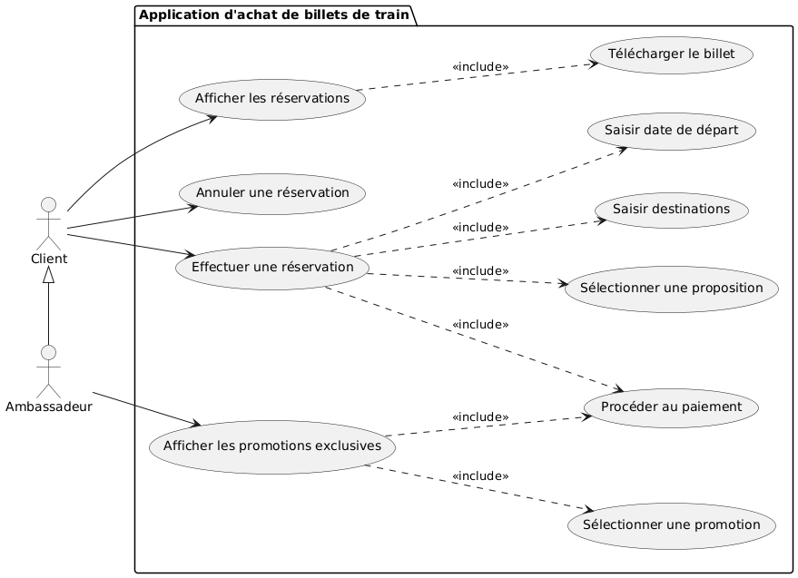

Source du diagramme :
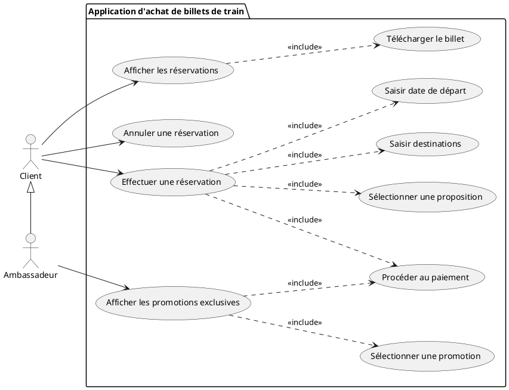

Le premier problème qui se pose lors de la modélisation est de représenter le (les) lien(s) entre trajets et gares : un trajet a une gare de départ, une d'arrivée et peut effectuer des escales dans d'autres gares.
On utilisera des liens 1-* pour représenter les liens pour les gares de départ et d'arrivée.
Pour les escales, on optera pour un lien *-*, qui pourrait être complété d'une classe d'association (avec les horaires de l'escale par exemple).

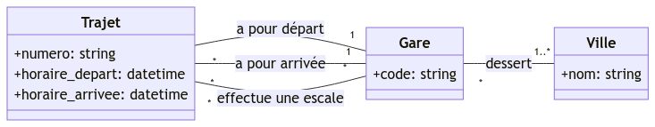

La partie du modèle traitant de la partie réservation (une réservation concerne un trajet) et ensuite ajoutée. Elle utilise trois classes : *Client* (celui qui effectue une réservation), *Reservation* (pour faire le lien entre le client et le trajet) et *Paiement* qui compose une réservation.

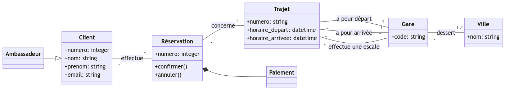 

Source du diagramme :
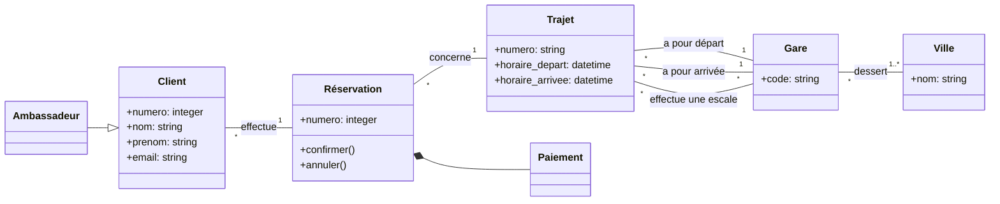

\newpage

## Gestion d'une ferme ##

On crée une classe *Eleveur* qui ne possède qu'une méthode, permettant de calculer le prix de l'ensemble de ses volailles. Un éleveur possède par ailleurs des volailles que nous représentons à l'aide d'une classe abstraite *Volaille*. 

*Poulet* et *Canard* héritent de cette classe abstraite. Chaque volaille possède un poids, un numéro permettant de l'identifier et un âge exprimé en semaines. Ces attributs sont transmis par héritage aux canards et poulets. De plus, les classes *Canard* et *Poulet* possèdent chacune des attributs de classe (*age_abattage* indiquant l'âge d'abattage identique pour toutes les instances de la classe, et *prix_kilo*, prix au kilo des instances de la classe, là aussi identique pour toutes les instances). Des accesseurs et mutateurs de classe permettent de mettre à jour ces attributs.

\newpage

## Gestion du cadastre ##
Le diagramme de cas d'utilisation comporte deux grandes fonctionnalités : gérer les parcelles et calculer les impôts. La fonctionnalité de gestion des parcelles est décomposées en plusieurs fonctionnalités optionnelles qui correspondent aux différentes tâches exprimées dans l'énoncé.

Dans une première approche, nous pouvons proposer le diagramme de classes suivant où nous utilisons des liens d'agrégation entre `Parcelle` et `Section`, et entre `Section` et `Commune`. S'il faut tenir compte de sous-sections, nous pouvons ajouter une classe entre les classes `Section` et `Parcelles`.

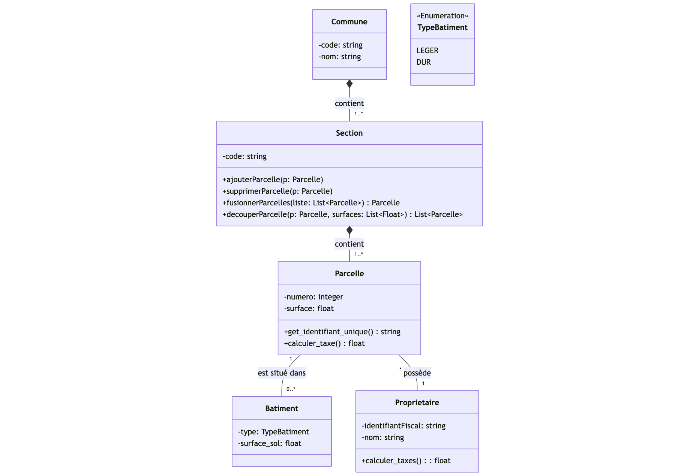

Mais cette version ne répond pas à la problématique de généricité demandée : il est nécessaire d'ajouter de nouvelles classes à chaque sous-niveau que nous voulons prendre en compte. Pour faire évoluer le modèle, nous proposons donc d'introduire une nouvelle classe `ZoneCadastrale` qui possède trois attributs `id`, `niveau` et `nom_niveau`, qui représentent respectivement l'identifiant de la zone, son numéro de niveau (1 pour une commune, 2 pour une section, 3 pour une sous-section...) et le libellé du niveau. 

Par ailleurs, nous indiquons qu'une zone cadastrale est une composition de zones cadastrales. De cette manière, nous conservons les relations de type *une commune est composées de sections*, *une section est composée de sous-sections*, etc.

Cette modélisation nous permet de reconstruire une hiérarchie dans les différentes zones cadastrales. Le niveau 1 est le plus haut : c'est celui qui contient les communes. Le niveau 2 est composé des éléments contenus dans ceux de niveau 1 (les sections), etc.

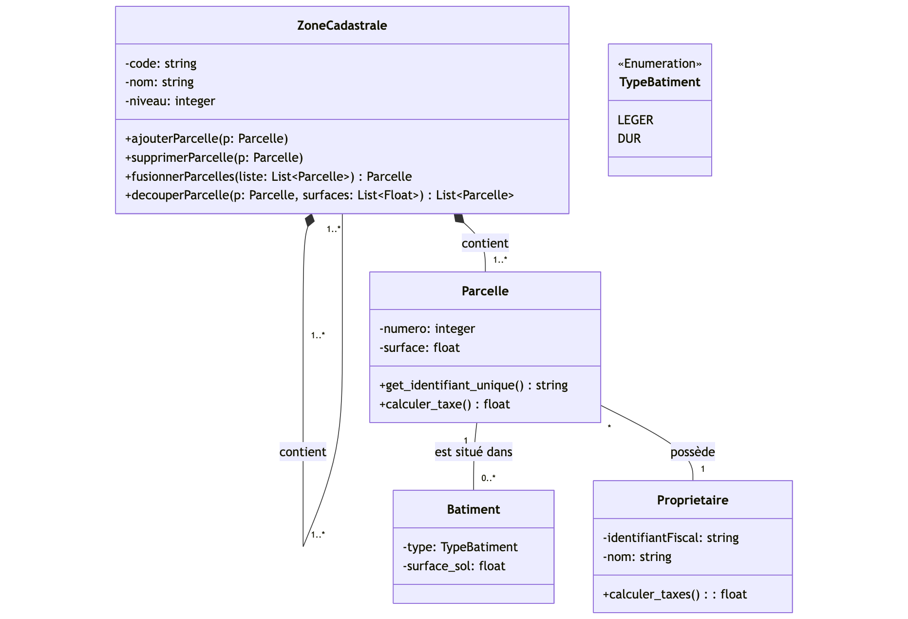

Dans cette deuxième version, nous avons également fait apparaître les méthodes les plus importantes.

Pour s'assurer que le sens de notre modélisation est bien compris, nous utilisons un diagramme d'objets qui illustrera un exemple de situation.

\newpage

## Station météo ##

\newpage

## Recette de la mousse au chocolat ##

Pour optimiser la réalisation de la recette, nous parallélisons toutes les tâches qui ne concernent pas les mêmes ingrédients.

\newpage

## Application de navigation GPS ##
Le système étudié est une application de navigation GPS.

Nous identifions trois cas d'utilisation principaux :

* afficher une carte;
* afficher la vitesse de déplacement;
* guider le conducteur, ce qui inclut de calculer et d'afficher des itinéraires.

Pour calculer la vitesse de déplacement et des itinéraires, le GPS a besoin de détecter la position de la voiture, ce qui fait appel à des satellites (acteur secondaire du système). La détection de la position de la voiture est une option de la fonctionnalité d'affichage de la carte.

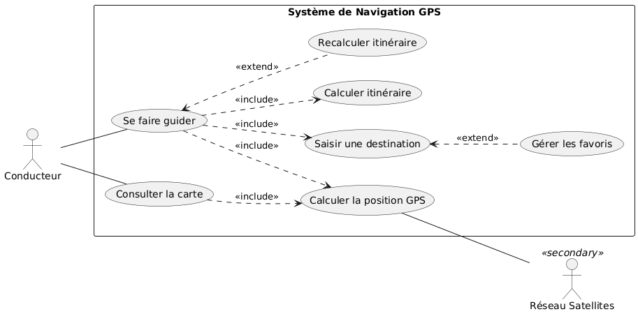

Lors de la réalisation de l'activité *Etre guidé*, le conducteur commence par allumer le GPS. Celui-ci cherche alors à détecter les satellites pour pouvoir calculer la position du véhicule. Le conducteur peut alors indiquer sa destination pour que l'application puisse calculer un itinéraire. Lorsque l'itinéraire est calculé, il s'affiche dans l'application et plusieurs cas sont alors possibles :

* soit le conducteur suit correctement la route indiquée : l'application lui indique alors simplement la route à suivre jusqu'à arriver à destination
* soit le conducteur ne respecte pas l'itinéraire indiqué : l'application recalcule alors un nouvel itinéraire en tenant compte de la nouvelle position et met à jour l'affichage de la route à suivre.

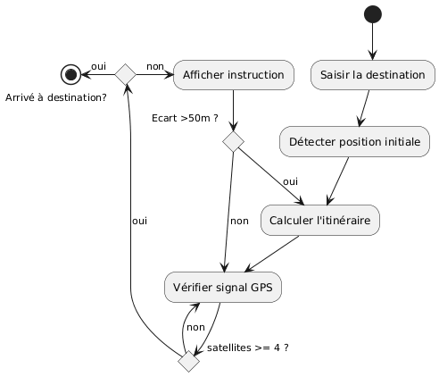

Notre analyse du système nous conduit pour commencer à identifier trois structures d'objets contribuant à son fonctionnement : l'adresse de destination, l'itinéraire et la position GPS de la voiture.

L'adresse de destination est traduite en position (coordonnées x,y) pour être utilisée dans le système. Un itinéraire est quand à lui composé d'une suite ordonnée de positions. Nous ajoutons donc cette classe à notre modèle et définissons la position GPS de la voiture comme un type particulier de position.

Enfin, nous ajoutons une classe affichage qui utilise la position GPS pour centrer la carte dessus et l'itinéraire pour le représenter sur le fond de carte et guider le conducteur.

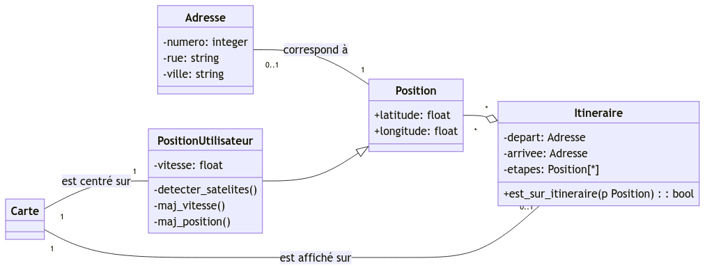

Source du diagramme :
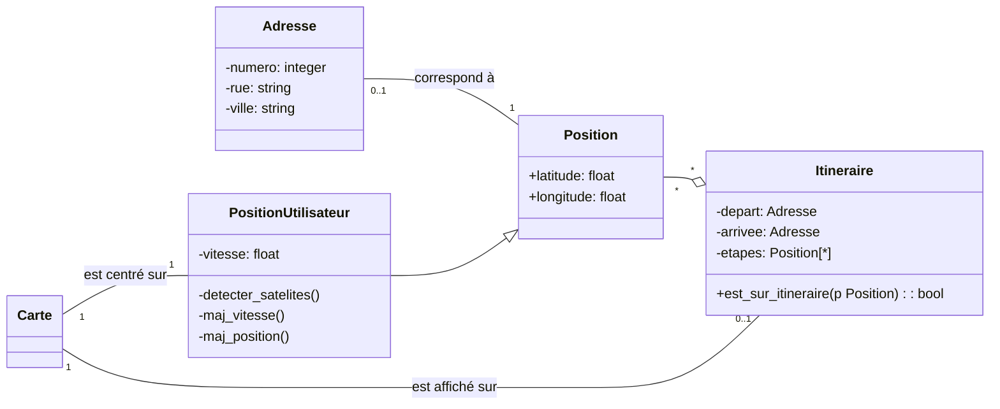

\newpage

## Réveille-matin ##

\newpage

## Cohérence de diagrammes de classes et de séquence ##

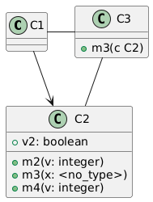

\newpage

## Démineur ##
Nous identifions deux fonctionnalités principales : configurer une partie et jouer une partie. *Configurer une partie* signifie choisir le nombre de cases et/ou le nombre de mines. Quant au cas d'utilisation *Jouer une partie*, il comprend les sous-fonctionnalités *poser un drapeau* et *découvrir une case*. Comme il n'est pas obligatoire de poser des drapeaux pour pouvoir jouer cette sous-fonctionnalité est optionnelle. En revanche il est obligatoire de découvrir au moins une case à un moment de la partie (sinon elle ne se termine jamais) : cette fonctionnalité est donc obligatoire.

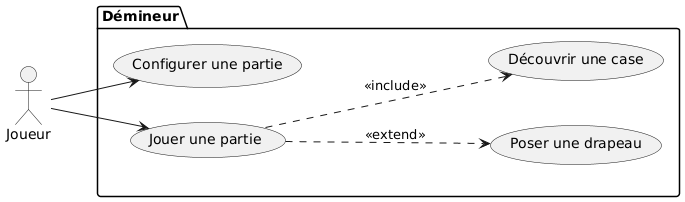

Les trois grandes classes que nous identifions sont `Partie`, `Grille` et `Case`. Une partie se joue sur une grille qui est composée de cases. Dans la classe `Partie`, nous prévoyons des attributs `nb_mines_initiales` contenant le nombre de mines que le joueur souhaite inclure dans sa grille et `taille_grille` qui renseignera la taille de la grille utilisée. Nous ajoutons également un attribut dérivé `nb_mines_restantes` qui nous permettra de déterminer si la partie est gagnée. Enfin la classe `Partie` contient des méthodes permettant de jouer (marquer et découvrir une case).

Le plateau est composé de cases qui sont positionnées à l'aide de leur numéro de ligne et de colonne. Les cases peuvent être de trois types différents : minées, vides ou numérotées (lorsqu'elles sont à côté d'une case minée). Le type de la case influe sur le comportement de la méthode `decouvrir()` : respectivement partie perdue, démasquage des cases voisines et démasquage de la seule case. Le comportement des méthodes de la classe `Case` dépend également de l'état de celle-ci : il ne se passe pas la même chose lorsque l'on essaye de marquer une case déjà marquée ou une case découverte par exemple.

Le diagramme de classe que nous avons établi est le suivant :

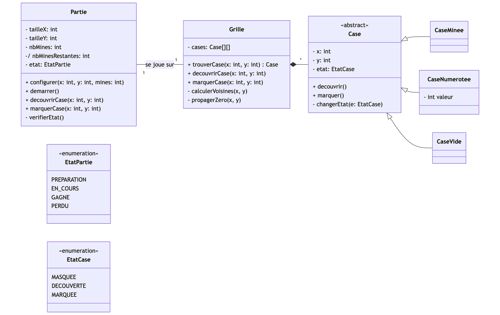

Pour compléter la modélisation, nous décrivons ensuite le cas d'utilisation *Découvrir une case* à l'aide d'un diagramme de séquence. Ce diagramme est intéressant ici car les objets interagissent fortement entre eux.

De même, nous utilisons un diagramme de séquence pour décrire le cas d'utilisation *Marquer une case*.

\newpage

## VéliDescartes ##
Nous identifions trois acteurs principaux utilisant le système : l'utilisateur sans abonnement qui souhaite s'abonner, l'utilisateur avec abonnement qui veut emprunter/déposer des vélos et signaler des incidents et l'administrateur du système qui désire réaliser des diagnostics d'état/utilisation.

 

Pour élaborer la structure de l'application, nous identifions plusieurs composants. L'utilisateur de VéliDescartes qui peut posséder ou pas un abonnement. Cet utilisateur emprunte des vélos qui sont déposés dans des stations. Les stations comme les vélos sont localisés avec ler position GPS.

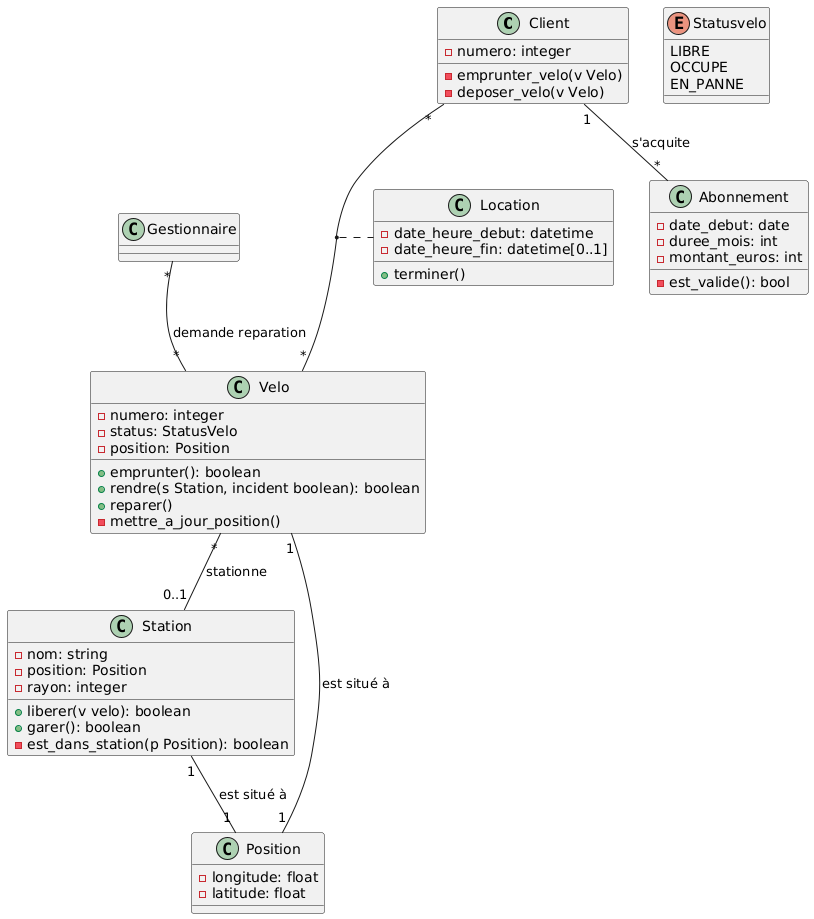 

Afin d'illustrer notre diagramme de classe, nous réalisons le diagramme d'objets suivant :

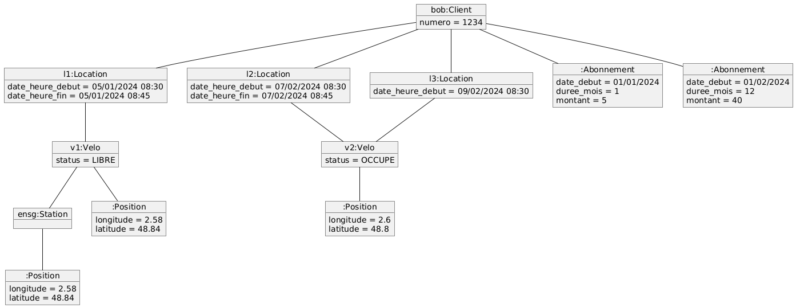

Ainsi que les différents états des vélos dans un diagramme d'état-transition:

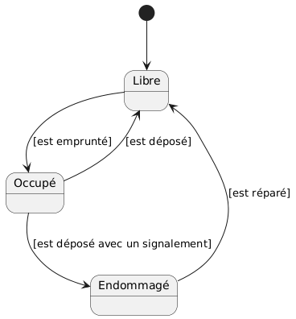

Nous choisissons de représenter les deux fonctionnalités principales *emprunter un vélo* et *déposer un vélo* sous forme de diagramme de séquence. Cela nous permet de mettre en évidence les interactions entre les objets et de montrer à quel moment intervient la création d'un objet Location.

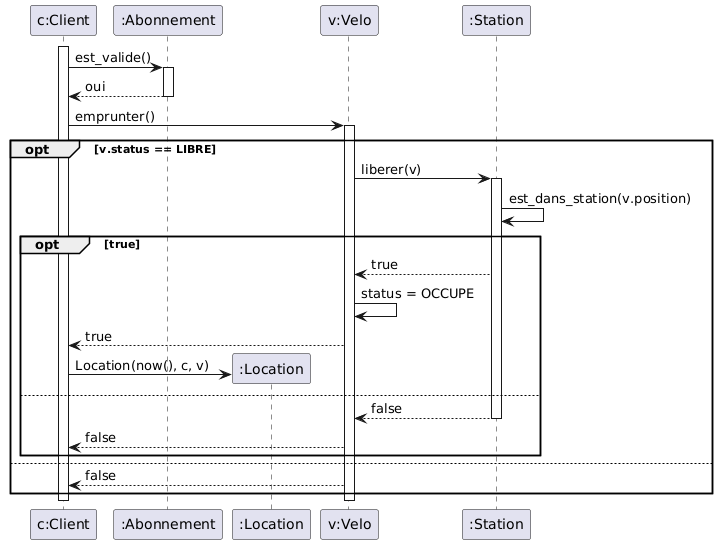

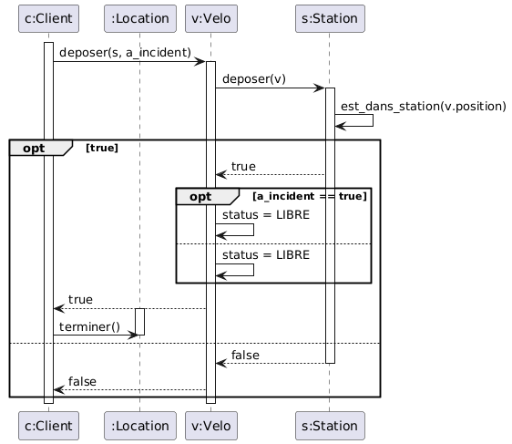

\newpage

## EncherePasChere #
à compléter...

Nous identifions trois acteurs : le visiteur, l'acheteur et le vendeur.

Le visiteur utilise l'application pour rechercher des objets mis en vente. Il peut également s'il a trouvé un objet qui l'intéresse s'inscrire comme acheteur. Ou s'inscrire comme vendeur s'il désire mettre des objets en vente.

L'acheteur peut, tout naturellement, rechercher des objets mis en vente. Il utilise également le système pour acheter un objet en vente directe ou poser une enchère sur un objet aux enchères. Cette enchère peut se conclure par l'achat de l'objet.

Le vendeur ne fait que mettre des objets en vente. Nous détaillons cette fonctionnalité pour préciser que la mise en vente peut être directe ou aux enchères.

Nous aurions pu utiliser des liens de généralisation entre visiteur et acheteur et/ou vendeur, mais avons choisi de ne pas le faire pour ne pas représenter le fait qu'un acheteur peut s'incrire comme vendeur par exemple. Cela implique également que les comptes acheteurs et vendeur sont complètement décorrélés.

Classes Acheteur et Vendeur. Classe ObjetMisEnVente. Enchere et VenteDirecte hétirent d'ObjetMisEnVente. Classe pour le site avec les méthodes génériques?

Séquence d'un achat aux enchères

Etat-transitions d'une enchère