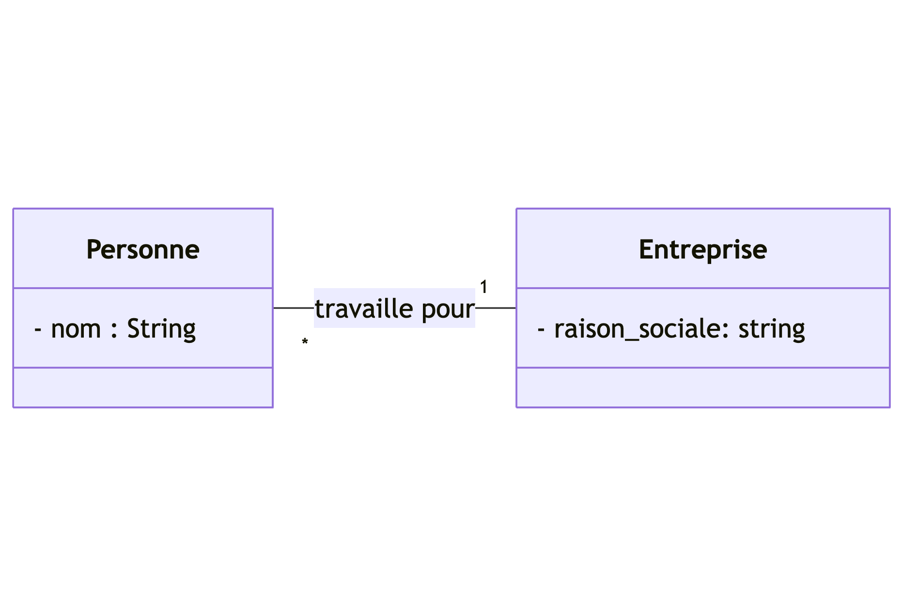
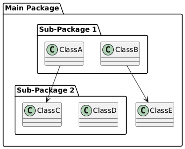
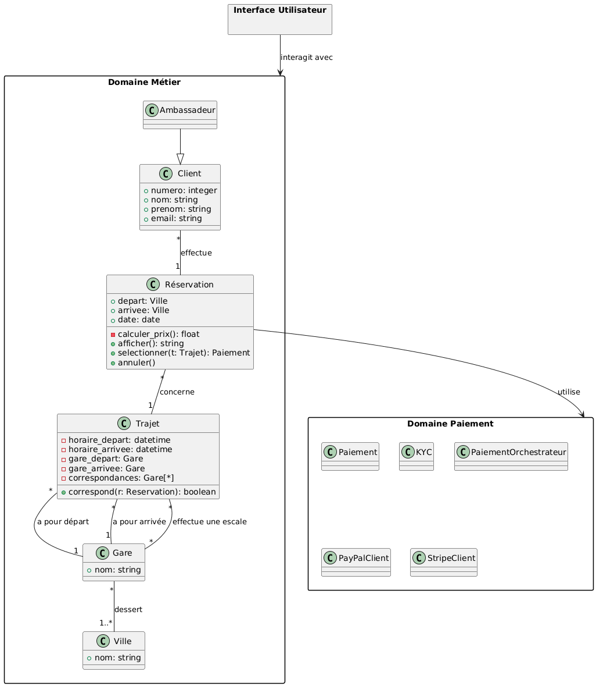
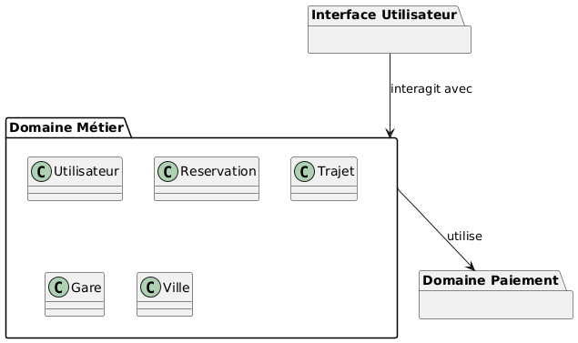
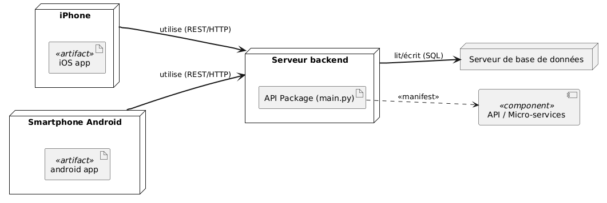

% Analyse informatique
% Centre de compétences technologies des systèmes d'information
% novembre 2025


# Introduction #

##  ##
<br/>


## Motivations ##

* Pas d'usure des logiciels
* Erreurs humaines uniquement
* Obsolescence d'un logiciel causée par
	* des logiciels plus performants
	* de nouveaux usages


## Quelques chiffres ##
<br/>

* Coût d'un logiciel :
    * développement initial = 30% 
    * maintenance = 53%
    * correction bogues = 17%


## Quelques chiffres ##
<br/>


## Le besoin ##
<br/>

* Outils d'aide à la modélisation pour :
	* élaborer la structure des programmes
	* s'assurer que les exigences initiales ont bien été respectées
	* maintenir les logiciels


## Le programme ##
<br/>

1. Introduction à la programmation orientée objet
2. Présentation d'UML
3. Etude de plusieurs diagrammes UML


## Organisation ##
<br/>

* 5 séances de 3h (alternance théorie / pratique)

<br />

* Supports disponibles sur https://github.com/ClementDelgrange/Cours_analyse_informatique

<br/>

* Devoir sur table


# Programmation orientée objet #

## Paradigmes de programmation ##

* Plusieurs **façons** de concevoir un programme :
    * **Impératif** : une suite d’instructions exécutées pas à pas
    * **Procédural** : les instructions sont regroupées en fonctions
    * **Fonctionnel** : une série de transformations de données
    * **Orienté objet** : des entités (objets) qui collaborent entre elles
    * ...


## Programmation impérative ##

* Première approche historique (dès les années 1940–50 : ALGOL 58)
* Programme = une suite d'instructions exécutées dans l'ordre
* Facile à comprendre, mais difficile à modifier quand le code grossit

```
1- faire fondre le beurre
2- lorsque le beurre est fondu ajouter le chocolat
3- ajouter les oeufs
```


## Programmation procédurale ##

* Évolution naturelle de la programmation impérative
* On regroupe les instructions en **procédures**
* Permet de découper un grand programme en **tâches réutilisables**
* Facilite la lecture, mais les données restent partagées partout


## Exemple ##


## Limites de la programmation procédurale ##


## Limites de la programmation procédurale ##


## Limites de la programmation procédurale ##

État initial : notre système gère Point et Polygon.
```
fonction CalculerSurface(entite)
{
    si (entite.type == 'POINT') {
        retourner 0
    }
    sinon si (entite.type == 'POLYGONE') {
        retourner FormuleCompliquee(entite.coords)
    } else {
        afficher_erreur("Type de géométrie non pris en charge.")
        retourner -1
    }
}
```


## Limites de la programmation procédurale ##

État initial : notre système gère Point et Polygon.
```
fonction CalculerPerimetre(entite)
{
    si (entite.type == 'POINT') {
        retourner 0;
    }
    sinon si (entite.type == 'POLYGONE') {
        retourner ...;
    } else {
        afficher_erreur("Type de géométrie non pris en charge.");
        retourner -1;
    }
}
```


## Limites de la programmation procédurale ##

Evolution : gérer les lignes
```
fonction CalculerSurface(entite)
{
    si (entite.type == 'POINT') {
        retourner 0;
    }
    sinon si (entite.type == 'LIGNE') {
        retourner 0;
    }
    sinon si (entite.type == 'POLYGONE') {
        retourner FormuleCompliquee(entite.coords);
    } else {
        afficher_erreur("Type de géométrie non pris en charge.");
        retourner 0;
    }
}
```


## Limites de la programmation procédurale ##

Evolution : gérer les lignes
```
fonction CalculerPerimetre(entite)
{
    si (entite.type == 'POINT') {
        retourner 0;
    }
    sinon si (entite.type == 'LIGNE') {
    	longueur_totale = 0;
    	pour i de 0 à TAILLE(entite.coords) - 2 faire {
            longueur_totale := longueur_totale + Distance(entite.coords[i], entite.coords[i+1]);
        }
        retourner longueur_totale;
    }
    sinon si (entite.type == 'POLYGONE') {
        retourner ...;
    } else {
        afficher_erreur("Type de géométrie non pris en charge.")
        retourner 0;
    }
}
```


## Programmation fonctionnelle ##

* Apparaît dès la fin des années 1950 (LISP)
* Un programme est une **composition de fonctions** : chaque fonction transforme des données et transmet le résultat
* Approche **déclarative** : on décrit *ce qu’on veut obtenir*, pas *comment le faire*


## Programmation orientée objet ##

* Popularisée dans les années 1980 (Smalltalk, C++)
* Regroupe **les données et les actions** dans une même entité : l’objet
* Chaque objet sait ce qu’il contient et ce qu’il peut faire
* Approche **ascendante** : on construit le programme à partir de petits acteurs autonomes


## Exemple ##
<br/>


## Procédural vs. orienté objet ##

* Programmation procédurale
  * Approche **descendante** : on découpe le problème en fonctions puis en sous-fonctions
  * Plus intuitive
* Programmation orientée objet
  * Approche **ascendante** : on part des objets du monde réel et on décrit leurs comportements
  * Objets réutilisables plus facilement maintenables
* Résolvent les mêmes problèmes


## Concepts de l'orienté objet - l'objet ##

> **Objet** : entité autonome, aux frontières précises, décrit par une collection de propriétés et de traitements associés

* Un objet possède une identité, un nom
* Un ensemble d'**attributs** caractérisent l'état de l'objet
* Un ensemble d'**opérations** en définit le comportement


## Exemples d'objets ##
<br/>


## Concepts de l'orienté objet - la classe ##

> **Classe** : type abstrait de donnée destiné à décrire une structure d'objets, caractérisé par des attributs et des méthodes

* Objet créé selon le modèle d'une classe
	* Objet = **instance** de classe


## Exemples de classes ##
<br/>

* Point
* Bouton
* Personne


## Concepts de l'orienté objet - l'encapsulation ##

> **Encapsulation** : concept qui consiste à masquer les détails de l'implémentation d'un objet à son utilisateur

* Partie visible de l'objet appelée **interface**
* Garantie l’intégrité des données
* Principe facilitant l’évolution des applications


## Exemple d'encapsulation ##
<br/>


## Exemple d'encapsulation ##
<br/>


## Concepts de l'orienté objet - l'héritage ##

> **Héritage** : principe autorisant le création d'une classe dérivée à partir d'une classe existante

* Attributs et méthodes de la classe existante transmis à la classe dérivée
* Classe *mère* / classe *fille*
* Principe encourageant la réutilisation


## Exemple d'héritage ##


## Concepts de l'orienté objet - le polymorphisme ##

> **Polymorphisme** : faculté de pouvoir redéfinir dans une classe dérivée les méthodes héritées de la classe parente

* Permet une programmation plus générique
* Dans le cas de l’héritage : spécifier un comportement général


## Exemple de polymorphisme ##
<br/>


## Exemple ##

```
Classe Point {
    méthode calculerSurface() {
        retourner 0;
    }
    méthode calculerPerimetre() {
    	retourner 0;
   	}
}

Classe Polygone {
    méthode calculerSurface() {
        retourner this.FormuleCompliquee();
    }
    méthode calculerPerimetre() {
    	retourner ...;
   	}
}

fonction TraiterInventaire(liste_geometries) {
    pour chaque entite dans liste_geometries {
        resultat1 = entite.calculerSurface();
        afficher(resultat1);
        resultat2 = entite.calculerPerimetre();
        afficher(resultat2);
    }
}
```


## Exemple ##

```
Classe Ligne {
    méthode calculerSurface() {
        retourner 0;
    }
    méthode calculerPerimetre() {
    	longueur_totale = 0;
    	pour i de 0 à TAILLE(self.coords) - 2 faire {
            longueur_totale := longueur_totale + Distance(self.coords[i], self.coords[i+1]);
        }
        retourner longueur_totale;
   	}
}

fonction TraiterInventaire(liste_geometries) {
    pour chaque entite dans liste_geometries {
        resultat1 = entite.calculerSurface();
        afficher(resultat1);
        resultat2 = entite.calculerPerimetre();
        afficher(resultat2);
    }
}
```


## Modélisation orienté objet ##

* En résumé, l'approche objet c'est :
	* objets, classes, encapsulation, héritage, polymorphisme
	* des facilités pour faire évoluer les programmes
* Mais :
	* pas toujours très intuitif
	* quelle représentation pour ces structures/concepts ?


# Présentation d'UML #

## Naissance d'un langage de modélisation ##
<br/>


## Naissance d'un langage de modélisation ##
<br/>


## Généralités ##


* Langage graphique de conception orienté objet
* Couvre l'intégralité des systèmes informatiques
	* utilisation, conception, déploiement
* Compréhensible par l'homme et par la machine
* Standard largement adopté par l'industrie


## Les diagrammes UML ##
<br/>


## Les diagrammes UML ##
<br/>

* 14 diagrammes en version 2.5
	* 7 diagrammes structurels : composants du système et fonctionnalités permises
	* 7 diagrammes comportementaux : interactions entre les éléments d'un système

<br/>


## UML ##
<br/>

* En résumé, UML c'est :
	* un langage graphique de conception orientée objet
	* constitué de diagrammes accompagnés d'explications
	* pas une méthode


# Le diagramme de cas d'utilisation #

## Le diagramme de cas d'utilisation ##

* **Structurer le besoin de l'utilisateur**
	* Représentation des attentes de l'utilisateur
	* Définition du périmètre de l'application (=*frontière*)


## Le cas d'utilisation ##

* Action (=> verbe à l'infinitif)


* Structuration possible en sous-cas d'utilisation
	* inclusion = obligatoire
	* extension = optionnel


## Les acteurs ##

* Personne ou système en interaction avec le système
* Identifié
* 2 catégories :
	* acteur principal : exprime une attente vis-à-vis du système
	* acteur secondaire : est sollicité par le système


## Les acteurs ##
<br/>


## Liens entre acteurs ##

* La généralisation


## Exemple ##


## Description textuelle ##

* Nécessaire pour 
	* Détailler un cas d'utilisation (entrées/sorties...)
	* Préciser une chronologie
* Comprend
	* Identification : nom, objectif, acteurs, dates, responsable
	* Description : précondition, scénario, postconditions
	* Spécifications non fonctionnelles


## Exercices ##

1. QCM identification des acteurs
2. Système de gestion de parking
3. Application d'achat de billets de train


# Le diagramme de classes #

## Diagramme de classes ##

* **Représenter les structures de données**
	* classes et liens entre classes
	* mise en oeuvre des concepts de l'orienté objet
	* modélisation statique


## Elements de bases ##

* La classe = structure de données abstraite
	* nom (au singulier)
	* attributs
	* méthodes
	


* L'association


## Les attributs ##

* Visibilité : public (`+`), privé (`-`), protégé (`#`)
* Type : `integer`, `float`, `string`, `date`, `boolean`, ...
* Multiplicité : `[2]`, `[3]`, `[*]`...
* Valeur par défaut : `=valeur_par_defaut`

``` 
{-, #, +} nom_attribut : type_attribut {[multiplicite]} {=valeur_par_defaut}
```

## Les attributs dérivés ##

* Dont la valeur dépend des autres attributs
	* pas d'affectation

<br/>
	


## Les méthodes ##

* Signature d'une méthode

```
{-, #, +} nom_methode ({nom_param1: type_param1, nom_param_2: type_param2, ...}) {: type_retour}
```


## Les associations ##

* 4 types d'associations
	* association (*simple*)
	* héritage
	* agrégation
	* composition
* Cardinalité : 
	* `0..1`
	* `1`
	* `*`
	* `1..*`
	* `M..N`
	* `N`


## L'association simple ##




## L'association simple ##


<br/>


## L'héritage ##

* Concept orienté objet du même nom
* Attributs et méthodes automatiquement transmis à la classe fille

<br/>


## Exemples d'héritage ##
<br/>


## Agrégation-composition ##

* Composition = *agrégation forte*

<br/>


## Les classes associations ##

* Classe avec des informations sur une association

<br/>


## Les classes abstraites ##

* Classe qui ne peut être instanciée

<br/>


## Exercice ##

1. Application d'achat de billets de train
2. Gestion d'un catalogue de symboles cartographiques
3. Gestion d'un cadastre


# Le diagramme de paquetage #

## Le diagramme de paquetages ##

* **Organiser les ensembles de classes et visualiser les dépendances entre groupes**
	* paquetage ou module = ensemble d'éléments UML (classes essentiellement) fournissant un service cohérent
	* gérer la complexité des grands projets en fournissant une vue de haut niveau de l'architecture


## Sous-paquetages ##
<br/>




## Architecture en couche ##
<br/>


## Exemple ##




## Exemple ##
<br/>




# Le diagramme d'objets #

## Le diagramme d'objets ##

* **Fournir une vue instantanée des objets du système à un instant donné**
	* illustrer le diagramme de classes
	* détailler un aspect complexe ou un scénario précis
	


## Les objets ##

* Objet = instance de classe
	* Nom de l'objet souligné : `nom_objet:NomClasse`
	* Attributs avec une valeur : `attribut: type = valeur`
	* Méthodes non représentées


## Les liens ##

* Lien = instance d'association
	* Liens simples uniquement
	* Pas d'héritage
	* Cardinalité de `1` toujours
	* Nom du lien souligné


## Exemple ##


<br/>


## Exemple ##


## Exercices ##

1. Gestion d'un cadastre


# Le diagramme de déploiement #

## Diagramme de déploiement ##

* **Décrire la configuration physique des matériels**
	* répartition des composants logiciels sur les noeuds matériels
	* interactions entre noeuds

<br/>


## Eléments de base ##

* Noeud
  * Machine physique ou virtuelle (PC, serveur, téléphone)
  * Représente le support d'exécution physique qui héberge le code


## Eléments de base ##

* Artéfact
  * Un fichier (un .exe, .html, .py...)
  * Représente l'entité logicielle concrète qui est déployée sur le noeud
* Relation de manifestation
  * L'action d'installer ou de copier-coller un fichier sur une machine
  * Indique que l'artéfact est hébergé et exécuté par le noeud


## Exemple ##
<br/>




## Exercices ##

1. Système de suivi GPS de flotte de véhicules
2. Station météo


# Le diagramme d'activité #

## Diagramme d'activité ##

* **Décrire les enchaînements d'actions lors d'une fonctionnalité importante**
	* un cas d'utilisation
	* une méthode importante


## Eléments de base ##
<br/>


<br/>


<br/>


## Branchement conditionnel ##

* Activités dépendantes du résultat d'un test

<br/>


## Transitions concurrentes ##

* Activités effectuées en parallèle
* **Join** = séparation de branches d'activités
* **Fork** = resynchronisation des branches d'activités

<br/>


## Exemple ##


## Exemple ##


## Couloir d'activités ##


## Exercice ##

1. Mousse au chocolat
2. Application de navigation GPS


# Le diagramme d'états-transitions #

## Diagramme d'états-transitions ##

* **Représenter les états possibles d'un objet et les transitions entre eux**
	* utile lorsque l'état d'un objet dépend de son historique
	* symbolique proche de celle du diagramme d'activité


## Etats et transitions ##

* Etat stable
* Transition instantanée


## Conditions de garde ##

* Plusieurs transitions possibles à partir d'un état


## Transitions reflexives ##

* Transition laissant l'objet dans le même état


## Exercice ##

1. Démineur


# Le diagramme de séquence #

## Diagramme de séquence ##

* **Décrire les interactions entre entités lors d'une fonctionnalité importante**
	* un cas d'utilisation
	* une méthode importante


## Activation des objets ##

* Axe du temps du haut vers le bas
* Ligne de vie des objets
	* périodes d'activation


## Echanges de messages ##

* Flux de données échangés
	* envoi d'un message =appel de méthode
	* réponse =retour de méthodes
	* numérotation optionnelle des messages échangés
* Types de messages :
	* synchrone : attente d'une réponse
	* asynchrone : pas de réponse/retour
	* de retour : valeur renvoyée suite à message synchrone
	* création / destruction

## Types de messages ##


## Cadre d'interaction ##

* Partie du diagramme associée à une modalité d'exécution
	* `opt` : condition de test (*si* en programmation)
	* `alt` : plusieurs conditions de test (*si / sinon si...*)
	* `loop` : répétition d'un échange de messages
	* `par` : fragments exécutés en parallèle
	* `ref` : passage par un autre diagramme de séquence


## Exemple ##


## Exemple ##


## Exercice ##

1. Correspondance diagramme de classes / diagramme de séquence
2. Démineur (suite)
