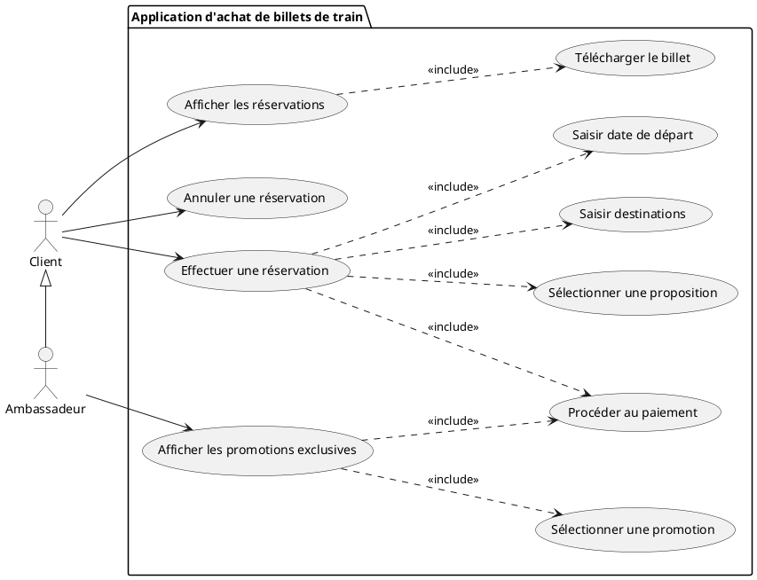
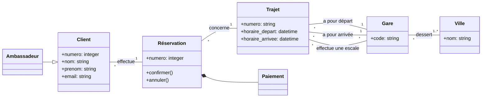
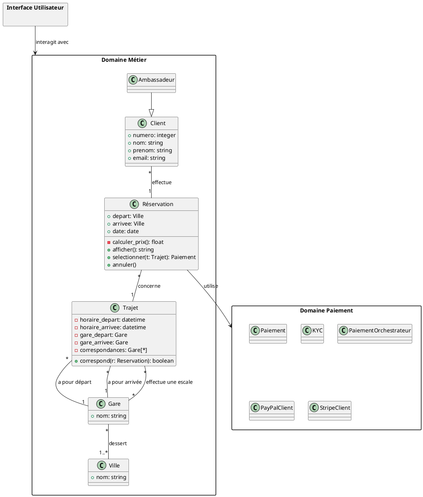

Diagramme de cas d'utilisation :

```plantuml
@startuml
left to right direction

actor Client
actor Ambassadeur

package "Application d'achat de billets de train" {
  usecase "Effectuer une réservation" as UC1
  usecase "Saisir destinations" as UC1a
  usecase "Saisir date de départ" as UC1b
  usecase "Sélectionner une proposition" as UC1c
  usecase "Procéder au paiement" as UC1d
  usecase "Afficher les réservations" as UC2
  usecase "Télécharger le billet" as UC2a
  usecase "Annuler une réservation" as UC3
  usecase "Afficher les promotions exclusives" as UC4
  usecase "Sélectionner une promotion" as UC4a
}

Client --> UC1
UC1 .-down-> UC1a : <<include>>
UC1 .-down-> UC1b : <<include>>
UC1 .-down-> UC1c : <<include>>
UC1 .-down-> UC1d : <<include>>
Client --> UC2
UC2 .-down-> UC2a : <<include>>
Client --> UC3

Client <|-right- Ambassadeur
Ambassadeur --> UC4
UC4 .-down-> UC4a : <<include>>
UC4 .-down-> UC1d : <<include>>
@enduml
```

Diagramme de classes :

```mermaid
classDiagram
    direction LR
    class Trajet{
        +numero: string
        +horaire_depart: datetime
        +horaire_arrivee: datetime
    }
    class Gare{
        +code: string
    }
    class Ville{
        +nom: string
    }
    class Client{
        +numero: integer
        +nom: string
        +prenom: string
        +email: string
    }
    class Ambassadeur
    class Réservation{
        +numero: integer
        +confirmer()
        +annuler()
    }
    class Paiement


    Trajet "*" -- "1" Gare: a pour départ
    Trajet "*" -- "1" Gare: a pour arrivée
    Trajet "*" -- "*" Gare: effectue une escale
    Gare "*" -- "1..*" Ville: dessert

    Réservation "*" -- "1" Trajet: concerne
    Client "*" -- "1" Réservation: effectue
    Ambassadeur --|> Client
    Réservation *-- Paiement
```

Diagramme de paquetage :

```plantuml
@startuml Application Vente Billets
skinparam packageStyle rect

' Définition des Paquetages
package "Interface Utilisateur" as UI {
    ' Les classes UI peuvent être implicites ou non détaillées ici
}

package "Domaine Paiement" as Paiement {
    class Paiement
    class KYC
    class PaiementOrchestrateur
    class PayPalClient
    class StripeClient
}

package "Domaine Métier" as Metier {
    ' Classes du domaine Métier
    class Trajet{
        -horaire_depart: datetime
        -horaire_arrivee: datetime
        -gare_depart: Gare
        -gare_arrivee: Gare
        -correspondances: Gare[*]
        +correspond(r: Reservation): boolean
    }
    class Gare{
        +nom: string
    }
    class Ville{
        +nom: string
    }
    class Client{
        +numero: integer
        +nom: string
        +prenom: string
        +email: string
    }
    class Ambassadeur
    class Réservation{
        +depart: Ville
        +arrivee: Ville
        +date: date
        -calculer_prix(): float
        +afficher(): string
        +selectionner(t: Trajet): Paiement
        +annuler()
    }

    ' Relations internes au paquetage Métier
    Trajet "*" -- "1" Gare: a pour départ
    Trajet "*" -- "1" Gare: a pour arrivée
    Trajet "*" -- "*" Gare: effectue une escale
    Gare "*" -- "1..*" Ville: dessert

    Réservation "*" -- "1" Trajet: concerne
    Client "*" -- "1" Réservation: effectue
    Ambassadeur --|> Client
}

' Dépendances entre Paquetages (vue de haut niveau)
UI --> Metier : interagit avec
Réservation --> Paiement: utilise

@enduml
```