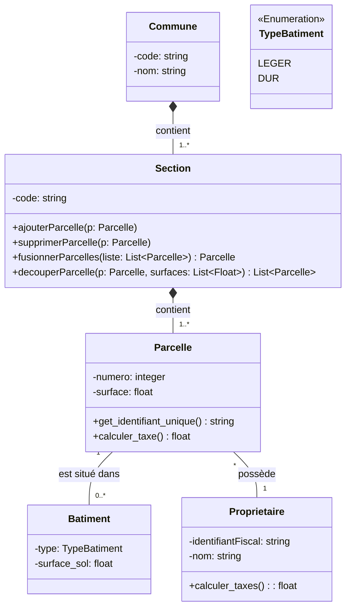
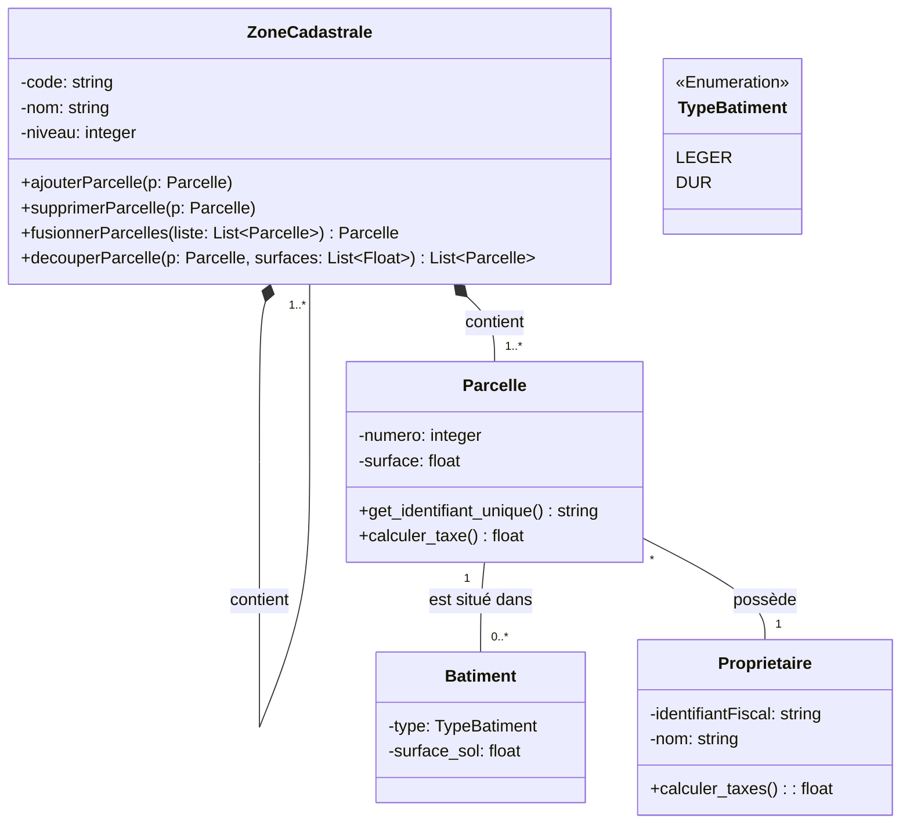

Classes v0:

```mermaid
classDiagram
    class Commune {
        -code: string
        -nom: string
    }

    class Section {
        -code: string
        +ajouterParcelle(p: Parcelle)
        +supprimerParcelle(p: Parcelle)
        +fusionnerParcelles(liste: List~Parcelle~) Parcelle
        +decouperParcelle(p: Parcelle, surfaces: List~Float~) List~Parcelle~
    }

    class Parcelle {
        -numero: integer
        -surface: float
        +get_identifiant_unique() string
        +calculer_taxe() float
    }

    class Batiment {
        -type: TypeBatiment
        -surface_sol: float
    }

    class Proprietaire {
        -identifiantFiscal: string
        -nom: string
        +calculer_taxes(): float
    }

    class TypeBatiment {
        <<Enumeration>>
        LEGER
        DUR
    }

    Commune *-- "1..*" Section : contient
    Section *-- "1..*" Parcelle : contient
    Parcelle "1" -- "0..*" Batiment : est situé dans
    Parcelle "*" -- "1" Proprietaire: possède
```

Classes v1:

```mermaid
classDiagram
    class ZoneCadastrale {
        -code: string
        -nom: string
        -niveau: integer
        +ajouterParcelle(p: Parcelle)
        +supprimerParcelle(p: Parcelle)
        +fusionnerParcelles(liste: List~Parcelle~) Parcelle
        +decouperParcelle(p: Parcelle, surfaces: List~Float~) List~Parcelle~
    }

    class Parcelle {
        -numero: integer
        -surface: float
        +get_identifiant_unique() string
        +calculer_taxe() float
    }

    class Batiment {
        -type: TypeBatiment
        -surface_sol: float
    }

    class Proprietaire {
        -identifiantFiscal: string
        -nom: string
        +calculer_taxes(): float
    }

    class TypeBatiment {
        <<Enumeration>>
        LEGER
        DUR
    }

    ZoneCadastrale *-- "1..*" ZoneCadastrale : contient
    ZoneCadastrale *-- "1..*" Parcelle : contient
    Parcelle "1" -- "0..*" Batiment : est situé dans
    Parcelle "*" -- "1" Proprietaire: possède

```