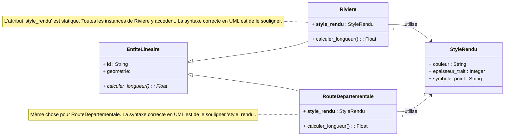

```mermaid
classDiagram
    direction LR

    class EntiteLineaire {
        + id : String
        + geometrie: 
        + calculer_longueur()* : Float
    }

    class Riviere {
        + __style_rendu__ : StyleRendu
        + calculer_longueur() : Float
    }

    class RouteDepartementale {
        + __style_rendu__ : StyleRendu
        + calculer_longueur() : Float
    }

    class StyleRendu {
        + couleur : String
        + epaisseur_trait : Integer
        + symbole_point : String
    }

    EntiteLineaire <|-- Riviere
    EntiteLineaire <|-- RouteDepartementale

    Riviere "1" --> "1" StyleRendu : utilise
    RouteDepartementale "1" --> "1" StyleRendu : utilise

    note for Riviere "L'attribut 'style_rendu' est statique. Toutes les instances de Rivière y accèdent. La syntaxe correcte en UML est de le souligner."
    note for RouteDepartementale "Même chose pour RouteDepartementale. La syntaxe correcte en UML est de le souligner 'style_rendu'."

```