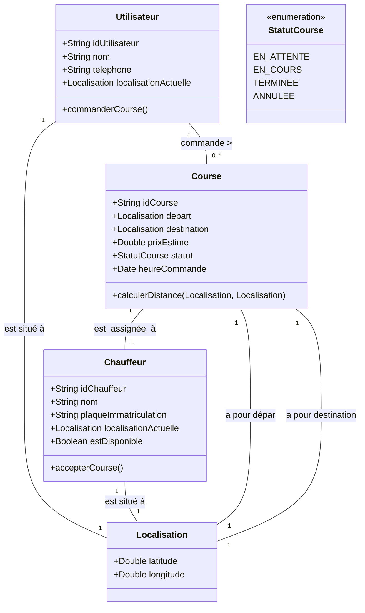
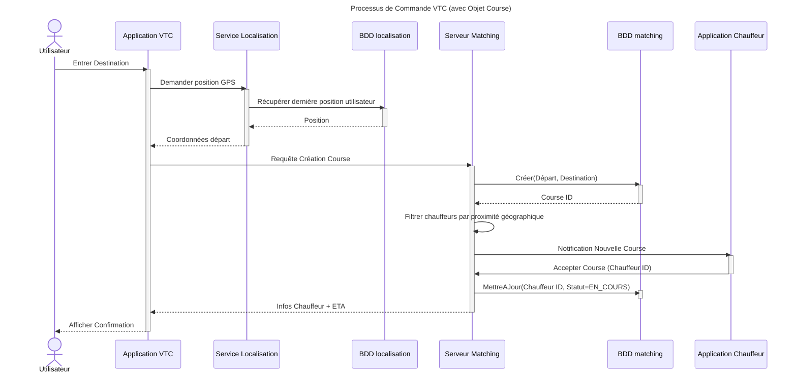

Diagramme de classes :

```mermaid
classDiagram
    direction TB
    
    class Utilisateur {
        +String idUtilisateur
        +String nom
        +String telephone
        +Localisation localisationActuelle
        +commanderCourse()
    }

    class Course {
        +String idCourse
        +Localisation depart
        +Localisation destination
        +Double prixEstime
        +StatutCourse statut
        +Date heureCommande
        +calculerDistance(Localisation, Localisation)
    }

    class Chauffeur {
        +String idChauffeur
        +String nom
        +String plaqueImmatriculation
        +Localisation localisationActuelle
        +Boolean estDisponible
        +accepterCourse()
    }
    
    class Localisation {
        +Double latitude
        +Double longitude
    }
    
    class StatutCourse {
        <<enumeration>>
        EN_ATTENTE
        EN_COURS
        TERMINEE
        ANNULEE
    }

    Utilisateur "1" -- "0..*" Course : commande >
    Course "1" -- "1" Chauffeur : est_assignée_à
    Localisation "1" -- "1" Course : a pour dépar
    Localisation "1" -- "1" Course : a pour destination
    Utilisateur "1" -- "1" Localisation : est situé à
    Chauffeur "1" -- "1" Localisation : est situé à
```

Diagramme de sequence :

```mermaid
sequenceDiagram
    actor Utilisateur
    participant AppVTC as Application VTC
    participant ServLoc as Service Localisation
    participant DBLoc as BDD localisation
    participant ServMatch as Serveur Matching
    participant DBMatch as BDD matching
    participant Chauffeur as Application Chauffeur
    
    title Processus de Commande VTC (avec Objet Course)
    
    Utilisateur->>AppVTC: Entrer Destination
    
    activate AppVTC
    AppVTC->>ServLoc: Demander position GPS
    activate ServLoc
    ServLoc->>DBLoc: Récupérer dernière position utilisateur
    activate DBLoc
    DBLoc-->>ServLoc: Position
    deactivate DBLoc
    ServLoc-->>AppVTC: Coordonnées départ
    deactivate ServLoc

    AppVTC->>ServMatch: Requête Création Course
    
    activate ServMatch
    ServMatch->>DBMatch: Créer(Départ, Destination)
    activate DBMatch
    DBMatch-->>ServMatch: Course ID
    deactivate DBMatch
    
    ServMatch->>ServMatch: Filtrer chauffeurs par proximité géographique
    
    ServMatch->>Chauffeur: Notification Nouvelle Course
    
    activate Chauffeur
    Chauffeur->>ServMatch: Accepter Course (Chauffeur ID)
    deactivate Chauffeur
    
    ServMatch->>DBMatch: MettreAJour(Chauffeur ID, Statut=EN_COURS)
    activate DBMatch
    deactivate DBMatch
    
    ServMatch-->>AppVTC: Infos Chauffeur + ETA
    deactivate ServMatch
    
    AppVTC-->>Utilisateur: Afficher Confirmation
    deactivate AppVTC
```