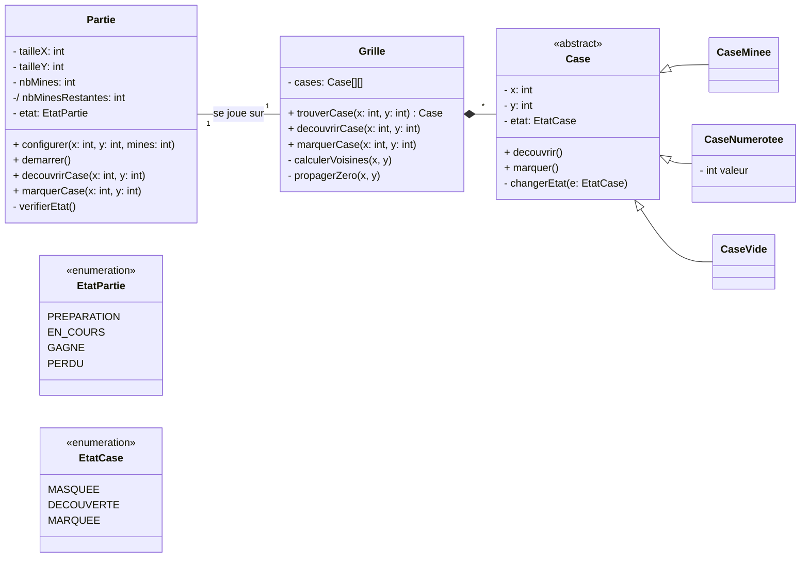

Diagramme de classes:

```mermaid
%% Diagramme de Classes - Démineur
classDiagram
    direction LR

    class Partie {
        - tailleX: int
        - tailleY: int
        - nbMines: int
        -/ nbMinesRestantes: int
        - etat: EtatPartie
        + configurer(x: int, y: int, mines: int)
        + demarrer()
        + decouvrirCase(x: int, y: int)
        + marquerCase(x: int, y: int)
        - verifierEtat()
    }

    class Grille {
        - cases: Case[][]
        + trouverCase(x: int, y: int) Case
        + decouvrirCase(x: int, y: int)
        + marquerCase(x: int, y: int)
        - calculerVoisines(x, y)
        - propagerZero(x, y)
    }

    class Case {
        <<abstract>>
        - x: int
        - y: int
        - etat: EtatCase
        + decouvrir()
        + marquer()
        - changerEtat(e: EtatCase)
    }

    class CaseMinee {
    }

    class CaseNumerotee {
        - int valeur
    }

    class CaseVide {

    }

    %% Enumérations
    class EtatPartie {
        <<enumeration>>
        PREPARATION
        EN_COURS
        GAGNE
        PERDU
    }

    class EtatCase {
        <<enumeration>>
        MASQUEE
        DECOUVERTE
        MARQUEE
    }

    %% Relations
    Partie "1" -- "1" Grille : se joue sur
    Grille *-- "*" Case
    Case <|-- CaseMinee
    Case <|-- CaseNumerotee
    Case <|-- CaseVide
```

