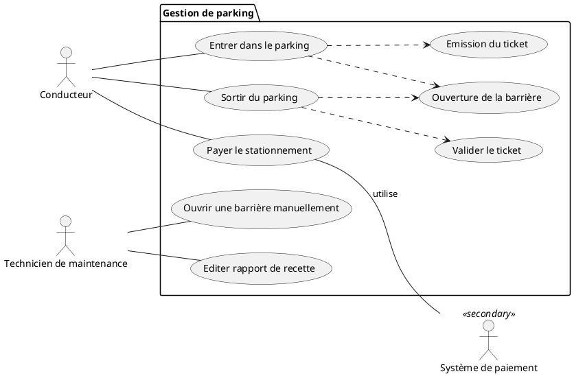

```plantuml
@startuml
left to right direction
actor Conducteur as c
actor "Technicien de maintenance" as t

package "Gestion de parking" as app {
  usecase "Entrer dans le parking" as UC1
  usecase "Emission du ticket" as UC1a
  usecase "Ouverture de la barrière" as UC1b
  usecase "Payer le stationnement" as UC2
  usecase "Sortir du parking" as UC3
  usecase "Valider le ticket" as UC3a
  usecase "Ouvrir une barrière manuellement" as UC4
  usecase "Editer rapport de recette" as UC5
}

actor "Système de paiement" as sp <<secondary>>

c -- UC1
UC1 ..> UC1a
UC1 ..> UC1b
c -- UC2
UC2 -- sp: utilise
c -- UC3
UC3 ..> UC3a
UC3 ..> UC1b
t -- UC4
t -- UC5

@enduml

```