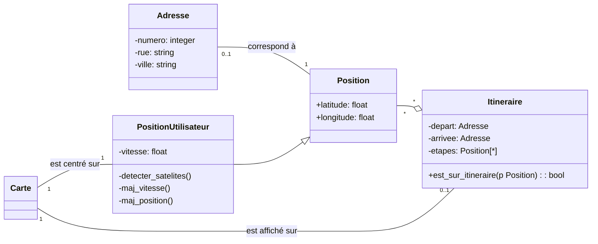

Diagramme de classes :

```mermaid
classDiagram
    direction LR
    class Adresse{
        -numero: integer
        -rue: string
        -ville: string
    }
    class Position{
        +latitude: float
        +longitude: float
    }
    class PositionUtilisateur{
        -vitesse: float
        -detecter_satelites()
        -maj_vitesse()
        -maj_position()
    }
    class Itineraire{
        -depart: Adresse
        -arrivee: Adresse
        -etapes: Position[*]
        +est_sur_itineraire(p Position): bool
    }
    class Carte{

    }

    Adresse "0..1" -- "1" Position: correspond à
    Position "*" --o "*" Itineraire
    PositionUtilisateur --|> Position
    Carte "1" -- "1" PositionUtilisateur: est centré sur
    Carte "1" -- "0..1" Itineraire: est affiché sur
```