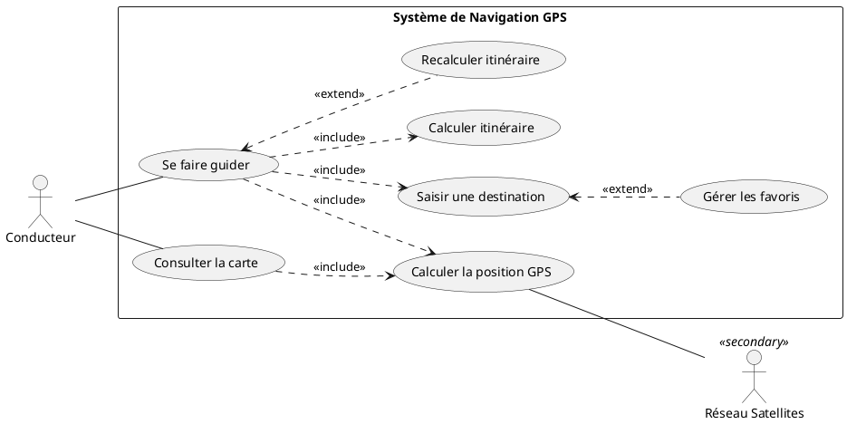
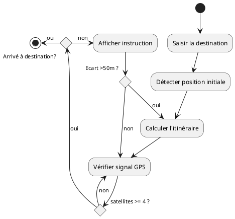
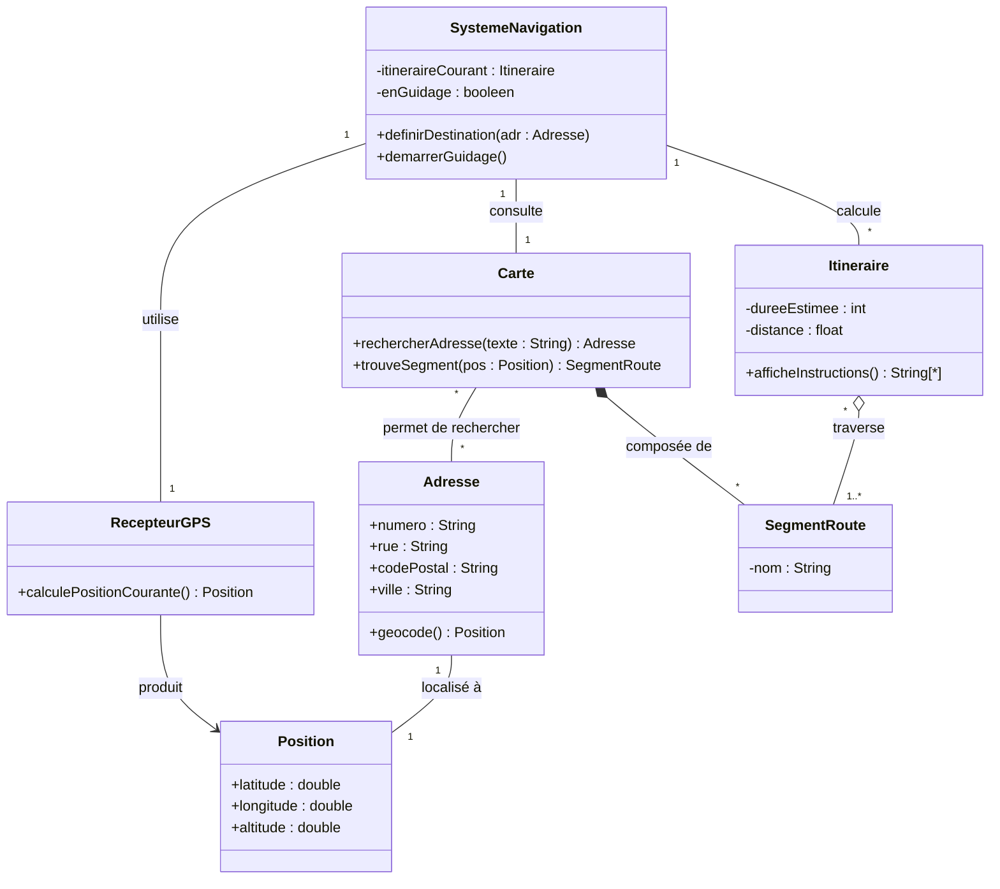

Diagramme de cas d'utilisation:

```plantuml
@startuml
left to right direction

actor "Conducteur" as Driver
actor "Réseau Satellites" as Sat <<secondary>>

rectangle "Système de Navigation GPS" {
  usecase "Consulter la carte" as UC_Carte
  usecase "Calculer la position GPS" as UC_Position
  
  usecase "Se faire guider" as UC_Guidage
  usecase "Saisir une destination" as UC_Dest
  usecase "Gérer les favoris" as UC_Fav
  usecase "Calculer itinéraire" as UC_Calcul
  usecase "Recalculer itinéraire" as UC_Recalcul

  ' Relations Acteurs
  Driver -- UC_Carte
  Driver -- UC_Guidage
  UC_Position -- Sat

  ' Relations Inclusions (Dépendances obligatoires)
  UC_Carte ..> UC_Position : <<include>>
  UC_Guidage ..> UC_Calcul: <<include>>
  UC_Guidage ..> UC_Position : <<include>>
  UC_Guidage ..> UC_Dest : <<include>>

  ' Relations Extensions (Optionnel ou conditionnel)
  UC_Dest <.. UC_Fav : <<extend>>
  UC_Guidage <.. UC_Recalcul : <<extend>>
}
@enduml
```

Activité guidage :

```plantuml
@startuml
(*) --> "Saisir la destination"
--> "Détecter position initiale"
--> "Calculer l'itinéraire"
--> "Vérifier signal GPS"
if "satellites >= 4 ?" then
  -->[oui] if "Arrivé à destination?" then
    --left>[oui] (*)
  else
    -right->[non] "Afficher instruction"
    if "Ecart >50m ?" then
      -->[oui] "Calculer l'itinéraire"
    else
      -->[non] "Vérifier signal GPS"
    endif
  endif
else
  -->[non] "Vérifier signal GPS"
endif

@enduml
```

Diagramme de classes :

```mermaid
classDiagram
    %% Classes principales système
    class SystemeNavigation {
        -itineraireCourant : Itineraire
        -enGuidage : booleen
        +definirDestination(adr : Adresse)
        +demarrerGuidage()
    }

    class RecepteurGPS {
        +calculePositionCourante() Position
    }

    %% Données Géographiques
    class Position {
        +latitude : double
        +longitude : double
        +altitude : double
    }

    class Adresse {
        +numero : String
        +rue : String
        +codePostal : String
        +ville : String
        +geocode() Position
    }

    class Carte {
        +rechercherAdresse(texte : String) Adresse
        +trouveSegment(pos : Position) SegmentRoute
    }

    class Itineraire {
        -dureeEstimee : int
        -distance : float
        +afficheInstructions() String[*]
    }

    class SegmentRoute {
        -nom : String
    }

    %% RELATIONS
    
    %% Le système utilise le GPS et la Carte
    SystemeNavigation "1" -- "1" RecepteurGPS : utilise
    SystemeNavigation "1" -- "1" Carte : consulte
    SystemeNavigation "1" -- "*" Itineraire : calcule
    
    %% Une adresse "correspond" à une position géographique
    Adresse "1" -- "1" Position : localisé à
    
    %% La carte contient les données brutes et permet de trouver des adresses
    Carte "*" -- "*" Adresse : permet de rechercher
    Carte *-- "*" SegmentRoute : composée de
    
    %% L'itinéraire est une suite de segments
    Itineraire "*" o-- "1..*" SegmentRoute : traverse
    
    %% Le GPS produit des positions
    RecepteurGPS --> Position : produit
```